# Architecture Overview — FreshSip Beverages CPG Data Platform

**Version:** 1.0
**Date:** 2026-04-05
**Author:** Data Architect Agent
**Status:** Final — Phase 3 Solutioning
**Platform:** Databricks (Community Edition, Hive metastore fallback)

---

## 1. High-Level Data Flow

```mermaid
flowchart TD
    subgraph SOURCES["Data Sources"]
        S1["POS Transactions\nJSON — Hourly"]
        S2["ERP Sales Orders\nCSV — Daily"]
        S3["ERP Returns\nCSV — Daily"]
        S4["ERP Inventory Snapshots\nCSV — Daily"]
        S5["IoT Production Sensors\nCSV/JSON — 5-min micro-batch"]
        S6["Logistics Shipments\nCSV — Daily"]
        S7["Customer/Retailer ERP\nCSV — Daily"]
        S8["Product Master ERP\nCSV — Daily"]
    end

    subgraph BRONZE["Bronze Layer — brz_freshsip (Hive DB)"]
        B1["brz_freshsip.pos_transactions_raw"]
        B2["brz_freshsip.erp_sales_raw"]
        B3["brz_freshsip.erp_returns_raw"]
        B4["brz_freshsip.erp_inventory_raw"]
        B5["brz_freshsip.iot_sensor_events_raw"]
        B6["brz_freshsip.logistics_shipments_raw"]
        B7["brz_freshsip.erp_customers_raw"]
        B8["brz_freshsip.erp_products_raw"]
    end

    subgraph SILVER["Silver Layer — slv_freshsip (Hive DB)"]
        SV1["slv_freshsip.sales_transactions"]
        SV2["slv_freshsip.sales_returns"]
        SV3["slv_freshsip.sales_spend"]
        SV4["slv_freshsip.inventory_stock"]
        SV5["slv_freshsip.ref_reorder_points"]
        SV6["slv_freshsip.production_batches"]
        SV7["slv_freshsip.production_events"]
        SV8["slv_freshsip.shipments"]
        SV9["slv_freshsip.customers"]
        SV10["slv_freshsip.products"]
        SV11["slv_freshsip.ref_products"]
    end

    subgraph GOLD["Gold Layer — gld_freshsip (Hive DB)"]
        direction TB
        subgraph DIMS["Shared Dimensions"]
            D1["gld_freshsip.dim_date"]
            D2["gld_freshsip.dim_product"]
            D3["gld_freshsip.dim_customer"]
            D4["gld_freshsip.dim_warehouse"]
            D5["gld_freshsip.dim_region"]
            D6["gld_freshsip.dim_channel"]
        end
        subgraph FACTS["Fact Tables"]
            F1["gld_freshsip.fact_sales"]
            F2["gld_freshsip.fact_inventory_snapshot"]
            F3["gld_freshsip.fact_production_batch"]
            F4["gld_freshsip.fact_shipment"]
        end
        subgraph KPIS["KPI Tables"]
            K1["sales_daily_revenue (S01)"]
            K2["sales_period_comparison (S02/S03)"]
            K3["sales_gross_margin_sku (S04)"]
            K4["inventory_stock_levels (I01/I04)"]
            K5["inventory_turnover (I02)"]
            K6["inventory_dsi (I03)"]
            K7["production_yield (P01)"]
            K8["production_quality (P02)"]
            K9["production_downtime (P03)"]
            K10["production_traceability (P04)"]
            K11["distribution_otd (D01)"]
            K12["distribution_fulfillment (D02)"]
            K13["distribution_cost (D03)"]
            K14["distribution_route_performance (D04)"]
            K15["customers_top_retailers (C01)"]
            K16["customers_cac (C02)"]
            K17["customers_retention (C03)"]
            K18["customers_concentration_risk (C04)"]
        end
    end

    subgraph DASH["Dashboard — Databricks AI/BI"]
        DA1["Sales View"]
        DA2["Inventory View"]
        DA3["Production View"]
        DA4["Distribution View"]
        DA5["Customer View"]
        DA6["Genie NL Query (Stretch)"]
    end

    S1 --> B1
    S2 --> B2
    S3 --> B3
    S4 --> B4
    S5 --> B5
    S6 --> B6
    S7 --> B7
    S8 --> B8

    B1 --> SV1
    B2 --> SV1
    B3 --> SV2
    B3 --> SV3
    B4 --> SV4
    B4 --> SV5
    B5 --> SV6
    B5 --> SV7
    B6 --> SV8
    B7 --> SV9
    B8 --> SV10
    B8 --> SV11

    SV1 --> F1
    SV2 --> F1
    SV4 --> F2
    SV6 --> F3
    SV7 --> SV8
    SV8 --> F4

    F1 --> K1
    F1 --> K2
    F1 --> K3
    F2 --> K4
    F2 --> K5
    F2 --> K6
    F3 --> K7
    F3 --> K8
    F3 --> K9
    F3 --> K10
    F4 --> K11
    F4 --> K12
    F4 --> K13
    F4 --> K14
    F1 --> K15
    SV9 --> K16
    SV9 --> K17
    K15 --> K18

    K1 --> DA1
    K2 --> DA1
    K3 --> DA1
    K4 --> DA2
    K5 --> DA2
    K6 --> DA2
    K7 --> DA3
    K8 --> DA3
    K9 --> DA3
    K10 --> DA3
    K11 --> DA4
    K12 --> DA4
    K13 --> DA4
    K14 --> DA4
    K15 --> DA5
    K16 --> DA5
    K17 --> DA5
    K18 --> DA5
    KPIS --> DA6
```

---

## 2. Technology Choices with Rationale

| Technology | Choice | Rationale |
|---|---|---|
| **Cloud Platform** | Databricks (Community Edition) | Zero cost; Spark native; Delta Lake built-in; AI/BI dashboards integrated; board demo shareable link |
| **Storage Format** | Delta Lake (Silver + Gold) | ACID transactions, time travel, schema enforcement, MERGE/UPSERT for SCD Type 2, Z-order optimization |
| **Bronze Storage** | Delta Lake (append-only, schema-on-read) | Delta file listing is deterministic; avoids Parquet file-level compaction complexity; unified format across all layers |
| **Pipeline Framework** | Spark Declarative Pipelines (SDP) — notebook fallback | SDP provides declarative Bronze→Silver→Gold chains, Auto Loader, and CDC patterns natively; notebook fallback for Community Edition limits |
| **Catalog** | Hive Metastore (fallback from Unity Catalog) | Unity Catalog unavailable on Community Edition; Hive databases `brz_freshsip`, `slv_freshsip`, `gld_freshsip` mirror UC schema names for easy promotion |
| **Micro-batch (IoT)** | Structured Streaming with `trigger(availableNow=True)` | True streaming unreliable on Community Edition (idle auto-termination); micro-batch every 5 minutes on scheduled job gives near-real-time with stability |
| **SCD Strategy** | Type 2 for products, customers, warehouses | Preserves pricing/cost history; required for accurate historical gross margin and CAC calculations; Type 1 for low-cardinality reference tables |
| **Partitioning** | Date columns (transaction_date, snapshot_date, event_date) | Dashboard queries always filter by date range; partition pruning eliminates full table scans on Community Edition's single cluster |
| **Z-Order** | SKU, warehouse_id, region, channel per table | Matches most common dashboard filter predicates; reduces data skipped metrics |
| **Orchestration** | Databricks Workflows (Jobs API via AI Dev Kit MCP) | Native retry logic, dependency management, job clusters (start/stop per run = cost control on Community Edition) |
| **CI/CD** | GitHub Actions + Databricks Asset Bundles (DABs) | Version-controlled deployment; schema migrations tracked in git; rollback via DABs bundle versioning |
| **Dashboard** | Databricks AI/BI | Zero additional license cost; shareable public link for board demo; Genie NL query stretch goal uses same workspace |
| **Synthetic Data** | 13 months of generated history | Enables YoY and MoM comparisons from day one; swapped for real SAP data post-board presentation |

---

## 3. Databricks Topology — Community Edition

### Cluster Configuration

| Parameter | Value | Rationale |
|---|---|---|
| **Cluster Type** | Standard Single-Node (Community Edition only option) | Community Edition restricts to single-node; Spark local mode |
| **DBR Version** | 15.4 LTS (Spark 3.5, Scala 2.12) | Latest LTS as of design date; SDP compatible; Photon not available on Community Edition |
| **Node Type** | Default Community Edition VM (15GB RAM, 2 cores) | No choice on Community Edition |
| **Auto-Termination** | 120 minutes (set max to avoid premature shutdown during batch jobs) | Community Edition auto-terminates after idle; long-running daily batch requires extended idle timeout |
| **Cluster Policy** | Single-user (Community Edition default) | No cluster policies on Community Edition; document as upgrade path |

### Compute Recommendations

| Workload | Pattern | Community Edition Approach |
|---|---|---|
| Bronze ingestion (hourly POS) | Job cluster, start/stop per run | Attach to running all-purpose cluster; schedule during off-peak hours |
| Silver batch (daily 06:00 UTC) | Job cluster | Pipeline notebook; one notebook per domain in sequence to avoid memory pressure |
| Gold KPI computation (daily) | Job cluster | Run after Silver completes via job dependency |
| IoT micro-batch (5-minute) | Scheduled trigger on Structured Streaming | `trigger(availableNow=True)` reads all new files; schedule via Workflows every 5 minutes |
| Dashboard queries | Serverless SQL warehouse (if available) or cluster attach | Pre-warm cluster 30 minutes before board demo |

### Storage Estimates (Community Edition DBFS)

| Layer | Estimated Size (13 months synthetic) | Retention |
|---|---|---|
| Bronze | ~2 GB (raw text files + Delta log) | 90 days then purge (VACUUM) |
| Silver | ~800 MB (typed Delta with OPTIMIZE) | Indefinite (production) |
| Gold | ~200 MB (pre-aggregated, small grain) | Indefinite |

---

## 4. Community Edition Fallback Strategy

When SDP (Lakeflow Declarative Pipelines) or Unity Catalog are unavailable, the following substitutions apply. The data model, schema names, and business logic are **identical** in both paths.

| Feature | Primary (SDP Available) | Fallback (Community Edition) | What Changes |
|---|---|---|---|
| Bronze ingestion | Auto Loader (`STREAMING TABLE` with `cloud_files`) | PySpark notebook reading from DBFS directory with `spark.read.format("json/csv")` | Replace Auto Loader with manual file listing; append via `insertInto` or `spark.write.mode("append")` |
| SCD Type 2 | SDP CDC pattern with `APPLY CHANGES INTO` | Explicit PySpark MERGE notebook using `DeltaTable.forName().merge()` | More code; same result |
| Orchestration | SDP pipeline trigger + Workflows | Databricks Workflow with notebook tasks and `depends_on` | No change to business logic |
| Catalog namespace | Unity Catalog (`catalog.schema.table`) | Hive metastore (`database.table`; catalog prefix dropped) | `brz_freshsip.pos_transactions_raw` instead of `freshsip_catalog.brz_freshsip.pos_transactions_raw` |
| Table ACLs | Unity Catalog grants | Workspace-level permissions (single-user environment; no RBAC needed) | No change for single-user board demo |
| Data lineage UI | Unity Catalog lineage graph | Manual lineage documentation in `data-lineage.md` | No runtime impact |

---

## 5. Pipeline Orchestration Schedule

All times are UTC. Community Edition cluster must be running or scheduled to start before pipeline execution.

| Job Name | Trigger | Domains | Dependencies | SLA Target |
|---|---|---|---|---|
| `freshsip_bronze_pos_hourly` | Cron: `0 * * * *` (every hour) | Sales (POS) | None | Complete within 20 min |
| `freshsip_bronze_daily` | Cron: `30 5 * * *` (05:30 UTC daily) | Sales ERP, Returns, Inventory, Logistics, Customers, Products | None | Complete within 30 min |
| `freshsip_silver_sales` | After `freshsip_bronze_pos_hourly` + `freshsip_bronze_daily` complete | Sales | bronze_pos_hourly, bronze_daily | Complete within 25 min |
| `freshsip_silver_inventory` | After `freshsip_bronze_daily` completes | Inventory | bronze_daily | Complete within 20 min |
| `freshsip_silver_customers_products` | After `freshsip_bronze_daily` completes | Customers, Products | bronze_daily | Complete within 15 min |
| `freshsip_silver_distribution` | After `freshsip_bronze_daily` completes | Distribution | bronze_daily | Complete within 15 min |
| `freshsip_iot_microbatch` | Cron: `*/5 * * * *` (every 5 minutes) | Production | None | Complete within 3 min per trigger |
| `freshsip_gold_sales` | After `freshsip_silver_sales` completes | Sales KPIs (S01–S04) | silver_sales | Complete within 20 min |
| `freshsip_gold_inventory` | After `freshsip_silver_inventory` completes | Inventory KPIs (I01–I04) | silver_inventory | Complete within 15 min |
| `freshsip_gold_distribution` | After `freshsip_silver_distribution` completes | Distribution KPIs (D01–D04) | silver_distribution | Complete within 15 min |
| `freshsip_gold_customers` | After `freshsip_silver_sales` + `freshsip_silver_customers_products` | Customer KPIs (C01–C04) | silver_sales, silver_customers_products | Complete within 15 min |
| `freshsip_gold_production` | After `freshsip_iot_microbatch` completes | Production KPIs (P01–P04) | iot_microbatch | Complete within 10 min |
| `freshsip_weekly_kpis` | Cron: `0 5 * * 1` (Monday 05:00 UTC) | I02 turnover, D03 cost, D04 routes, C01 retailers | All Silver complete | Complete within 20 min |
| `freshsip_monthly_kpis` | Cron: `0 6 1 * *` (1st of month 06:00 UTC) | C02 CAC, C03 retention, C04 concentration | All Silver complete | Complete within 15 min |

**Total daily batch window:** Bronze starts 05:30 UTC → Gold KPIs complete by 07:00 UTC (90 minutes maximum).

---

## 6. Data Freshness SLAs per Domain

| Domain | Source Frequency | Target Refresh | Acceptable Max | Pipeline Path | Breach Action |
|---|---|---|---|---|---|
| **Sales** | POS JSON hourly; ERP CSV daily | 1 hour (POS); 4 hours (ERP) | 2 hours | bronze_pos_hourly → silver_sales → gold_sales | Alert if Gold table `last_updated_ts` > 2 hours old |
| **Inventory** | ERP CSV daily | 1 hour (derived from sales) | 4 hours | bronze_daily → silver_inventory → gold_inventory | Alert if stock level snapshot > 4 hours stale |
| **Production** | IoT CSV/JSON every 5 minutes | 5 minutes (micro-batch) | 15 minutes | iot_microbatch → silver_production → gold_production | Alert if batch completion event not in Gold within 15 min |
| **Distribution** | Logistics CSV daily | 4 hours | 12 hours | bronze_daily → silver_distribution → gold_distribution | Alert if shipment records > 12 hours behind expected date |
| **Customers** | ERP CSV daily | 24 hours | 48 hours | bronze_daily → silver_customers_products → gold_customers | Alert if customer records > 48 hours stale |
| **Products** | ERP CSV daily | 24 hours | 48 hours | bronze_daily → silver_customers_products | N/A (reference data) |

---

## 7. Naming Conventions Summary

| Layer | Database | Table Pattern | Example |
|---|---|---|---|
| Bronze | `brz_freshsip` | `{domain}_{entity}_raw` | `brz_freshsip.pos_transactions_raw` |
| Silver | `slv_freshsip` | `{domain}_{entity}` | `slv_freshsip.sales_transactions` |
| Gold Dims | `gld_freshsip` | `dim_{entity}` | `gld_freshsip.dim_product` |
| Gold Facts | `gld_freshsip` | `fact_{domain}_{entity}` | `gld_freshsip.fact_sales` |
| Gold KPIs | `gld_freshsip` | `{domain}_{kpi_name}` | `gld_freshsip.sales_daily_revenue` |
| Columns | — | `snake_case` | `transaction_date`, `units_on_hand` |
| Surrogate Keys | — | `{entity}_key` | `product_key`, `transaction_key` |
| Foreign Keys | — | `{referenced_entity}_key` | `product_key` in fact table |
| Audit Columns | — | `created_at`, `updated_at`, `is_current` | — |
| Bronze Metadata | — | `_ingested_at`, `_source_file`, `_batch_id`, `_pipeline_run_id` | — |

---

## 8. Phase Delivery Mapping to Architecture

| Phase | Week | Architecture Components | Domains |
|---|---|---|---|
| MVP | Week 1 | Bronze tables: pos_transactions_raw, erp_sales_raw, erp_returns_raw; Silver: sales_transactions, sales_returns | Sales |
| MVP | Week 2 | Gold: sales_daily_revenue, sales_period_comparison, sales_gross_margin_sku; Bronze+Silver+Gold Inventory; Dashboard: Sales + Inventory pages | Sales, Inventory |
| Phase 2 | Week 3 | IoT micro-batch pipeline; Production Silver+Gold; Distribution Silver+Gold; Customer Gold | Production, Distribution, Customers |
| Polish | Week 4 | All KPI tables complete; Genie Space (stretch); dim_date and star schema fully populated | All |
