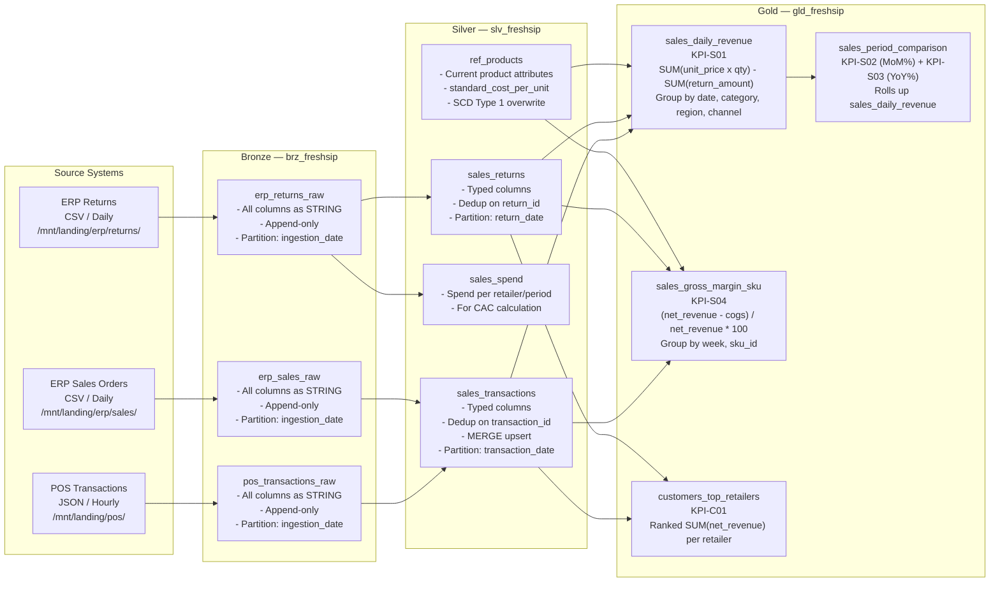
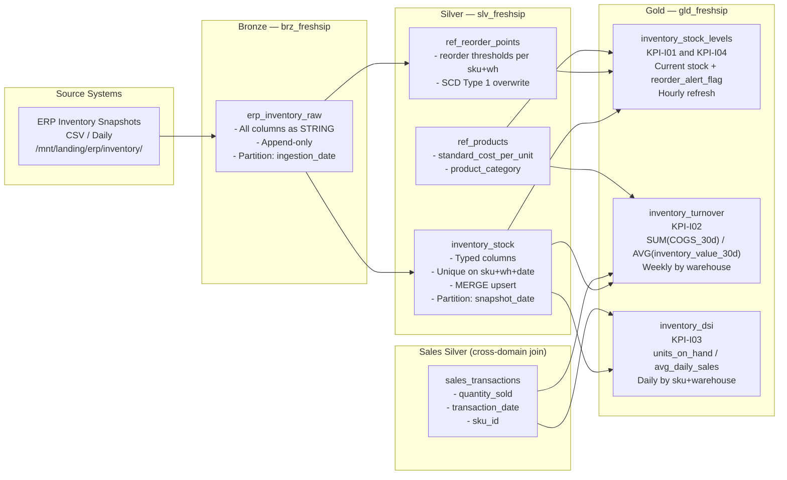
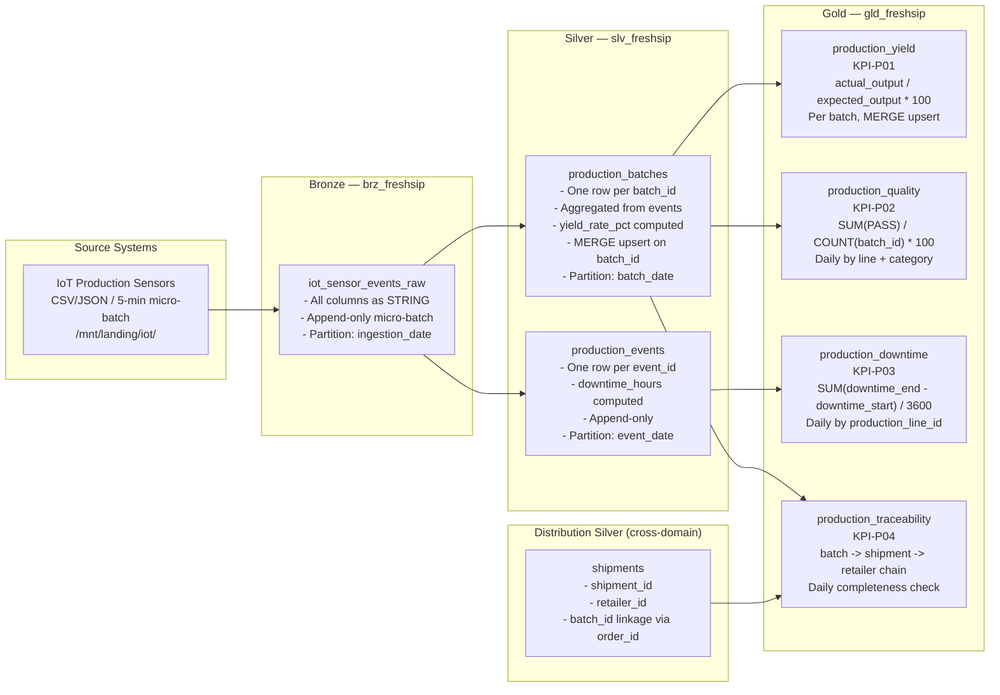
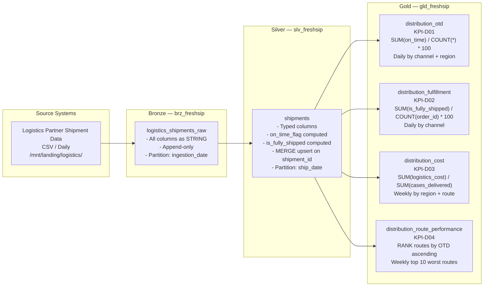
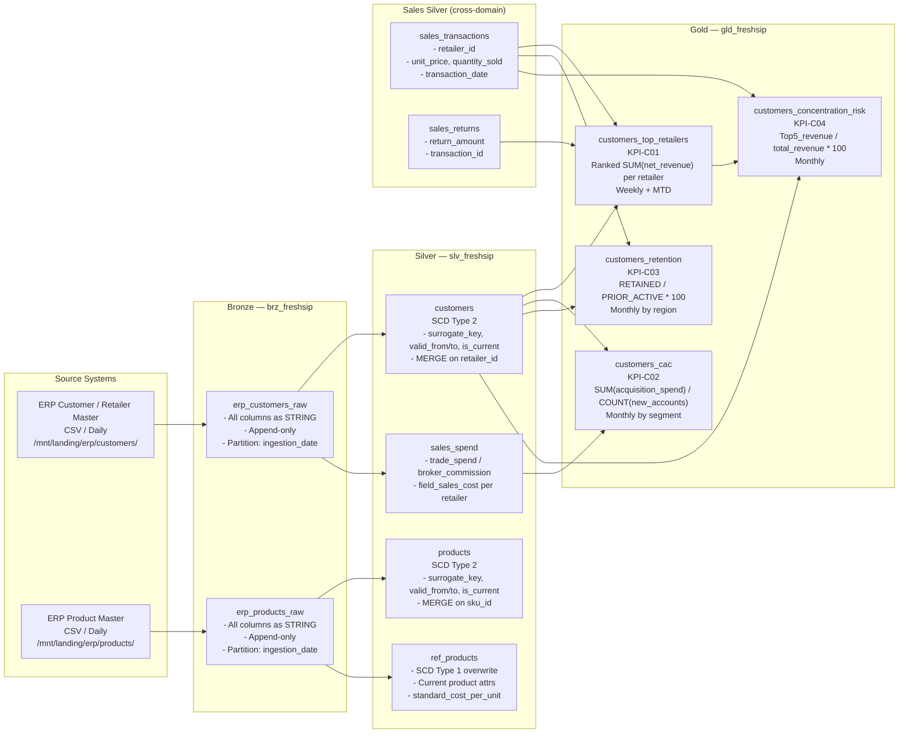

# Data Lineage — FreshSip Beverages CPG Data Platform

**Version:** 1.0
**Date:** 2026-04-05
**Author:** Data Architect Agent
**Status:** Final — Phase 3 Solutioning

---

## Overview

This document defines end-to-end data lineage for all five domains of the FreshSip CPG Data Platform. Each section provides:

1. A Mermaid flowchart diagram showing source → Bronze → Silver → Gold flow
2. A lineage table with transformation details and quality gates
3. Column-level lineage for key KPI computations

---

## Domain 1: Sales

### Sales Lineage Diagram



### Sales Lineage Table

| Stage | Table | Source | Transformation | Quality Gate |
|---|---|---|---|---|
| Ingestion | `brz_freshsip.pos_transactions_raw` | POS JSON hourly files | Append-only; all columns as STRING; metadata columns auto-added | BRZ-SALES-POS-001 through 007 |
| Ingestion | `brz_freshsip.erp_sales_raw` | ERP CSV daily | Append-only; schema-on-read | BRZ-SALES-ERP-001 through 005 |
| Ingestion | `brz_freshsip.erp_returns_raw` | ERP returns CSV daily | Append-only | BRZ-SALES-RET-001 through 004 |
| Cleaning | `slv_freshsip.sales_transactions` | pos_transactions_raw + erp_sales_raw | Dedup on transaction_id; type cast STRING→typed; null handling; channel validation | SLV-SALES-TXN-001 through 010 |
| Cleaning | `slv_freshsip.sales_returns` | erp_returns_raw | Dedup on return_id; type cast; reason code validation | SLV-SALES-RET-001 through 006 |
| Aggregation | `gld_freshsip.sales_daily_revenue` | sales_transactions + sales_returns + ref_products | GROUP BY (date, category, region, channel); compute net_revenue = gross - returns | GLD-SALES-REV-001 through 004 |
| Aggregation | `gld_freshsip.sales_period_comparison` | sales_daily_revenue | MoM window: current MTD vs prior MTD; YoY window: YTD vs prior YTD | GLD-SALES-MOM-001 through 003 |
| Aggregation | `gld_freshsip.sales_gross_margin_sku` | sales_transactions + sales_returns + ref_products | Weekly GROUP BY sku_id; gross_margin = net_revenue - (standard_cost x qty) | GLD-SALES-MARG-001 through 003 |

### Sales Column-Level Lineage (KPI-S01)

```
slv_freshsip.sales_transactions.unit_price (DECIMAL)
  └─ * slv_freshsip.sales_transactions.quantity_sold (INTEGER)
      = gross_sales_amount
          └─ - slv_freshsip.sales_returns.return_amount (DECIMAL, joined on transaction_id)
              = gld_freshsip.sales_daily_revenue.net_revenue

slv_freshsip.ref_products.product_category (STRING)
  └─ JOIN on sku_id
      → gld_freshsip.sales_daily_revenue.product_category

slv_freshsip.sales_transactions.region (STRING)
  └─ → gld_freshsip.sales_daily_revenue.region

slv_freshsip.sales_transactions.transaction_date (DATE)
  └─ → gld_freshsip.sales_daily_revenue.report_date
```

### Sales Column-Level Lineage (KPI-S04)

```
slv_freshsip.ref_products.standard_cost_per_unit (DECIMAL)
  └─ * slv_freshsip.sales_transactions.quantity_sold (INTEGER)
      = cogs per line
          └─ SUM(cogs) / SUM(net_revenue) * 100
              = gld_freshsip.sales_gross_margin_sku.gross_margin_pct
```

---

## Domain 2: Inventory

### Inventory Lineage Diagram



### Inventory Lineage Table

| Stage | Table | Source | Transformation | Quality Gate |
|---|---|---|---|---|
| Ingestion | `brz_freshsip.erp_inventory_raw` | ERP inventory CSV daily | Append-only; schema-on-read | BRZ-INV-SNAP-001 through 005 |
| Cleaning | `slv_freshsip.inventory_stock` | erp_inventory_raw | Dedup on (sku_id, warehouse_id, snapshot_date); type cast; compute inventory_value; reject negative stock | SLV-INV-STOCK-001 through 008 |
| Reference | `slv_freshsip.ref_reorder_points` | erp_inventory_raw (reorder_point_units column) | Extract reorder thresholds; MERGE overwrite on (sku_id, warehouse_id) | SLV-INV-ROP-001 through 005 |
| KPI | `gld_freshsip.inventory_stock_levels` | inventory_stock + ref_reorder_points + ref_products | Join on sku_id+warehouse_id; compute reorder_alert_flag and deficit_units | GLD-INV-STOCK-001 through 004 |
| KPI | `gld_freshsip.inventory_turnover` | inventory_stock + sales_transactions + ref_products | 30-day rolling COGS / avg inventory value by warehouse | GLD-INV-TURN-001 through 003 |
| KPI | `gld_freshsip.inventory_dsi` | inventory_stock + sales_transactions | units_on_hand / (30-day avg daily sales) per sku+warehouse | GLD-INV-DSI-001 through 003 |

### Inventory Column-Level Lineage (KPI-I04 — Reorder Alert)

```
slv_freshsip.inventory_stock.units_on_hand (INTEGER)
  └─ <= slv_freshsip.ref_reorder_points.reorder_point_units (INTEGER)
      = gld_freshsip.inventory_stock_levels.reorder_alert_flag (BOOLEAN)

slv_freshsip.ref_reorder_points.reorder_point_units (INTEGER)
  └─ - slv_freshsip.inventory_stock.units_on_hand (INTEGER)
      = gld_freshsip.inventory_stock_levels.deficit_units (INTEGER)
```

### Inventory Column-Level Lineage (KPI-I03 — DSI)

```
slv_freshsip.inventory_stock.units_on_hand (INTEGER)
  └─ / (SUM(slv_freshsip.sales_transactions.quantity_sold) / 30.0)
       [trailing 30 days, grouped by sku_id]
      = gld_freshsip.inventory_dsi.dsi_days (DECIMAL)
```

---

## Domain 3: Production

### Production Lineage Diagram



### Production Lineage Table

| Stage | Table | Source | Transformation | Quality Gate |
|---|---|---|---|---|
| Ingestion | `brz_freshsip.iot_sensor_events_raw` | IoT sensor CSV/JSON micro-batch every 5 min | Append-only; schema-on-read; triggered via Structured Streaming | BRZ-PROD-IOT-001 through 005 |
| Aggregation | `slv_freshsip.production_batches` | iot_sensor_events_raw | Pivot BATCH_START/BATCH_END/QC_CHECK events into one row per batch_id; compute yield_rate_pct | SLV-PROD-BATCH-001 through 008 |
| Cleaning | `slv_freshsip.production_events` | iot_sensor_events_raw | One row per event_id; compute downtime_hours from timestamps | SLV-PROD-EVT-001 through 007 |
| KPI | `gld_freshsip.production_yield` | production_batches + ref_products | MERGE on batch_id; compute yield alert flags | GLD-PROD-YIELD-001 through 003 |
| KPI | `gld_freshsip.production_quality` | production_batches + ref_products | Daily GROUP BY line + category; qc_pass_rate | GLD-PROD-QC-001 through 003 |
| KPI | `gld_freshsip.production_downtime` | production_events | Daily GROUP BY production_line_id; SUM downtime hours for DOWNTIME_UNPLANNED events | GLD-PROD-DT-001 through 003 |
| KPI | `gld_freshsip.production_traceability` | production_batches + shipments + customers | Left join chain; compute is_fully_traceable flag | N/A (count check only) |

### Production Column-Level Lineage (KPI-P01 — Yield Rate)

```
brz_freshsip.iot_sensor_events_raw.actual_output_cases (STRING)
  └─ CAST to INTEGER
      → slv_freshsip.production_batches.actual_output_cases (INTEGER)
          └─ / slv_freshsip.production_batches.expected_output_cases (INTEGER)
              * 100
              = gld_freshsip.production_yield.yield_rate_pct (DECIMAL)

brz_freshsip.iot_sensor_events_raw.downtime_start_ts (STRING)
brz_freshsip.iot_sensor_events_raw.downtime_end_ts (STRING)
  └─ CAST to TIMESTAMP
      → (downtime_end_ts - downtime_start_ts) / 3600.0
          = slv_freshsip.production_events.downtime_hours (DECIMAL)
              → SUM per (event_date, production_line_id)
                  = gld_freshsip.production_downtime.downtime_hours (DECIMAL)
```

---

## Domain 4: Distribution

### Distribution Lineage Diagram



### Distribution Lineage Table

| Stage | Table | Source | Transformation | Quality Gate |
|---|---|---|---|---|
| Ingestion | `brz_freshsip.logistics_shipments_raw` | Logistics partner CSV daily | Append-only; schema-on-read | BRZ-DIST-SHIP-001 through 005 |
| Cleaning | `slv_freshsip.shipments` | logistics_shipments_raw | Dedup on shipment_id; type cast; compute on_time_flag = (actual_delivery_date <= promised_delivery_date); compute is_fully_shipped | SLV-DIST-SHIP-001 through 009 |
| KPI | `gld_freshsip.distribution_otd` | shipments | Daily GROUP BY (channel, region); SUM on_time_flag / COUNT(shipment_id) * 100 | GLD-DIST-OTD-001 through 003 |
| KPI | `gld_freshsip.distribution_fulfillment` | shipments | Daily GROUP BY channel; COUNT fully_shipped orders / total orders | GLD-DIST-FULL-001 through 003 |
| KPI | `gld_freshsip.distribution_cost` | shipments | Weekly GROUP BY (region, route_id, channel); logistics_cost / cases_delivered | GLD-DIST-COST-001 through 003 |
| KPI | `gld_freshsip.distribution_route_performance` | shipments | Weekly GROUP BY route_id; RANK by OTD% ascending; retain top 10 worst | N/A (ranking) |

### Distribution Column-Level Lineage (KPI-D01 — OTD)

```
brz_freshsip.logistics_shipments_raw.actual_delivery_date (STRING)
  └─ CAST to DATE
      → slv_freshsip.shipments.actual_delivery_date (DATE)
          └─ <= slv_freshsip.shipments.promised_delivery_date (DATE)
              = slv_freshsip.shipments.on_time_flag (BOOLEAN)
                  → SUM(CASE WHEN on_time_flag THEN 1 ELSE 0 END) / COUNT(shipment_id) * 100
                      = gld_freshsip.distribution_otd.otd_pct (DECIMAL)

brz_freshsip.logistics_shipments_raw.logistics_cost_usd (STRING)
  └─ CAST to DECIMAL
      → slv_freshsip.shipments.logistics_cost_usd (DECIMAL)
          → SUM(logistics_cost_usd) / SUM(cases_delivered)
              = gld_freshsip.distribution_cost.cost_per_case (DECIMAL)
```

---

## Domain 5: Customers

### Customers Lineage Diagram



### Customers Lineage Table

| Stage | Table | Source | Transformation | Quality Gate |
|---|---|---|---|---|
| Ingestion | `brz_freshsip.erp_customers_raw` | ERP customer CSV daily | Append-only; schema-on-read | BRZ-CUST-ERP-001 through 005 |
| Ingestion | `brz_freshsip.erp_products_raw` | ERP product CSV daily | Append-only; schema-on-read | BRZ-PROD-ERP-001 through 005 |
| SCD Type 2 | `slv_freshsip.customers` | erp_customers_raw | Detect changed attributes; close prior record (set valid_to, is_current=false); insert new version | SLV-CUST-001 through 007 |
| SCD Type 2 | `slv_freshsip.products` | erp_products_raw | Same SCD Type 2 MERGE pattern as customers | SLV-PROD-SKU-001 through 007 |
| SCD Type 1 | `slv_freshsip.ref_products` | products (is_current=true) | Full overwrite with current-version attributes; used for Gold joins | SLV-PROD-SKU-001 through 007 |
| Spend | `slv_freshsip.sales_spend` | erp_customers_raw (spend columns) | Extract trade_spend, broker_commission, field_sales_cost per retailer per period | SLV-SALES-SPEND-001 through 006 |
| KPI | `gld_freshsip.customers_top_retailers` | sales_transactions + sales_returns + customers | Ranked net_revenue per retailer; weekly window | GLD-CUST-TOP-001 through 003 |
| KPI | `gld_freshsip.customers_cac` | customers + sales_spend | New accounts (activation_date in period) + SUM(acquisition_spend) / count | GLD-CUST-CAC-001 through 003 |
| KPI | `gld_freshsip.customers_retention` | customers + sales_transactions | Distinct active retailers in prior vs. current period | GLD-CUST-RET-001 through 003 |
| KPI | `gld_freshsip.customers_concentration_risk` | customers_top_retailers + sales_transactions | Top5 revenue / total revenue | GLD-CUST-CONC-001 through 003 |

### Customers Column-Level Lineage (KPI-C02 — CAC)

```
brz_freshsip.erp_customers_raw.trade_spend_usd (STRING)
brz_freshsip.erp_customers_raw.broker_commission_usd (STRING)
brz_freshsip.erp_customers_raw.field_sales_cost_usd (STRING)
  └─ CAST to DECIMAL
      → slv_freshsip.sales_spend.trade_spend_usd
      → slv_freshsip.sales_spend.broker_commission_usd
      → slv_freshsip.sales_spend.field_sales_cost_usd
          └─ SUM(all three)
              = slv_freshsip.sales_spend.total_acquisition_cost_usd (DECIMAL)

brz_freshsip.erp_customers_raw.account_activation_date (STRING)
  └─ CAST to DATE
      → slv_freshsip.customers.account_activation_date (DATE)
          └─ WHERE activation_date IN current period
              = COUNT(DISTINCT new_account_id)

SUM(total_acquisition_cost_usd) / COUNT(DISTINCT new_account_id)
  = gld_freshsip.customers_cac.cac_usd (DECIMAL)
```

### Customers Column-Level Lineage (KPI-C04 — Concentration Risk)

```
slv_freshsip.sales_transactions.unit_price (DECIMAL)
  └─ * slv_freshsip.sales_transactions.quantity_sold (INTEGER)
      - slv_freshsip.sales_returns.return_amount (DECIMAL)
          = retailer_net_revenue per retailer
              └─ RANK() OVER ORDER BY retailer_net_revenue DESC
                  → gld_freshsip.customers_top_retailers.revenue_rank

gld_freshsip.customers_top_retailers.retailer_net_revenue
  └─ WHERE revenue_rank <= 5
      SUM(top5_revenue) / SUM(all_revenue) * 100
          = gld_freshsip.customers_concentration_risk.top5_concentration_pct
```

---

## Cross-Domain Joins Summary

The following Silver tables are joined across domain boundaries in Gold KPI computations:

| Join | Left Table | Right Table | Join Keys | Used In KPI |
|---|---|---|---|---|
| Sales + Products | `sales_transactions` | `ref_products` | `sku_id` | KPI-S01, S04, I02, I03 |
| Sales + Customers | `sales_transactions` | `customers` | `retailer_id` | KPI-C01, C03, C04 |
| Sales + Returns | `sales_transactions` | `sales_returns` | `transaction_id` | KPI-S01, S04, C01, C04 |
| Inventory + Products | `inventory_stock` | `ref_products` | `sku_id` | KPI-I01, I02, I04 |
| Inventory + Reorder Points | `inventory_stock` | `ref_reorder_points` | `sku_id, warehouse_id` | KPI-I01, I04 |
| Inventory + Sales | `inventory_stock` | `sales_transactions` | `sku_id` | KPI-I02, I03 |
| Production + Products | `production_batches` | `ref_products` | `sku_id` | KPI-P01, P02 |
| Production + Shipments | `production_batches` | `shipments` | `batch_id` (via order_id) | KPI-P04 |
| Customers + Spend | `customers` | `sales_spend` | `retailer_id` | KPI-C02 |
| Customers + Transactions | `customers` | `sales_transactions` | `retailer_id` | KPI-C01, C03 |

---

## Lineage Summary Table

| Source File | Bronze Table | Silver Table(s) | Gold KPI Table(s) | KPI IDs |
|---|---|---|---|---|
| POS JSON (hourly) | `pos_transactions_raw` | `sales_transactions` | `sales_daily_revenue`, `sales_period_comparison`, `sales_gross_margin_sku`, `customers_top_retailers` | S01, S02, S03, S04, C01 |
| ERP Sales CSV (daily) | `erp_sales_raw` | `sales_transactions` | (same as above) | S01, S02, S03, S04 |
| ERP Returns CSV (daily) | `erp_returns_raw` | `sales_returns`, `sales_spend` | `sales_daily_revenue`, `sales_gross_margin_sku`, `customers_cac` | S01, S04, C02 |
| ERP Inventory CSV (daily) | `erp_inventory_raw` | `inventory_stock`, `ref_reorder_points` | `inventory_stock_levels`, `inventory_turnover`, `inventory_dsi` | I01, I02, I03, I04 |
| IoT Sensors (5-min) | `iot_sensor_events_raw` | `production_batches`, `production_events` | `production_yield`, `production_quality`, `production_downtime`, `production_traceability` | P01, P02, P03, P04 |
| Logistics CSV (daily) | `logistics_shipments_raw` | `shipments` | `distribution_otd`, `distribution_fulfillment`, `distribution_cost`, `distribution_route_performance` | D01, D02, D03, D04 |
| ERP Customers CSV (daily) | `erp_customers_raw` | `customers`, `sales_spend` | `customers_top_retailers`, `customers_cac`, `customers_retention`, `customers_concentration_risk` | C01, C02, C03, C04 |
| ERP Products CSV (daily) | `erp_products_raw` | `products`, `ref_products` | (reference used in all margin KPIs) | S04, I01, I02, P01, P02 |
