# Bronze Layer Schema — FreshSip Beverages CPG Data Platform

**Version:** 1.0
**Date:** 2026-04-05
**Author:** Data Architect Agent
**Layer:** Bronze — Raw Ingestion (Append-Only, Schema-on-Read)
**Database:** `brz_freshsip` (Hive Metastore)

---

## Design Principles

- All source columns ingested as `STRING` (schema-on-read; no type casting in Bronze)
- Four standard metadata columns on every table: `_ingested_at`, `_source_file`, `_batch_id`, `_pipeline_run_id`
- Write mode: **Append-only**. Records are never updated or deleted.
- Partitioned by `ingestion_date DATE` (derived from `_ingested_at` at write time) for partition pruning
- Storage: Delta Lake format
- Source file path or system identifier stored in `_source_file` for lineage
- Retention: 90 days; purged via `VACUUM` after Silver pipeline confirms successful processing

---

## Metadata Columns (Applied to Every Bronze Table)

| Column | Type | Description |
|---|---|---|
| `_ingested_at` | TIMESTAMP | Timestamp when the record was written to the Bronze table |
| `_source_file` | STRING | Full file path or system identifier of the source (e.g., `/mnt/landing/pos/2026-04-05T14_00.json`) |
| `_batch_id` | STRING | UUID identifying the pipeline batch run that ingested this record |
| `_pipeline_run_id` | STRING | Databricks pipeline or job run ID for end-to-end traceability |
| `ingestion_date` | DATE | Partition column; derived from `_ingested_at` (`CAST(_ingested_at AS DATE)`) |

---

## ER Diagram — Bronze Layer

```mermaid
erDiagram
    POS_TRANSACTIONS_RAW {
        string transaction_id
        string retailer_id
        string sku_id
        string quantity
        string unit_price
        string transaction_timestamp
        string channel
        string region
        string state
        string store_id
        timestamp _ingested_at
        string _source_file
        string _batch_id
        string _pipeline_run_id
        date ingestion_date
    }
    ERP_SALES_RAW {
        string order_id
        string order_line_id
        string retailer_id
        string sku_id
        string quantity_ordered
        string quantity_shipped
        string invoice_price
        string order_date
        string ship_date
        string channel
        string region
        string state
        timestamp _ingested_at
        string _source_file
        string _batch_id
        string _pipeline_run_id
        date ingestion_date
    }
    ERP_RETURNS_RAW {
        string return_id
        string transaction_id
        string order_id
        string retailer_id
        string sku_id
        string quantity_returned
        string return_amount
        string return_date
        string return_reason_code
        timestamp _ingested_at
        string _source_file
        string _batch_id
        string _pipeline_run_id
        date ingestion_date
    }
    ERP_INVENTORY_RAW {
        string warehouse_id
        string sku_id
        string units_on_hand
        string units_in_transit
        string units_reserved
        string snapshot_date
        string snapshot_timestamp
        string reorder_point_units
        string standard_cost_per_unit
        timestamp _ingested_at
        string _source_file
        string _batch_id
        string _pipeline_run_id
        date ingestion_date
    }
    IOT_SENSOR_EVENTS_RAW {
        string event_id
        string batch_id
        string production_line_id
        string event_type
        string event_timestamp
        string sku_id
        string expected_output_cases
        string actual_output_cases
        string qc_status
        string downtime_start_ts
        string downtime_end_ts
        string sensor_temperature
        string sensor_pressure
        string operator_id
        timestamp _ingested_at
        string _source_file
        string _batch_id
        string _pipeline_run_id
        date ingestion_date
    }
    LOGISTICS_SHIPMENTS_RAW {
        string shipment_id
        string order_id
        string retailer_id
        string warehouse_id
        string route_id
        string carrier_id
        string ship_date
        string promised_delivery_date
        string actual_delivery_date
        string cases_delivered
        string logistics_cost_usd
        string channel
        string region
        string state
        string is_fully_shipped
        string quantity_ordered
        string quantity_shipped
        timestamp _ingested_at
        string _source_file
        string _batch_id
        string _pipeline_run_id
        date ingestion_date
    }
    ERP_CUSTOMERS_RAW {
        string retailer_id
        string retailer_name
        string retail_segment
        string channel
        string region
        string state
        string city
        string credit_terms_days
        string account_activation_date
        string account_status
        string trade_spend_usd
        string broker_commission_usd
        string field_sales_cost_usd
        string record_effective_date
        timestamp _ingested_at
        string _source_file
        string _batch_id
        string _pipeline_run_id
        date ingestion_date
    }
    ERP_PRODUCTS_RAW {
        string sku_id
        string product_name
        string product_category
        string product_subcategory
        string brand
        string packaging_type
        string package_size_ml
        string standard_cost_per_unit
        string list_price
        string price_tier
        string is_active
        string record_effective_date
        timestamp _ingested_at
        string _source_file
        string _batch_id
        string _pipeline_run_id
        date ingestion_date
    }
```



---

## Table Definitions

---

### Table: `brz_freshsip.pos_transactions_raw`

**Layer:** Bronze
**Domain:** Sales
**Description:** Raw POS (Point of Sale) transaction records from hourly JSON files submitted by retail partners.
**Source:** Retailer POS systems — JSON files; path `/mnt/landing/pos/YYYY-MM-DD/HH/*.json`
**Partition Key:** `ingestion_date`
**Z-Order Columns:** None (Bronze — raw storage only)
**Primary Key:** None enforced (append-only; dedup in Silver)
**Update Strategy:** Append-only

| Column Name | Data Type | Nullable | Description | Business Rule |
|---|---|---|---|---|
| `transaction_id` | STRING | YES | POS transaction identifier from retailer system | Deduplicated in Silver |
| `retailer_id` | STRING | YES | Retailer account identifier | Referenced in `slv_freshsip.customers` |
| `sku_id` | STRING | YES | Product SKU identifier | Referenced in `slv_freshsip.ref_products` |
| `quantity` | STRING | YES | Units sold (ingested as string; typed in Silver) | Must cast to INTEGER in Silver |
| `unit_price` | STRING | YES | Invoice unit price in USD (string; typed in Silver) | Must cast to DECIMAL in Silver |
| `transaction_timestamp` | STRING | YES | ISO 8601 timestamp of transaction from POS | Must cast to TIMESTAMP in Silver |
| `channel` | STRING | YES | Distribution channel (Retail, Wholesale, DTC) | Validated against reference list in Silver |
| `region` | STRING | YES | US region (e.g., Northeast, Southeast) | Validated against reference list in Silver |
| `state` | STRING | YES | US state code (2-char) | ISO 3166-2 validation in Silver |
| `store_id` | STRING | YES | Retailer store location identifier | Informational; not a foreign key |
| `_ingested_at` | TIMESTAMP | NOT NULL | Pipeline ingestion timestamp | Auto-set by pipeline |
| `_source_file` | STRING | NOT NULL | Source JSON file path | Auto-set by pipeline |
| `_batch_id` | STRING | NOT NULL | Ingestion batch UUID | Auto-set by pipeline |
| `_pipeline_run_id` | STRING | NOT NULL | Databricks job run ID | Auto-set by pipeline |
| `ingestion_date` | DATE | NOT NULL | Partition column; derived from `_ingested_at` | Auto-set by pipeline |

**CREATE TABLE DDL:**
```sql
CREATE TABLE IF NOT EXISTS brz_freshsip.pos_transactions_raw (
    transaction_id      STRING,
    retailer_id         STRING,
    sku_id              STRING,
    quantity            STRING,
    unit_price          STRING,
    transaction_timestamp STRING,
    channel             STRING,
    region              STRING,
    state               STRING,
    store_id            STRING,
    _ingested_at        TIMESTAMP NOT NULL,
    _source_file        STRING    NOT NULL,
    _batch_id           STRING    NOT NULL,
    _pipeline_run_id    STRING    NOT NULL,
    ingestion_date      DATE      NOT NULL
)
USING DELTA
PARTITIONED BY (ingestion_date)
TBLPROPERTIES (
    'delta.autoOptimize.optimizeWrite' = 'true',
    'delta.autoOptimize.autoCompact'   = 'true',
    'layer'                            = 'bronze',
    'domain'                           = 'sales',
    'source_format'                    = 'json',
    'source_frequency'                 = 'hourly',
    'retention_days'                   = '90'
);
```

---

### Table: `brz_freshsip.erp_sales_raw`

**Layer:** Bronze
**Domain:** Sales
**Description:** Raw ERP sales order and order line records from daily CSV exports; includes invoice prices and fulfillment quantities.
**Source:** SAP ERP — CSV files; path `/mnt/landing/erp/sales/YYYY-MM-DD/*.csv`
**Partition Key:** `ingestion_date`
**Z-Order Columns:** None
**Primary Key:** None enforced
**Update Strategy:** Append-only

| Column Name | Data Type | Nullable | Description | Business Rule |
|---|---|---|---|---|
| `order_id` | STRING | YES | ERP sales order identifier | Deduplicated on (order_id, order_line_id) in Silver |
| `order_line_id` | STRING | YES | Line item within the order | Combined with order_id for unique key |
| `retailer_id` | STRING | YES | Retailer account identifier | References customers domain |
| `sku_id` | STRING | YES | Product SKU identifier | References products domain |
| `quantity_ordered` | STRING | YES | Units ordered (string; cast in Silver) | Cast to INTEGER |
| `quantity_shipped` | STRING | YES | Units actually shipped (string; cast in Silver) | Cast to INTEGER |
| `invoice_price` | STRING | YES | Price per unit on invoice in USD | Cast to DECIMAL |
| `order_date` | STRING | YES | Date order was placed | Cast to DATE |
| `ship_date` | STRING | YES | Date order was shipped | Cast to DATE |
| `channel` | STRING | YES | Distribution channel | Validated in Silver |
| `region` | STRING | YES | US region | Validated in Silver |
| `state` | STRING | YES | US state code | Validated in Silver |
| `_ingested_at` | TIMESTAMP | NOT NULL | Pipeline ingestion timestamp | Auto-set |
| `_source_file` | STRING | NOT NULL | Source CSV file path | Auto-set |
| `_batch_id` | STRING | NOT NULL | Ingestion batch UUID | Auto-set |
| `_pipeline_run_id` | STRING | NOT NULL | Databricks job run ID | Auto-set |
| `ingestion_date` | DATE | NOT NULL | Partition column | Auto-set |

**CREATE TABLE DDL:**
```sql
CREATE TABLE IF NOT EXISTS brz_freshsip.erp_sales_raw (
    order_id            STRING,
    order_line_id       STRING,
    retailer_id         STRING,
    sku_id              STRING,
    quantity_ordered    STRING,
    quantity_shipped    STRING,
    invoice_price       STRING,
    order_date          STRING,
    ship_date           STRING,
    channel             STRING,
    region              STRING,
    state               STRING,
    _ingested_at        TIMESTAMP NOT NULL,
    _source_file        STRING    NOT NULL,
    _batch_id           STRING    NOT NULL,
    _pipeline_run_id    STRING    NOT NULL,
    ingestion_date      DATE      NOT NULL
)
USING DELTA
PARTITIONED BY (ingestion_date)
TBLPROPERTIES (
    'delta.autoOptimize.optimizeWrite' = 'true',
    'delta.autoOptimize.autoCompact'   = 'true',
    'layer'                            = 'bronze',
    'domain'                           = 'sales',
    'source_format'                    = 'csv',
    'source_frequency'                 = 'daily',
    'retention_days'                   = '90'
);
```

---

### Table: `brz_freshsip.erp_returns_raw`

**Layer:** Bronze
**Domain:** Sales
**Description:** Raw ERP returns data from daily CSV exports; each record represents a single return transaction.
**Source:** SAP ERP — CSV files; path `/mnt/landing/erp/returns/YYYY-MM-DD/*.csv`
**Partition Key:** `ingestion_date`
**Z-Order Columns:** None
**Primary Key:** None enforced
**Update Strategy:** Append-only

| Column Name | Data Type | Nullable | Description | Business Rule |
|---|---|---|---|---|
| `return_id` | STRING | YES | Unique return transaction identifier | Deduplicated in Silver |
| `transaction_id` | STRING | YES | Originating POS transaction ID | Foreign key to sales_transactions in Silver |
| `order_id` | STRING | YES | Originating ERP order ID | Foreign key to erp_sales in Silver |
| `retailer_id` | STRING | YES | Retailer account identifier | References customers |
| `sku_id` | STRING | YES | Returned product SKU | References products |
| `quantity_returned` | STRING | YES | Units returned | Cast to INTEGER in Silver |
| `return_amount` | STRING | YES | Credit amount in USD | Cast to DECIMAL in Silver |
| `return_date` | STRING | YES | Date of return | Cast to DATE in Silver |
| `return_reason_code` | STRING | YES | Standard reason code (e.g., DAMAGED, EXPIRED, WRONG_ITEM) | Validated against reference list in Silver |
| `_ingested_at` | TIMESTAMP | NOT NULL | Pipeline ingestion timestamp | Auto-set |
| `_source_file` | STRING | NOT NULL | Source CSV file path | Auto-set |
| `_batch_id` | STRING | NOT NULL | Ingestion batch UUID | Auto-set |
| `_pipeline_run_id` | STRING | NOT NULL | Databricks job run ID | Auto-set |
| `ingestion_date` | DATE | NOT NULL | Partition column | Auto-set |

**CREATE TABLE DDL:**
```sql
CREATE TABLE IF NOT EXISTS brz_freshsip.erp_returns_raw (
    return_id           STRING,
    transaction_id      STRING,
    order_id            STRING,
    retailer_id         STRING,
    sku_id              STRING,
    quantity_returned   STRING,
    return_amount       STRING,
    return_date         STRING,
    return_reason_code  STRING,
    _ingested_at        TIMESTAMP NOT NULL,
    _source_file        STRING    NOT NULL,
    _batch_id           STRING    NOT NULL,
    _pipeline_run_id    STRING    NOT NULL,
    ingestion_date      DATE      NOT NULL
)
USING DELTA
PARTITIONED BY (ingestion_date)
TBLPROPERTIES (
    'delta.autoOptimize.optimizeWrite' = 'true',
    'delta.autoOptimize.autoCompact'   = 'true',
    'layer'                            = 'bronze',
    'domain'                           = 'sales',
    'source_format'                    = 'csv',
    'source_frequency'                 = 'daily',
    'retention_days'                   = '90'
);
```

---

### Table: `brz_freshsip.erp_inventory_raw`

**Layer:** Bronze
**Domain:** Inventory
**Description:** Raw daily inventory snapshot records from ERP; one record per SKU per warehouse per snapshot run.
**Source:** SAP ERP — CSV files; path `/mnt/landing/erp/inventory/YYYY-MM-DD/*.csv`
**Partition Key:** `ingestion_date`
**Z-Order Columns:** None
**Primary Key:** None enforced
**Update Strategy:** Append-only

| Column Name | Data Type | Nullable | Description | Business Rule |
|---|---|---|---|---|
| `warehouse_id` | STRING | YES | Warehouse identifier | References warehouses dimension |
| `sku_id` | STRING | YES | Product SKU identifier | References products |
| `units_on_hand` | STRING | YES | Current units in warehouse | Cast to INTEGER; must be >= 0 in Silver |
| `units_in_transit` | STRING | YES | Units in transit to warehouse | Cast to INTEGER |
| `units_reserved` | STRING | YES | Units reserved for pending orders | Cast to INTEGER |
| `snapshot_date` | STRING | YES | Date of snapshot | Cast to DATE in Silver |
| `snapshot_timestamp` | STRING | YES | Full timestamp of snapshot | Cast to TIMESTAMP in Silver |
| `reorder_point_units` | STRING | YES | Reorder threshold for this SKU at this warehouse | Cast to INTEGER; loaded into ref_reorder_points |
| `standard_cost_per_unit` | STRING | YES | Standard cost per unit in USD | Cast to DECIMAL in Silver |
| `_ingested_at` | TIMESTAMP | NOT NULL | Pipeline ingestion timestamp | Auto-set |
| `_source_file` | STRING | NOT NULL | Source CSV file path | Auto-set |
| `_batch_id` | STRING | NOT NULL | Ingestion batch UUID | Auto-set |
| `_pipeline_run_id` | STRING | NOT NULL | Databricks job run ID | Auto-set |
| `ingestion_date` | DATE | NOT NULL | Partition column | Auto-set |

**CREATE TABLE DDL:**
```sql
CREATE TABLE IF NOT EXISTS brz_freshsip.erp_inventory_raw (
    warehouse_id            STRING,
    sku_id                  STRING,
    units_on_hand           STRING,
    units_in_transit        STRING,
    units_reserved          STRING,
    snapshot_date           STRING,
    snapshot_timestamp      STRING,
    reorder_point_units     STRING,
    standard_cost_per_unit  STRING,
    _ingested_at            TIMESTAMP NOT NULL,
    _source_file            STRING    NOT NULL,
    _batch_id               STRING    NOT NULL,
    _pipeline_run_id        STRING    NOT NULL,
    ingestion_date          DATE      NOT NULL
)
USING DELTA
PARTITIONED BY (ingestion_date)
TBLPROPERTIES (
    'delta.autoOptimize.optimizeWrite' = 'true',
    'delta.autoOptimize.autoCompact'   = 'true',
    'layer'                            = 'bronze',
    'domain'                           = 'inventory',
    'source_format'                    = 'csv',
    'source_frequency'                 = 'daily',
    'retention_days'                   = '90'
);
```

---

### Table: `brz_freshsip.iot_sensor_events_raw`

**Layer:** Bronze
**Domain:** Production
**Description:** Raw IoT sensor event records from production lines; ingested every 5 minutes via micro-batch; each record represents a sensor event (batch start, batch end, QC check, downtime event).
**Source:** IoT sensors on production lines — CSV or JSON micro-batch; path `/mnt/landing/iot/YYYY-MM-DD/HH-MM/*.csv`
**Partition Key:** `ingestion_date`
**Z-Order Columns:** None
**Primary Key:** None enforced
**Update Strategy:** Append-only

| Column Name | Data Type | Nullable | Description | Business Rule |
|---|---|---|---|---|
| `event_id` | STRING | YES | Unique sensor event identifier | Deduplicated in Silver on event_id |
| `batch_id` | STRING | YES | Production batch identifier; groups related events | Foreign key to production_batches in Silver |
| `production_line_id` | STRING | YES | Production line identifier | Validated in Silver |
| `event_type` | STRING | YES | Event classification (BATCH_START, BATCH_END, QC_CHECK, DOWNTIME_UNPLANNED, DOWNTIME_PLANNED) | Validated against enum in Silver |
| `event_timestamp` | STRING | YES | ISO 8601 timestamp of the event | Cast to TIMESTAMP in Silver |
| `sku_id` | STRING | YES | SKU being produced in this batch | References products |
| `expected_output_cases` | STRING | YES | Planned output in standard cases | Cast to INTEGER in Silver |
| `actual_output_cases` | STRING | YES | Actual output in standard cases | Cast to INTEGER in Silver |
| `qc_status` | STRING | YES | QC result (PASS, FAIL, PENDING) | Null unless event_type = QC_CHECK |
| `downtime_start_ts` | STRING | YES | Start of downtime window | Null unless DOWNTIME event |
| `downtime_end_ts` | STRING | YES | End of downtime window | Null unless DOWNTIME event |
| `sensor_temperature` | STRING | YES | Temperature reading in Celsius | Cast to DECIMAL in Silver |
| `sensor_pressure` | STRING | YES | Pressure reading in PSI | Cast to DECIMAL in Silver |
| `operator_id` | STRING | YES | Operator on shift (informational) | Not a foreign key |
| `_ingested_at` | TIMESTAMP | NOT NULL | Pipeline ingestion timestamp | Auto-set |
| `_source_file` | STRING | NOT NULL | Source file path | Auto-set |
| `_batch_id` | STRING | NOT NULL | Pipeline batch UUID | Auto-set |
| `_pipeline_run_id` | STRING | NOT NULL | Databricks job run ID | Auto-set |
| `ingestion_date` | DATE | NOT NULL | Partition column | Auto-set |

**CREATE TABLE DDL:**
```sql
CREATE TABLE IF NOT EXISTS brz_freshsip.iot_sensor_events_raw (
    event_id                STRING,
    batch_id                STRING,
    production_line_id      STRING,
    event_type              STRING,
    event_timestamp         STRING,
    sku_id                  STRING,
    expected_output_cases   STRING,
    actual_output_cases     STRING,
    qc_status               STRING,
    downtime_start_ts       STRING,
    downtime_end_ts         STRING,
    sensor_temperature      STRING,
    sensor_pressure         STRING,
    operator_id             STRING,
    _ingested_at            TIMESTAMP NOT NULL,
    _source_file            STRING    NOT NULL,
    _batch_id               STRING    NOT NULL,
    _pipeline_run_id        STRING    NOT NULL,
    ingestion_date          DATE      NOT NULL
)
USING DELTA
PARTITIONED BY (ingestion_date)
TBLPROPERTIES (
    'delta.autoOptimize.optimizeWrite' = 'true',
    'delta.autoOptimize.autoCompact'   = 'true',
    'layer'                            = 'bronze',
    'domain'                           = 'production',
    'source_format'                    = 'csv_json',
    'source_frequency'                 = '5min_microbatch',
    'retention_days'                   = '90'
);
```

---

### Table: `brz_freshsip.logistics_shipments_raw`

**Layer:** Bronze
**Domain:** Distribution
**Description:** Raw logistics shipment records from daily CSV files provided by the logistics partner; includes delivery performance and cost data.
**Source:** Logistics partner — CSV files; path `/mnt/landing/logistics/YYYY-MM-DD/*.csv`
**Partition Key:** `ingestion_date`
**Z-Order Columns:** None
**Primary Key:** None enforced
**Update Strategy:** Append-only

| Column Name | Data Type | Nullable | Description | Business Rule |
|---|---|---|---|---|
| `shipment_id` | STRING | YES | Unique shipment identifier | Deduplicated in Silver |
| `order_id` | STRING | YES | Linked ERP order | Foreign key to erp_sales in Silver |
| `retailer_id` | STRING | YES | Destination retailer | References customers |
| `warehouse_id` | STRING | YES | Origin warehouse | References warehouses |
| `route_id` | STRING | YES | Logistics route identifier | Key for route performance KPI |
| `carrier_id` | STRING | YES | Carrier/logistics company | Informational |
| `ship_date` | STRING | YES | Date shipment departed warehouse | Cast to DATE in Silver |
| `promised_delivery_date` | STRING | YES | Committed delivery date from ERP | Cast to DATE in Silver |
| `actual_delivery_date` | STRING | YES | Actual date delivered at destination | Cast to DATE in Silver |
| `cases_delivered` | STRING | YES | Number of cases delivered | Cast to INTEGER in Silver |
| `logistics_cost_usd` | STRING | YES | Total logistics cost for this shipment | Cast to DECIMAL in Silver |
| `channel` | STRING | YES | Distribution channel | Validated in Silver |
| `region` | STRING | YES | Destination region | Validated in Silver |
| `state` | STRING | YES | Destination US state | Validated in Silver |
| `is_fully_shipped` | STRING | YES | Whether all ordered items were shipped (true/false) | Cast to BOOLEAN in Silver |
| `quantity_ordered` | STRING | YES | Original quantity ordered | Cast to INTEGER in Silver |
| `quantity_shipped` | STRING | YES | Quantity actually shipped | Cast to INTEGER in Silver |
| `_ingested_at` | TIMESTAMP | NOT NULL | Pipeline ingestion timestamp | Auto-set |
| `_source_file` | STRING | NOT NULL | Source CSV file path | Auto-set |
| `_batch_id` | STRING | NOT NULL | Ingestion batch UUID | Auto-set |
| `_pipeline_run_id` | STRING | NOT NULL | Databricks job run ID | Auto-set |
| `ingestion_date` | DATE | NOT NULL | Partition column | Auto-set |

**CREATE TABLE DDL:**
```sql
CREATE TABLE IF NOT EXISTS brz_freshsip.logistics_shipments_raw (
    shipment_id             STRING,
    order_id                STRING,
    retailer_id             STRING,
    warehouse_id            STRING,
    route_id                STRING,
    carrier_id              STRING,
    ship_date               STRING,
    promised_delivery_date  STRING,
    actual_delivery_date    STRING,
    cases_delivered         STRING,
    logistics_cost_usd      STRING,
    channel                 STRING,
    region                  STRING,
    state                   STRING,
    is_fully_shipped        STRING,
    quantity_ordered        STRING,
    quantity_shipped        STRING,
    _ingested_at            TIMESTAMP NOT NULL,
    _source_file            STRING    NOT NULL,
    _batch_id               STRING    NOT NULL,
    _pipeline_run_id        STRING    NOT NULL,
    ingestion_date          DATE      NOT NULL
)
USING DELTA
PARTITIONED BY (ingestion_date)
TBLPROPERTIES (
    'delta.autoOptimize.optimizeWrite' = 'true',
    'delta.autoOptimize.autoCompact'   = 'true',
    'layer'                            = 'bronze',
    'domain'                           = 'distribution',
    'source_format'                    = 'csv',
    'source_frequency'                 = 'daily',
    'retention_days'                   = '90'
);
```

---

### Table: `brz_freshsip.erp_customers_raw`

**Layer:** Bronze
**Domain:** Customers
**Description:** Raw retailer/customer master data from daily ERP CSV exports; includes account metadata, segment classification, and acquisition cost components.
**Source:** SAP ERP — CSV files; path `/mnt/landing/erp/customers/YYYY-MM-DD/*.csv`
**Partition Key:** `ingestion_date`
**Z-Order Columns:** None
**Primary Key:** None enforced
**Update Strategy:** Append-only (SCD Type 2 applied in Silver)

| Column Name | Data Type | Nullable | Description | Business Rule |
|---|---|---|---|---|
| `retailer_id` | STRING | YES | Unique retailer account identifier | SCD Type 2 key in Silver |
| `retailer_name` | STRING | YES | Retailer business name | Tracked for SCD changes |
| `retail_segment` | STRING | YES | Segment classification (e.g., Grocery, Convenience, Club) | Validated in Silver |
| `channel` | STRING | YES | Distribution channel (Retail, Wholesale, DTC) | Validated in Silver |
| `region` | STRING | YES | US region | Validated in Silver |
| `state` | STRING | YES | US state code | Validated in Silver |
| `city` | STRING | YES | City name | Informational |
| `credit_terms_days` | STRING | YES | Net payment terms in days (e.g., 30, 60) | Cast to INTEGER in Silver |
| `account_activation_date` | STRING | YES | Date account was activated | Cast to DATE in Silver |
| `account_status` | STRING | YES | Current status (ACTIVE, INACTIVE, SUSPENDED) | Validated in Silver |
| `trade_spend_usd` | STRING | YES | Trade spend allocated to this account for current period | Cast to DECIMAL; used for CAC |
| `broker_commission_usd` | STRING | YES | Broker commission for account acquisition | Cast to DECIMAL; used for CAC |
| `field_sales_cost_usd` | STRING | YES | Field sales cost allocated to account | Cast to DECIMAL; used for CAC |
| `record_effective_date` | STRING | YES | Date this record version is effective from | Used for SCD Type 2 in Silver |
| `_ingested_at` | TIMESTAMP | NOT NULL | Pipeline ingestion timestamp | Auto-set |
| `_source_file` | STRING | NOT NULL | Source CSV file path | Auto-set |
| `_batch_id` | STRING | NOT NULL | Ingestion batch UUID | Auto-set |
| `_pipeline_run_id` | STRING | NOT NULL | Databricks job run ID | Auto-set |
| `ingestion_date` | DATE | NOT NULL | Partition column | Auto-set |

**CREATE TABLE DDL:**
```sql
CREATE TABLE IF NOT EXISTS brz_freshsip.erp_customers_raw (
    retailer_id             STRING,
    retailer_name           STRING,
    retail_segment          STRING,
    channel                 STRING,
    region                  STRING,
    state                   STRING,
    city                    STRING,
    credit_terms_days       STRING,
    account_activation_date STRING,
    account_status          STRING,
    trade_spend_usd         STRING,
    broker_commission_usd   STRING,
    field_sales_cost_usd    STRING,
    record_effective_date   STRING,
    _ingested_at            TIMESTAMP NOT NULL,
    _source_file            STRING    NOT NULL,
    _batch_id               STRING    NOT NULL,
    _pipeline_run_id        STRING    NOT NULL,
    ingestion_date          DATE      NOT NULL
)
USING DELTA
PARTITIONED BY (ingestion_date)
TBLPROPERTIES (
    'delta.autoOptimize.optimizeWrite' = 'true',
    'delta.autoOptimize.autoCompact'   = 'true',
    'layer'                            = 'bronze',
    'domain'                           = 'customers',
    'source_format'                    = 'csv',
    'source_frequency'                 = 'daily',
    'retention_days'                   = '90'
);
```

---

### Table: `brz_freshsip.erp_products_raw`

**Layer:** Bronze
**Domain:** Products
**Description:** Raw product master data from daily ERP CSV exports; includes SKU attributes, cost, pricing tier, and lifecycle status.
**Source:** SAP ERP — CSV files; path `/mnt/landing/erp/products/YYYY-MM-DD/*.csv`
**Partition Key:** `ingestion_date`
**Z-Order Columns:** None
**Primary Key:** None enforced
**Update Strategy:** Append-only (SCD Type 2 applied in Silver)

| Column Name | Data Type | Nullable | Description | Business Rule |
|---|---|---|---|---|
| `sku_id` | STRING | YES | Unique SKU identifier | SCD Type 2 key in Silver |
| `product_name` | STRING | YES | Full product name | Tracked for SCD changes |
| `product_category` | STRING | YES | Category (Carbonated Soft Drinks, Flavored Water, Energy Drinks, Juice Blends) | Validated against 4-category enum |
| `product_subcategory` | STRING | YES | Subcategory within category | Informational |
| `brand` | STRING | YES | Brand name | Tracked for SCD changes |
| `packaging_type` | STRING | YES | Package type (Can, Bottle, Carton, Keg) | Validated in Silver |
| `package_size_ml` | STRING | YES | Package volume in milliliters | Cast to INTEGER in Silver |
| `standard_cost_per_unit` | STRING | YES | Standard cost per unit in USD | Cast to DECIMAL; critical for margin KPIs |
| `list_price` | STRING | YES | Standard list price per unit in USD | Cast to DECIMAL in Silver |
| `price_tier` | STRING | YES | Price tier (Economy, Standard, Premium) | Validated in Silver |
| `is_active` | STRING | YES | Whether SKU is active (true/false) | Cast to BOOLEAN in Silver |
| `record_effective_date` | STRING | YES | Date this record version is effective | Used for SCD Type 2 in Silver |
| `_ingested_at` | TIMESTAMP | NOT NULL | Pipeline ingestion timestamp | Auto-set |
| `_source_file` | STRING | NOT NULL | Source CSV file path | Auto-set |
| `_batch_id` | STRING | NOT NULL | Ingestion batch UUID | Auto-set |
| `_pipeline_run_id` | STRING | NOT NULL | Databricks job run ID | Auto-set |
| `ingestion_date` | DATE | NOT NULL | Partition column | Auto-set |

**CREATE TABLE DDL:**
```sql
CREATE TABLE IF NOT EXISTS brz_freshsip.erp_products_raw (
    sku_id                  STRING,
    product_name            STRING,
    product_category        STRING,
    product_subcategory     STRING,
    brand                   STRING,
    packaging_type          STRING,
    package_size_ml         STRING,
    standard_cost_per_unit  STRING,
    list_price              STRING,
    price_tier              STRING,
    is_active               STRING,
    record_effective_date   STRING,
    _ingested_at            TIMESTAMP NOT NULL,
    _source_file            STRING    NOT NULL,
    _batch_id               STRING    NOT NULL,
    _pipeline_run_id        STRING    NOT NULL,
    ingestion_date          DATE      NOT NULL
)
USING DELTA
PARTITIONED BY (ingestion_date)
TBLPROPERTIES (
    'delta.autoOptimize.optimizeWrite' = 'true',
    'delta.autoOptimize.autoCompact'   = 'true',
    'layer'                            = 'bronze',
    'domain'                           = 'products',
    'source_format'                    = 'csv',
    'source_frequency'                 = 'daily',
    'retention_days'                   = '90'
);
```

---

## Bronze Layer Summary

| Table | Domain | Source Format | Frequency | Partition Key | Row Count Estimate (13 months) |
|---|---|---|---|---|---|
| `pos_transactions_raw` | Sales | JSON | Hourly | `ingestion_date` | ~5.5M rows (500K/month, hourly) |
| `erp_sales_raw` | Sales | CSV | Daily | `ingestion_date` | ~390K rows (30K/month) |
| `erp_returns_raw` | Sales | CSV | Daily | `ingestion_date` | ~40K rows (3K/month) |
| `erp_inventory_raw` | Inventory | CSV | Daily | `ingestion_date` | ~195K rows (50 SKUs x 30 warehouses x 365 days) |
| `iot_sensor_events_raw` | Production | CSV/JSON | 5-min micro-batch | `ingestion_date` | ~2.1M rows (events per batch x batches/day) |
| `logistics_shipments_raw` | Distribution | CSV | Daily | `ingestion_date` | ~78K rows (6K/month) |
| `erp_customers_raw` | Customers | CSV | Daily | `ingestion_date` | ~150K rows (500 retailers x 365 days) |
| `erp_products_raw` | Products | CSV | Daily | `ingestion_date` | ~26K rows (60 SKUs x 365 days) |
