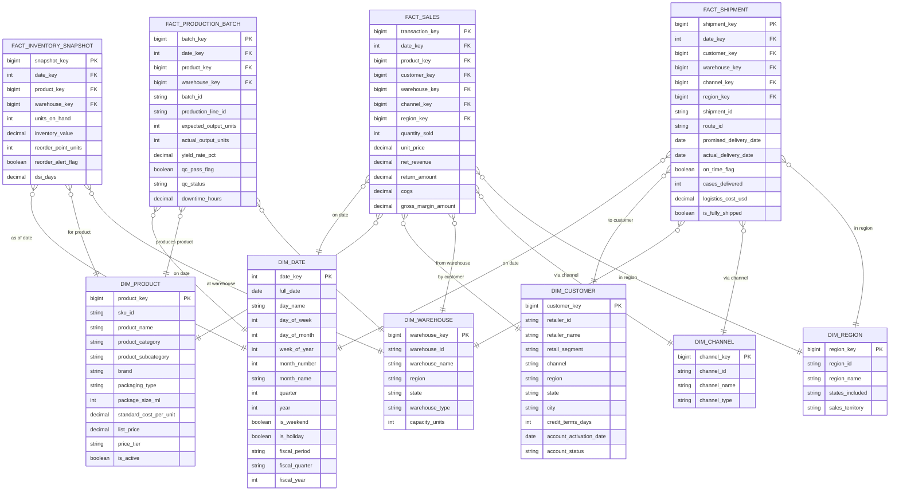

# Gold Layer Schema — FreshSip Beverages CPG Data Platform

**Version:** 1.0
**Date:** 2026-04-05
**Author:** Data Architect Agent
**Layer:** Gold — Star Schema, Pre-Computed KPIs, Dashboard-Ready
**Database:** `gld_freshsip` (Hive Metastore)

---

## Design Principles

- **Star schema:** Fact tables surrounded by conformed dimension tables
- **Pre-computed KPIs:** All 20 KPIs from the KPI Registry are materialized as Gold tables
- **Partition by date:** Every table partitioned by a relevant date column
- **Z-order:** Columns matching dashboard filter predicates
- **Overwrite strategy:** KPI tables fully overwritten on each scheduled run (idempotent)
- **Fact tables:** Use MERGE on surrogate key; updated incrementally from Silver
- **Dimension tables:** Refreshed from Silver current-version data; dim_date is seeded once

---

## Star Schema ER Diagram



---

## Part 1: Dimension Tables

---

### Table: `gld_freshsip.dim_date`

**Layer:** Gold
**Domain:** Shared Dimension
**Description:** Date dimension table covering all dates in the data platform; seeded once for 5 years surrounding the project date range; supports all date-based filtering and period comparisons.
**Source:** Generated (no Silver source); seeded by pipeline
**Partition Key:** `year` (integer partition for full-year pruning)
**Z-Order Columns:** `full_date`
**Primary Key:** `date_key`
**Update Strategy:** Append-only (append new years as needed)

| Column Name | Data Type | Nullable | Description |
|---|---|---|---|
| `date_key` | INTEGER | NOT NULL | Surrogate key in YYYYMMDD integer format (e.g., 20260405) |
| `full_date` | DATE | NOT NULL | The calendar date |
| `day_name` | STRING | NOT NULL | Full day name (Monday through Sunday) |
| `day_of_week` | INTEGER | NOT NULL | Day number 1 (Monday) to 7 (Sunday) per ISO 8601 |
| `day_of_month` | INTEGER | NOT NULL | Day number within month (1–31) |
| `week_of_year` | INTEGER | NOT NULL | ISO week number (1–53) |
| `month_number` | INTEGER | NOT NULL | Month number (1–12) |
| `month_name` | STRING | NOT NULL | Full month name (January through December) |
| `quarter` | INTEGER | NOT NULL | Calendar quarter (1–4) |
| `year` | INTEGER | NOT NULL | Calendar year (partition key) |
| `is_weekend` | BOOLEAN | NOT NULL | TRUE if Saturday or Sunday |
| `is_holiday` | BOOLEAN | NOT NULL | TRUE if US federal holiday |
| `holiday_name` | STRING | YES | Name of holiday if is_holiday = true |
| `fiscal_period` | STRING | NOT NULL | Fiscal month label (FY_YYYY_MM format) |
| `fiscal_quarter` | STRING | NOT NULL | Fiscal quarter label (FY_YYYY_Q# format) |
| `fiscal_year` | INTEGER | NOT NULL | Fiscal year (FreshSip fiscal year = calendar year) |
| `days_in_month` | INTEGER | NOT NULL | Number of days in this calendar month |
| `is_month_end` | BOOLEAN | NOT NULL | TRUE if last day of the calendar month |
| `is_quarter_end` | BOOLEAN | NOT NULL | TRUE if last day of the quarter |
| `is_year_end` | BOOLEAN | NOT NULL | TRUE if December 31 |

**CREATE TABLE DDL:**
```sql
CREATE TABLE IF NOT EXISTS gld_freshsip.dim_date (
    date_key        INTEGER   NOT NULL,
    full_date       DATE      NOT NULL,
    day_name        STRING    NOT NULL,
    day_of_week     INTEGER   NOT NULL,
    day_of_month    INTEGER   NOT NULL,
    week_of_year    INTEGER   NOT NULL,
    month_number    INTEGER   NOT NULL,
    month_name      STRING    NOT NULL,
    quarter         INTEGER   NOT NULL,
    year            INTEGER   NOT NULL,
    is_weekend      BOOLEAN   NOT NULL,
    is_holiday      BOOLEAN   NOT NULL,
    holiday_name    STRING,
    fiscal_period   STRING    NOT NULL,
    fiscal_quarter  STRING    NOT NULL,
    fiscal_year     INTEGER   NOT NULL,
    days_in_month   INTEGER   NOT NULL,
    is_month_end    BOOLEAN   NOT NULL,
    is_quarter_end  BOOLEAN   NOT NULL,
    is_year_end     BOOLEAN   NOT NULL,
    CONSTRAINT pk_dim_date PRIMARY KEY (date_key)
)
USING DELTA
PARTITIONED BY (year)
TBLPROPERTIES (
    'delta.autoOptimize.optimizeWrite' = 'true'
);
```

---

### Table: `gld_freshsip.dim_product`

**Layer:** Gold
**Domain:** Shared Dimension
**Description:** Current-version product dimension; sourced from `slv_freshsip.ref_products`; one row per active SKU.
**Source:** `slv_freshsip.ref_products`
**Partition Key:** `product_category`
**Z-Order Columns:** `sku_id`, `price_tier`
**Primary Key:** `product_key`
**Update Strategy:** Full overwrite on daily pipeline run

| Column Name | Data Type | Nullable | Description |
|---|---|---|---|
| `product_key` | BIGINT | NOT NULL | Surrogate key (hash of sku_id) |
| `sku_id` | STRING | NOT NULL | Business key |
| `product_name` | STRING | NOT NULL | Full product name |
| `product_category` | STRING | NOT NULL | Category (partition key) |
| `product_subcategory` | STRING | YES | Subcategory |
| `brand` | STRING | NOT NULL | Brand |
| `packaging_type` | STRING | NOT NULL | Package type |
| `package_size_ml` | INTEGER | NOT NULL | Package size in milliliters |
| `standard_cost_per_unit` | DECIMAL(10,4) | NOT NULL | Standard cost (used in margin KPIs) |
| `list_price` | DECIMAL(10,4) | NOT NULL | Standard list price |
| `price_tier` | STRING | NOT NULL | Price tier |
| `is_active` | BOOLEAN | NOT NULL | Active SKU flag |
| `last_refreshed_at` | TIMESTAMP | NOT NULL | When dimension was last refreshed |

**CREATE TABLE DDL:**
```sql
CREATE TABLE IF NOT EXISTS gld_freshsip.dim_product (
    product_key             BIGINT        NOT NULL,
    sku_id                  STRING        NOT NULL,
    product_name            STRING        NOT NULL,
    product_category        STRING        NOT NULL,
    product_subcategory     STRING,
    brand                   STRING        NOT NULL,
    packaging_type          STRING        NOT NULL,
    package_size_ml         INTEGER       NOT NULL,
    standard_cost_per_unit  DECIMAL(10,4) NOT NULL,
    list_price              DECIMAL(10,4) NOT NULL,
    price_tier              STRING        NOT NULL,
    is_active               BOOLEAN       NOT NULL,
    last_refreshed_at       TIMESTAMP     NOT NULL,
    CONSTRAINT pk_dim_product PRIMARY KEY (product_key)
)
USING DELTA
PARTITIONED BY (product_category)
TBLPROPERTIES (
    'delta.autoOptimize.optimizeWrite' = 'true'
);
```

---

### Table: `gld_freshsip.dim_customer`

**Layer:** Gold
**Domain:** Shared Dimension
**Description:** Current-version customer/retailer dimension; sourced from `slv_freshsip.customers` where `is_current = true`.
**Source:** `slv_freshsip.customers`
**Partition Key:** `region`
**Z-Order Columns:** `retailer_id`, `retail_segment`
**Primary Key:** `customer_key`
**Update Strategy:** Full overwrite on daily pipeline run

| Column Name | Data Type | Nullable | Description |
|---|---|---|---|
| `customer_key` | BIGINT | NOT NULL | Surrogate key (hash of retailer_id) |
| `retailer_id` | STRING | NOT NULL | Business key |
| `retailer_name` | STRING | NOT NULL | Retailer business name |
| `retail_segment` | STRING | NOT NULL | Segment classification |
| `channel` | STRING | NOT NULL | Distribution channel |
| `region` | STRING | NOT NULL | US region (partition key) |
| `state` | STRING | NOT NULL | US state |
| `city` | STRING | YES | City name |
| `credit_terms_days` | INTEGER | NOT NULL | Net payment terms |
| `account_activation_date` | DATE | NOT NULL | Account activation date |
| `account_status` | STRING | NOT NULL | Account status |
| `last_refreshed_at` | TIMESTAMP | NOT NULL | When dimension was last refreshed |

**CREATE TABLE DDL:**
```sql
CREATE TABLE IF NOT EXISTS gld_freshsip.dim_customer (
    customer_key            BIGINT    NOT NULL,
    retailer_id             STRING    NOT NULL,
    retailer_name           STRING    NOT NULL,
    retail_segment          STRING    NOT NULL,
    channel                 STRING    NOT NULL,
    region                  STRING    NOT NULL,
    state                   STRING    NOT NULL,
    city                    STRING,
    credit_terms_days       INTEGER   NOT NULL,
    account_activation_date DATE      NOT NULL,
    account_status          STRING    NOT NULL,
    last_refreshed_at       TIMESTAMP NOT NULL,
    CONSTRAINT pk_dim_customer PRIMARY KEY (customer_key)
)
USING DELTA
PARTITIONED BY (region)
TBLPROPERTIES (
    'delta.autoOptimize.optimizeWrite' = 'true'
);
```

---

### Table: `gld_freshsip.dim_warehouse`

**Layer:** Gold
**Domain:** Shared Dimension
**Description:** Warehouse dimension table; seeded from inventory data; one row per physical warehouse.
**Source:** Seeded from `slv_freshsip.inventory_stock` distinct warehouse_id values + reference file
**Partition Key:** `region`
**Z-Order Columns:** `warehouse_id`
**Primary Key:** `warehouse_key`
**Update Strategy:** Overwrite on pipeline run

| Column Name | Data Type | Nullable | Description |
|---|---|---|---|
| `warehouse_key` | BIGINT | NOT NULL | Surrogate key |
| `warehouse_id` | STRING | NOT NULL | Business key |
| `warehouse_name` | STRING | NOT NULL | Human-readable warehouse name |
| `region` | STRING | NOT NULL | US region (partition key) |
| `state` | STRING | NOT NULL | US state |
| `warehouse_type` | STRING | NOT NULL | Type (Distribution Center, Production Facility, Cold Storage) |
| `capacity_units` | INTEGER | NOT NULL | Max capacity in standard cases |
| `last_refreshed_at` | TIMESTAMP | NOT NULL | When dimension was last refreshed |

**CREATE TABLE DDL:**
```sql
CREATE TABLE IF NOT EXISTS gld_freshsip.dim_warehouse (
    warehouse_key       BIGINT    NOT NULL,
    warehouse_id        STRING    NOT NULL,
    warehouse_name      STRING    NOT NULL,
    region              STRING    NOT NULL,
    state               STRING    NOT NULL,
    warehouse_type      STRING    NOT NULL,
    capacity_units      INTEGER   NOT NULL,
    last_refreshed_at   TIMESTAMP NOT NULL,
    CONSTRAINT pk_dim_warehouse PRIMARY KEY (warehouse_key)
)
USING DELTA
PARTITIONED BY (region)
TBLPROPERTIES (
    'delta.autoOptimize.optimizeWrite' = 'true'
);
```

---

### Table: `gld_freshsip.dim_region`

**Layer:** Gold
**Domain:** Shared Dimension
**Description:** Region dimension; maps US regions to their constituent states and sales territories.
**Source:** Seeded from reference configuration file; 5 US regions
**Partition Key:** None (tiny table; 5 rows)
**Primary Key:** `region_key`
**Update Strategy:** Full overwrite

| Column Name | Data Type | Nullable | Description |
|---|---|---|---|
| `region_key` | BIGINT | NOT NULL | Surrogate key |
| `region_id` | STRING | NOT NULL | Short region code (e.g., NE, SE, MW, SW, W) |
| `region_name` | STRING | NOT NULL | Full region name (e.g., Northeast, Southeast) |
| `states_included` | STRING | NOT NULL | Comma-separated list of US state codes in this region |
| `sales_territory` | STRING | NOT NULL | Sales territory manager assignment |
| `last_refreshed_at` | TIMESTAMP | NOT NULL | When dimension was last refreshed |

**CREATE TABLE DDL:**
```sql
CREATE TABLE IF NOT EXISTS gld_freshsip.dim_region (
    region_key          BIGINT    NOT NULL,
    region_id           STRING    NOT NULL,
    region_name         STRING    NOT NULL,
    states_included     STRING    NOT NULL,
    sales_territory     STRING    NOT NULL,
    last_refreshed_at   TIMESTAMP NOT NULL,
    CONSTRAINT pk_dim_region PRIMARY KEY (region_key)
)
USING DELTA
TBLPROPERTIES (
    'delta.autoOptimize.optimizeWrite' = 'true'
);
```

---

### Table: `gld_freshsip.dim_channel`

**Layer:** Gold
**Domain:** Shared Dimension
**Description:** Distribution channel dimension; three channels (Retail, Wholesale, DTC).
**Source:** Seeded from reference configuration
**Partition Key:** None (tiny table; 3 rows)
**Primary Key:** `channel_key`
**Update Strategy:** Full overwrite

| Column Name | Data Type | Nullable | Description |
|---|---|---|---|
| `channel_key` | BIGINT | NOT NULL | Surrogate key |
| `channel_id` | STRING | NOT NULL | Short code (RETAIL, WHOLESALE, DTC) |
| `channel_name` | STRING | NOT NULL | Full channel name |
| `channel_type` | STRING | NOT NULL | Indirect vs. Direct classification |
| `last_refreshed_at` | TIMESTAMP | NOT NULL | When dimension was last refreshed |

**CREATE TABLE DDL:**
```sql
CREATE TABLE IF NOT EXISTS gld_freshsip.dim_channel (
    channel_key         BIGINT    NOT NULL,
    channel_id          STRING    NOT NULL,
    channel_name        STRING    NOT NULL,
    channel_type        STRING    NOT NULL,
    last_refreshed_at   TIMESTAMP NOT NULL,
    CONSTRAINT pk_dim_channel PRIMARY KEY (channel_key)
)
USING DELTA
TBLPROPERTIES (
    'delta.autoOptimize.optimizeWrite' = 'true'
);
```

---

## Part 2: Fact Tables

---

### Table: `gld_freshsip.fact_sales`

**Layer:** Gold
**Domain:** Sales
**Description:** Sales fact table at transaction-line grain; each row is one sale line with all foreign keys to dimensions and computed revenue and cost measures.
**Source:** `slv_freshsip.sales_transactions`, `slv_freshsip.sales_returns`, `slv_freshsip.ref_products`
**Partition Key:** `transaction_date`
**Z-Order Columns:** `product_key`, `customer_key`, `region_key`, `channel_key`
**Primary Key:** `transaction_key`
**Update Strategy:** Delta MERGE on `transaction_key`; incremental load from Silver

| Column Name | Data Type | Nullable | Description |
|---|---|---|---|
| `transaction_key` | BIGINT | NOT NULL | FK to Silver sales_transactions.transaction_key |
| `date_key` | INTEGER | NOT NULL | FK to dim_date (YYYYMMDD format) |
| `product_key` | BIGINT | NOT NULL | FK to dim_product |
| `customer_key` | BIGINT | NOT NULL | FK to dim_customer |
| `warehouse_key` | BIGINT | YES | FK to dim_warehouse (null for DTC pure-POS) |
| `channel_key` | BIGINT | NOT NULL | FK to dim_channel |
| `region_key` | BIGINT | NOT NULL | FK to dim_region |
| `transaction_date` | DATE | NOT NULL | Calendar date (partition key) |
| `sku_id` | STRING | NOT NULL | Denormalized for query convenience |
| `retailer_id` | STRING | NOT NULL | Denormalized for query convenience |
| `quantity_sold` | INTEGER | NOT NULL | Units sold |
| `unit_price` | DECIMAL(10,4) | NOT NULL | Invoice unit price in USD |
| `gross_sales_amount` | DECIMAL(14,4) | NOT NULL | `unit_price * quantity_sold` |
| `return_amount` | DECIMAL(14,4) | NOT NULL | Return credit amount (0 if no returns) |
| `net_revenue` | DECIMAL(14,4) | NOT NULL | `gross_sales_amount - return_amount` |
| `cogs` | DECIMAL(14,4) | NOT NULL | `standard_cost_per_unit * quantity_sold` |
| `gross_margin_amount` | DECIMAL(14,4) | NOT NULL | `net_revenue - cogs` |
| `gross_margin_pct` | DECIMAL(6,4) | YES | `gross_margin_amount / net_revenue` (null if net_revenue = 0) |
| `last_updated_ts` | TIMESTAMP | NOT NULL | When this fact row was last updated |

**CREATE TABLE DDL:**
```sql
CREATE TABLE IF NOT EXISTS gld_freshsip.fact_sales (
    transaction_key     BIGINT        NOT NULL,
    date_key            INTEGER       NOT NULL,
    product_key         BIGINT        NOT NULL,
    customer_key        BIGINT        NOT NULL,
    warehouse_key       BIGINT,
    channel_key         BIGINT        NOT NULL,
    region_key          BIGINT        NOT NULL,
    transaction_date    DATE          NOT NULL,
    sku_id              STRING        NOT NULL,
    retailer_id         STRING        NOT NULL,
    quantity_sold       INTEGER       NOT NULL,
    unit_price          DECIMAL(10,4) NOT NULL,
    gross_sales_amount  DECIMAL(14,4) NOT NULL,
    return_amount       DECIMAL(14,4) NOT NULL,
    net_revenue         DECIMAL(14,4) NOT NULL,
    cogs                DECIMAL(14,4) NOT NULL,
    gross_margin_amount DECIMAL(14,4) NOT NULL,
    gross_margin_pct    DECIMAL(6,4),
    last_updated_ts     TIMESTAMP     NOT NULL
)
USING DELTA
PARTITIONED BY (transaction_date)
TBLPROPERTIES (
    'delta.autoOptimize.optimizeWrite' = 'true',
    'delta.autoOptimize.autoCompact'   = 'true'
)
-- After CREATE: OPTIMIZE gld_freshsip.fact_sales ZORDER BY (product_key, customer_key, region_key, channel_key);
```

---

### Table: `gld_freshsip.fact_inventory_snapshot`

**Layer:** Gold
**Domain:** Inventory
**Description:** Daily inventory snapshot fact; one row per (sku, warehouse, snapshot date); includes reorder alert flag and DSI computation.
**Source:** `slv_freshsip.inventory_stock`, `slv_freshsip.ref_reorder_points`, `slv_freshsip.sales_transactions` (for DSI avg daily sales)
**Partition Key:** `snapshot_date`
**Z-Order Columns:** `product_key`, `warehouse_key`
**Primary Key:** `snapshot_key`
**Update Strategy:** Delta MERGE on (`snapshot_key`); daily full refresh for current day

| Column Name | Data Type | Nullable | Description |
|---|---|---|---|
| `snapshot_key` | BIGINT | NOT NULL | Surrogate key (hash of sku_id + warehouse_id + snapshot_date) |
| `date_key` | INTEGER | NOT NULL | FK to dim_date |
| `product_key` | BIGINT | NOT NULL | FK to dim_product |
| `warehouse_key` | BIGINT | NOT NULL | FK to dim_warehouse |
| `snapshot_date` | DATE | NOT NULL | Date of snapshot (partition key) |
| `sku_id` | STRING | NOT NULL | Denormalized |
| `warehouse_id` | STRING | NOT NULL | Denormalized |
| `units_on_hand` | INTEGER | NOT NULL | Current units in warehouse |
| `inventory_value` | DECIMAL(18,4) | NOT NULL | `units_on_hand * standard_cost_per_unit` |
| `reorder_point_units` | INTEGER | NOT NULL | Reorder threshold for this SKU/warehouse |
| `reorder_alert_flag` | BOOLEAN | NOT NULL | TRUE if `units_on_hand <= reorder_point_units` |
| `avg_daily_sales_units` | DECIMAL(10,4) | YES | Trailing 30-day average daily sales (for DSI) |
| `dsi_days` | DECIMAL(8,2) | YES | `units_on_hand / avg_daily_sales_units` |
| `last_updated_ts` | TIMESTAMP | NOT NULL | When this row was last computed |

**CREATE TABLE DDL:**
```sql
CREATE TABLE IF NOT EXISTS gld_freshsip.fact_inventory_snapshot (
    snapshot_key            BIGINT        NOT NULL,
    date_key                INTEGER       NOT NULL,
    product_key             BIGINT        NOT NULL,
    warehouse_key           BIGINT        NOT NULL,
    snapshot_date           DATE          NOT NULL,
    sku_id                  STRING        NOT NULL,
    warehouse_id            STRING        NOT NULL,
    units_on_hand           INTEGER       NOT NULL,
    inventory_value         DECIMAL(18,4) NOT NULL,
    reorder_point_units     INTEGER       NOT NULL,
    reorder_alert_flag      BOOLEAN       NOT NULL,
    avg_daily_sales_units   DECIMAL(10,4),
    dsi_days                DECIMAL(8,2),
    last_updated_ts         TIMESTAMP     NOT NULL
)
USING DELTA
PARTITIONED BY (snapshot_date)
TBLPROPERTIES (
    'delta.autoOptimize.optimizeWrite' = 'true',
    'delta.autoOptimize.autoCompact'   = 'true'
)
-- After CREATE: OPTIMIZE gld_freshsip.fact_inventory_snapshot ZORDER BY (product_key, warehouse_key);
```

---

### Table: `gld_freshsip.fact_production_batch`

**Layer:** Gold
**Domain:** Production
**Description:** Production batch fact table; one row per batch_id with yield rate, QC result, and downtime hours from related events.
**Source:** `slv_freshsip.production_batches`, `slv_freshsip.production_events`
**Partition Key:** `batch_date`
**Z-Order Columns:** `product_key`, `warehouse_key`
**Primary Key:** `batch_key`
**Update Strategy:** Delta MERGE on `batch_key`; micro-batch update as IoT events arrive

| Column Name | Data Type | Nullable | Description |
|---|---|---|---|
| `batch_key` | BIGINT | NOT NULL | Surrogate key (from Silver batch_key) |
| `date_key` | INTEGER | NOT NULL | FK to dim_date (based on batch_date) |
| `product_key` | BIGINT | NOT NULL | FK to dim_product |
| `warehouse_key` | BIGINT | NOT NULL | FK to dim_warehouse |
| `batch_id` | STRING | NOT NULL | Denormalized batch identifier |
| `production_line_id` | STRING | NOT NULL | Denormalized |
| `batch_date` | DATE | NOT NULL | Date of batch start (partition key) |
| `expected_output_units` | INTEGER | NOT NULL | Planned output cases |
| `actual_output_units` | INTEGER | YES | Actual output (null until batch complete) |
| `yield_rate_pct` | DECIMAL(6,2) | YES | `actual / expected * 100` |
| `qc_pass_flag` | BOOLEAN | YES | TRUE if QC passed |
| `qc_status` | STRING | YES | QC result string |
| `downtime_hours` | DECIMAL(8,2) | NOT NULL | Total unplanned downtime for this batch (0 if none) |
| `last_updated_ts` | TIMESTAMP | NOT NULL | When this fact row was last updated |

**CREATE TABLE DDL:**
```sql
CREATE TABLE IF NOT EXISTS gld_freshsip.fact_production_batch (
    batch_key               BIGINT       NOT NULL,
    date_key                INTEGER      NOT NULL,
    product_key             BIGINT       NOT NULL,
    warehouse_key           BIGINT       NOT NULL,
    batch_id                STRING       NOT NULL,
    production_line_id      STRING       NOT NULL,
    batch_date              DATE         NOT NULL,
    expected_output_units   INTEGER      NOT NULL,
    actual_output_units     INTEGER,
    yield_rate_pct          DECIMAL(6,2),
    qc_pass_flag            BOOLEAN,
    qc_status               STRING,
    downtime_hours          DECIMAL(8,2) NOT NULL,
    last_updated_ts         TIMESTAMP    NOT NULL
)
USING DELTA
PARTITIONED BY (batch_date)
TBLPROPERTIES (
    'delta.autoOptimize.optimizeWrite' = 'true',
    'delta.autoOptimize.autoCompact'   = 'true'
)
-- After CREATE: OPTIMIZE gld_freshsip.fact_production_batch ZORDER BY (product_key, warehouse_key);
```

---

### Table: `gld_freshsip.fact_shipment`

**Layer:** Gold
**Domain:** Distribution
**Description:** Shipment fact table; one row per shipment with delivery performance and cost metrics.
**Source:** `slv_freshsip.shipments`
**Partition Key:** `ship_date`
**Z-Order Columns:** `channel_key`, `region_key`, `warehouse_key`
**Primary Key:** `shipment_key`
**Update Strategy:** Delta MERGE on `shipment_key`

| Column Name | Data Type | Nullable | Description |
|---|---|---|---|
| `shipment_key` | BIGINT | NOT NULL | Surrogate key (from Silver shipment_key) |
| `date_key` | INTEGER | NOT NULL | FK to dim_date (ship_date) |
| `customer_key` | BIGINT | NOT NULL | FK to dim_customer |
| `warehouse_key` | BIGINT | NOT NULL | FK to dim_warehouse |
| `channel_key` | BIGINT | NOT NULL | FK to dim_channel |
| `region_key` | BIGINT | NOT NULL | FK to dim_region |
| `shipment_id` | STRING | NOT NULL | Denormalized |
| `route_id` | STRING | NOT NULL | Denormalized |
| `ship_date` | DATE | NOT NULL | Departure date (partition key) |
| `promised_delivery_date` | DATE | NOT NULL | Committed delivery date |
| `actual_delivery_date` | DATE | YES | Actual delivery (null if not yet delivered) |
| `on_time_flag` | BOOLEAN | YES | TRUE if on or before promised date |
| `cases_delivered` | INTEGER | NOT NULL | Cases delivered |
| `logistics_cost_usd` | DECIMAL(14,4) | NOT NULL | Total logistics cost |
| `is_fully_shipped` | BOOLEAN | NOT NULL | All items shipped flag |
| `last_updated_ts` | TIMESTAMP | NOT NULL | When this row was last updated |

**CREATE TABLE DDL:**
```sql
CREATE TABLE IF NOT EXISTS gld_freshsip.fact_shipment (
    shipment_key            BIGINT        NOT NULL,
    date_key                INTEGER       NOT NULL,
    customer_key            BIGINT        NOT NULL,
    warehouse_key           BIGINT        NOT NULL,
    channel_key             BIGINT        NOT NULL,
    region_key              BIGINT        NOT NULL,
    shipment_id             STRING        NOT NULL,
    route_id                STRING        NOT NULL,
    ship_date               DATE          NOT NULL,
    promised_delivery_date  DATE          NOT NULL,
    actual_delivery_date    DATE,
    on_time_flag            BOOLEAN,
    cases_delivered         INTEGER       NOT NULL,
    logistics_cost_usd      DECIMAL(14,4) NOT NULL,
    is_fully_shipped        BOOLEAN       NOT NULL,
    last_updated_ts         TIMESTAMP     NOT NULL
)
USING DELTA
PARTITIONED BY (ship_date)
TBLPROPERTIES (
    'delta.autoOptimize.optimizeWrite' = 'true',
    'delta.autoOptimize.autoCompact'   = 'true'
)
-- After CREATE: OPTIMIZE gld_freshsip.fact_shipment ZORDER BY (channel_key, region_key, warehouse_key);
```

---

## Part 3: KPI Tables

---

### Table: `gld_freshsip.sales_daily_revenue` — KPI-S01

**Description:** Daily net revenue aggregated by product_category, region, and channel; refreshed hourly; primary sales KPI.
**Source:** `slv_freshsip.sales_transactions`, `slv_freshsip.sales_returns`, `slv_freshsip.ref_products`
**Partition Key:** `report_date`
**Z-Order Columns:** `product_category`, `region`, `channel`
**Refresh Frequency:** Hourly
**Update Strategy:** Overwrite for current date partition; append for prior dates (idempotent)

| Column Name | Data Type | Nullable | Description |
|---|---|---|---|
| `revenue_key` | BIGINT | NOT NULL | Surrogate key (hash of report_date + product_category + region + channel) |
| `report_date` | DATE | NOT NULL | Business date (partition key) |
| `product_category` | STRING | NOT NULL | Product category |
| `region` | STRING | NOT NULL | US region |
| `channel` | STRING | NOT NULL | Distribution channel |
| `gross_sales_amount` | DECIMAL(18,4) | NOT NULL | `SUM(unit_price * quantity_sold)` |
| `return_amount` | DECIMAL(18,4) | NOT NULL | `SUM(return_amount)` for the day |
| `net_revenue` | DECIMAL(18,4) | NOT NULL | `gross_sales_amount - return_amount` |
| `transaction_count` | INTEGER | NOT NULL | Number of transactions |
| `units_sold` | BIGINT | NOT NULL | Total units sold |
| `last_updated_ts` | TIMESTAMP | NOT NULL | When this row was computed |
| `data_as_of` | DATE | NOT NULL | Business date the KPI reflects |

**KPI-S01 Computation SQL:**
```sql
-- KPI-S01: Daily Revenue
INSERT OVERWRITE gld_freshsip.sales_daily_revenue
SELECT
    xxhash64(CONCAT(t.transaction_date, p.product_category, t.region, t.channel)) AS revenue_key,
    t.transaction_date                                                              AS report_date,
    p.product_category,
    t.region,
    t.channel,
    SUM(t.unit_price * t.quantity_sold)                                            AS gross_sales_amount,
    SUM(COALESCE(r.return_amount, 0))                                              AS return_amount,
    SUM(t.unit_price * t.quantity_sold) - SUM(COALESCE(r.return_amount, 0))       AS net_revenue,
    COUNT(DISTINCT t.transaction_id)                                               AS transaction_count,
    SUM(t.quantity_sold)                                                           AS units_sold,
    CURRENT_TIMESTAMP()                                                            AS last_updated_ts,
    t.transaction_date                                                             AS data_as_of
FROM slv_freshsip.sales_transactions t
JOIN slv_freshsip.ref_products p
    ON t.sku_id = p.sku_id
LEFT JOIN slv_freshsip.sales_returns r
    ON t.transaction_id = r.transaction_id
GROUP BY
    t.transaction_date,
    p.product_category,
    t.region,
    t.channel;
```

**CREATE TABLE DDL:**
```sql
CREATE TABLE IF NOT EXISTS gld_freshsip.sales_daily_revenue (
    revenue_key         BIGINT        NOT NULL,
    report_date         DATE          NOT NULL,
    product_category    STRING        NOT NULL,
    region              STRING        NOT NULL,
    channel             STRING        NOT NULL,
    gross_sales_amount  DECIMAL(18,4) NOT NULL,
    return_amount       DECIMAL(18,4) NOT NULL,
    net_revenue         DECIMAL(18,4) NOT NULL,
    transaction_count   INTEGER       NOT NULL,
    units_sold          BIGINT        NOT NULL,
    last_updated_ts     TIMESTAMP     NOT NULL,
    data_as_of          DATE          NOT NULL
)
USING DELTA
PARTITIONED BY (report_date)
TBLPROPERTIES (
    'delta.autoOptimize.optimizeWrite' = 'true',
    'delta.autoOptimize.autoCompact'   = 'true'
)
-- After CREATE: OPTIMIZE gld_freshsip.sales_daily_revenue ZORDER BY (product_category, region, channel);
```

---

### Table: `gld_freshsip.sales_period_comparison` — KPI-S02 (MoM) and KPI-S03 (YoY)

**Description:** Period-over-period revenue comparison; computes MoM% and YoY% by product_category, region, and channel; refreshed daily.
**Source:** `gld_freshsip.sales_daily_revenue`
**Partition Key:** `comparison_month`
**Refresh Frequency:** Daily at 06:00 UTC
**Update Strategy:** Overwrite current month partition

| Column Name | Data Type | Nullable | Description |
|---|---|---|---|
| `comparison_key` | BIGINT | NOT NULL | Surrogate key |
| `comparison_month` | STRING | NOT NULL | Year-month label (YYYY-MM) — partition key |
| `product_category` | STRING | NOT NULL | Product category |
| `region` | STRING | NOT NULL | US region |
| `channel` | STRING | NOT NULL | Distribution channel |
| `current_month_revenue` | DECIMAL(18,4) | NOT NULL | MTD revenue for current_month |
| `prior_month_revenue` | DECIMAL(18,4) | NOT NULL | MTD revenue for same window in prior month |
| `mom_pct_change` | DECIMAL(8,4) | YES | MoM % change (null if prior_month_revenue = 0) |
| `current_ytd_revenue` | DECIMAL(18,4) | NOT NULL | YTD revenue for current year |
| `prior_ytd_revenue` | DECIMAL(18,4) | NOT NULL | YTD revenue for same period prior year |
| `yoy_pct_change` | DECIMAL(8,4) | YES | YoY % change (null if prior_ytd_revenue = 0) |
| `last_updated_ts` | TIMESTAMP | NOT NULL | When computed |
| `data_as_of` | DATE | NOT NULL | Business date |

**KPI-S02/S03 Computation SQL:**
```sql
-- KPI-S02 and KPI-S03: Revenue Period Comparison
INSERT OVERWRITE gld_freshsip.sales_period_comparison
WITH monthly_revenue AS (
    SELECT
        TRUNC(report_date, 'MM')             AS year_month,
        YEAR(report_date)                    AS yr,
        product_category,
        region,
        channel,
        SUM(net_revenue)                     AS monthly_net_revenue
    FROM gld_freshsip.sales_daily_revenue
    GROUP BY TRUNC(report_date, 'MM'), YEAR(report_date), product_category, region, channel
),
current_period AS (
    SELECT * FROM monthly_revenue
    WHERE year_month = TRUNC(CURRENT_DATE(), 'MM')
),
prior_month_period AS (
    SELECT * FROM monthly_revenue
    WHERE year_month = TRUNC(ADD_MONTHS(CURRENT_DATE(), -1), 'MM')
),
ytd_current AS (
    SELECT product_category, region, channel, SUM(monthly_net_revenue) AS ytd_revenue
    FROM monthly_revenue
    WHERE yr = YEAR(CURRENT_DATE())
    GROUP BY product_category, region, channel
),
ytd_prior AS (
    SELECT product_category, region, channel, SUM(monthly_net_revenue) AS ytd_revenue
    FROM monthly_revenue
    WHERE yr = YEAR(CURRENT_DATE()) - 1
    GROUP BY product_category, region, channel
)
SELECT
    xxhash64(CONCAT(CAST(TRUNC(CURRENT_DATE(), 'MM') AS STRING), c.product_category, c.region, c.channel)) AS comparison_key,
    TRUNC(CURRENT_DATE(), 'MM')                                                                            AS comparison_month,
    c.product_category,
    c.region,
    c.channel,
    COALESCE(c.monthly_net_revenue, 0)                                                                 AS current_month_revenue,
    COALESCE(pm.monthly_net_revenue, 0)                                                                AS prior_month_revenue,
    (COALESCE(c.monthly_net_revenue, 0) - COALESCE(pm.monthly_net_revenue, 0))
        / NULLIF(COALESCE(pm.monthly_net_revenue, 0), 0) * 100                                        AS mom_pct_change,
    COALESCE(yc.ytd_revenue, 0)                                                                        AS current_ytd_revenue,
    COALESCE(yp.ytd_revenue, 0)                                                                        AS prior_ytd_revenue,
    (COALESCE(yc.ytd_revenue, 0) - COALESCE(yp.ytd_revenue, 0))
        / NULLIF(COALESCE(yp.ytd_revenue, 0), 0) * 100                                                AS yoy_pct_change,
    CURRENT_TIMESTAMP()                                                                                AS last_updated_ts,
    CURRENT_DATE()                                                                                     AS data_as_of
FROM current_period c
LEFT JOIN prior_month_period pm
    ON c.product_category = pm.product_category AND c.region = pm.region AND c.channel = pm.channel
LEFT JOIN ytd_current yc
    ON c.product_category = yc.product_category AND c.region = yc.region AND c.channel = yc.channel
LEFT JOIN ytd_prior yp
    ON c.product_category = yp.product_category AND c.region = yp.region AND c.channel = yp.channel;
```

**CREATE TABLE DDL:**
```sql
CREATE TABLE IF NOT EXISTS gld_freshsip.sales_period_comparison (
    comparison_key          BIGINT        NOT NULL,
    comparison_month        STRING        NOT NULL,
    product_category        STRING        NOT NULL,
    region                  STRING        NOT NULL,
    channel                 STRING        NOT NULL,
    current_month_revenue   DECIMAL(18,4) NOT NULL,
    prior_month_revenue     DECIMAL(18,4) NOT NULL,
    mom_pct_change          DECIMAL(8,4),
    current_ytd_revenue     DECIMAL(18,4) NOT NULL,
    prior_ytd_revenue       DECIMAL(18,4) NOT NULL,
    yoy_pct_change          DECIMAL(8,4),
    last_updated_ts         TIMESTAMP     NOT NULL,
    data_as_of              DATE          NOT NULL
)
USING DELTA
PARTITIONED BY (comparison_month)
TBLPROPERTIES (
    'delta.autoOptimize.optimizeWrite' = 'true'
);
```

---

### Table: `gld_freshsip.sales_gross_margin_sku` — KPI-S04

**Description:** Weekly gross margin percentage by SKU and product_category; flags SKUs below margin threshold.
**Source:** `slv_freshsip.sales_transactions`, `slv_freshsip.sales_returns`, `slv_freshsip.ref_products`
**Partition Key:** `week_start_date`
**Z-Order Columns:** `sku_id`, `product_category`
**Refresh Frequency:** Daily at 06:00 UTC
**Update Strategy:** Overwrite current week partition

| Column Name | Data Type | Nullable | Description |
|---|---|---|---|
| `margin_key` | BIGINT | NOT NULL | Surrogate key |
| `week_start_date` | DATE | NOT NULL | Monday of the reporting week (partition key) |
| `sku_id` | STRING | NOT NULL | Product SKU |
| `product_category` | STRING | NOT NULL | Product category |
| `product_name` | STRING | NOT NULL | Product name |
| `net_revenue` | DECIMAL(18,4) | NOT NULL | Net revenue for week |
| `cogs` | DECIMAL(18,4) | NOT NULL | Cost of goods sold |
| `gross_margin_amount` | DECIMAL(18,4) | NOT NULL | `net_revenue - cogs` |
| `gross_margin_pct` | DECIMAL(8,4) | YES | `gross_margin_amount / net_revenue * 100` |
| `units_sold` | BIGINT | NOT NULL | Units sold |
| `margin_alert_flag` | BOOLEAN | NOT NULL | TRUE if gross_margin_pct < 30% |
| `is_partial_week` | BOOLEAN | NOT NULL | TRUE if the current week is not yet complete |
| `last_updated_ts` | TIMESTAMP | NOT NULL | When computed |

**KPI-S04 Computation SQL:**
```sql
-- KPI-S04: Gross Margin by SKU (weekly)
INSERT OVERWRITE gld_freshsip.sales_gross_margin_sku
SELECT
    xxhash64(CONCAT(DATE_TRUNC('WEEK', t.transaction_date), t.sku_id))            AS margin_key,
    CAST(DATE_TRUNC('WEEK', t.transaction_date) AS DATE)                           AS week_start_date,
    t.sku_id,
    p.product_category,
    p.product_name,
    SUM(t.unit_price * t.quantity_sold) - SUM(COALESCE(r.return_amount, 0))       AS net_revenue,
    SUM(p.standard_cost_per_unit * t.quantity_sold)                                AS cogs,
    (SUM(t.unit_price * t.quantity_sold) - SUM(COALESCE(r.return_amount, 0)))
        - SUM(p.standard_cost_per_unit * t.quantity_sold)                          AS gross_margin_amount,
    ((SUM(t.unit_price * t.quantity_sold) - SUM(COALESCE(r.return_amount, 0)))
        - SUM(p.standard_cost_per_unit * t.quantity_sold))
        / NULLIF(SUM(t.unit_price * t.quantity_sold) - SUM(COALESCE(r.return_amount, 0)), 0) * 100
                                                                                   AS gross_margin_pct,
    SUM(t.quantity_sold)                                                           AS units_sold,
    CASE
        WHEN ((SUM(t.unit_price * t.quantity_sold) - SUM(COALESCE(r.return_amount, 0)))
            - SUM(p.standard_cost_per_unit * t.quantity_sold))
            / NULLIF(SUM(t.unit_price * t.quantity_sold) - SUM(COALESCE(r.return_amount, 0)), 0) * 100 < 30
        THEN true
        ELSE false
    END                                                                            AS margin_alert_flag,
    CASE WHEN DATE_TRUNC('WEEK', CURRENT_DATE()) = DATE_TRUNC('WEEK', t.transaction_date)
         THEN true ELSE false
    END                                                                            AS is_partial_week,
    CURRENT_TIMESTAMP()                                                            AS last_updated_ts
FROM slv_freshsip.sales_transactions t
JOIN slv_freshsip.ref_products p ON t.sku_id = p.sku_id
LEFT JOIN slv_freshsip.sales_returns r ON t.transaction_id = r.transaction_id
GROUP BY DATE_TRUNC('WEEK', t.transaction_date), t.sku_id, p.product_category, p.product_name;
```

**CREATE TABLE DDL:**
```sql
CREATE TABLE IF NOT EXISTS gld_freshsip.sales_gross_margin_sku (
    margin_key          BIGINT        NOT NULL,
    week_start_date     DATE          NOT NULL,
    sku_id              STRING        NOT NULL,
    product_category    STRING        NOT NULL,
    product_name        STRING        NOT NULL,
    net_revenue         DECIMAL(18,4) NOT NULL,
    cogs                DECIMAL(18,4) NOT NULL,
    gross_margin_amount DECIMAL(18,4) NOT NULL,
    gross_margin_pct    DECIMAL(8,4),
    units_sold          BIGINT        NOT NULL,
    margin_alert_flag   BOOLEAN       NOT NULL,
    is_partial_week     BOOLEAN       NOT NULL,
    last_updated_ts     TIMESTAMP     NOT NULL
)
USING DELTA
PARTITIONED BY (week_start_date)
TBLPROPERTIES (
    'delta.autoOptimize.optimizeWrite' = 'true'
)
-- After CREATE: OPTIMIZE gld_freshsip.sales_gross_margin_sku ZORDER BY (sku_id, product_category);
```

---

### Table: `gld_freshsip.inventory_stock_levels` — KPI-I01 and KPI-I04

**Description:** Current inventory levels per SKU per warehouse with reorder alert flags; refreshed hourly; serves both I01 (stock level) and I04 (reorder alert).
**Source:** `slv_freshsip.inventory_stock`, `slv_freshsip.ref_reorder_points`, `slv_freshsip.ref_products`
**Partition Key:** `snapshot_date`
**Z-Order Columns:** `sku_id`, `warehouse_id`
**Refresh Frequency:** Hourly
**Update Strategy:** Overwrite current date partition

| Column Name | Data Type | Nullable | Description |
|---|---|---|---|
| `stock_level_key` | BIGINT | NOT NULL | Surrogate key |
| `snapshot_date` | DATE | NOT NULL | Date of snapshot (partition key) |
| `snapshot_timestamp` | TIMESTAMP | NOT NULL | Exact snapshot time |
| `sku_id` | STRING | NOT NULL | Product SKU |
| `warehouse_id` | STRING | NOT NULL | Warehouse identifier |
| `product_name` | STRING | NOT NULL | Denormalized product name |
| `product_category` | STRING | NOT NULL | Denormalized category |
| `units_on_hand` | INTEGER | NOT NULL | Current units in stock |
| `inventory_value` | DECIMAL(18,4) | NOT NULL | `units_on_hand * standard_cost_per_unit` |
| `reorder_point_units` | INTEGER | NOT NULL | Reorder threshold |
| `deficit_units` | INTEGER | NOT NULL | `reorder_point_units - units_on_hand` (negative = above threshold) |
| `reorder_alert_flag` | BOOLEAN | NOT NULL | TRUE if `units_on_hand <= reorder_point_units` |
| `stockout_flag` | BOOLEAN | NOT NULL | TRUE if `units_on_hand = 0` |
| `last_updated_ts` | TIMESTAMP | NOT NULL | When computed |

**KPI-I01/I04 Computation SQL:**
```sql
-- KPI-I01: Current Stock Level; KPI-I04: Reorder Alert Flag
INSERT OVERWRITE gld_freshsip.inventory_stock_levels
SELECT
    xxhash64(CONCAT(i.snapshot_date, i.sku_id, i.warehouse_id)) AS stock_level_key,
    i.snapshot_date,
    i.snapshot_timestamp,
    i.sku_id,
    i.warehouse_id,
    p.product_name,
    p.product_category,
    i.units_on_hand,
    i.inventory_value,
    r.reorder_point_units,
    r.reorder_point_units - i.units_on_hand                      AS deficit_units,
    CASE WHEN i.units_on_hand <= r.reorder_point_units THEN true ELSE false END
                                                                  AS reorder_alert_flag,
    CASE WHEN i.units_on_hand = 0 THEN true ELSE false END        AS stockout_flag,
    CURRENT_TIMESTAMP()                                           AS last_updated_ts
FROM slv_freshsip.inventory_stock i
JOIN slv_freshsip.ref_reorder_points r
    ON i.sku_id = r.sku_id AND i.warehouse_id = r.warehouse_id
JOIN slv_freshsip.ref_products p
    ON i.sku_id = p.sku_id
WHERE i.snapshot_date = CURRENT_DATE();
```

**CREATE TABLE DDL:**
```sql
CREATE TABLE IF NOT EXISTS gld_freshsip.inventory_stock_levels (
    stock_level_key     BIGINT        NOT NULL,
    snapshot_date       DATE          NOT NULL,
    snapshot_timestamp  TIMESTAMP     NOT NULL,
    sku_id              STRING        NOT NULL,
    warehouse_id        STRING        NOT NULL,
    product_name        STRING        NOT NULL,
    product_category    STRING        NOT NULL,
    units_on_hand       INTEGER       NOT NULL,
    inventory_value     DECIMAL(18,4) NOT NULL,
    reorder_point_units INTEGER       NOT NULL,
    deficit_units       INTEGER       NOT NULL,
    reorder_alert_flag  BOOLEAN       NOT NULL,
    stockout_flag       BOOLEAN       NOT NULL,
    last_updated_ts     TIMESTAMP     NOT NULL
)
USING DELTA
PARTITIONED BY (snapshot_date)
TBLPROPERTIES (
    'delta.autoOptimize.optimizeWrite' = 'true',
    'delta.autoOptimize.autoCompact'   = 'true'
)
-- After CREATE: OPTIMIZE gld_freshsip.inventory_stock_levels ZORDER BY (sku_id, warehouse_id);
```

---

### Table: `gld_freshsip.inventory_turnover` — KPI-I02

**Description:** Inventory turnover rate by warehouse; trailing 30-day rolling window; refreshed weekly.
**Source:** `slv_freshsip.inventory_stock`, `slv_freshsip.sales_transactions`, `slv_freshsip.ref_products`
**Partition Key:** `week_start_date`
**Refresh Frequency:** Weekly (Monday 05:00 UTC)
**Update Strategy:** Overwrite current week partition

| Column Name | Data Type | Nullable | Description |
|---|---|---|---|
| `turnover_key` | BIGINT | NOT NULL | Surrogate key |
| `week_start_date` | DATE | NOT NULL | Week of computation (partition key) |
| `warehouse_id` | STRING | NOT NULL | Warehouse identifier |
| `cogs_30d` | DECIMAL(18,4) | NOT NULL | Cost of goods sold in trailing 30 days |
| `avg_inventory_value_30d` | DECIMAL(18,4) | NOT NULL | Average inventory value over 30 days |
| `inventory_turnover_rate` | DECIMAL(8,4) | YES | `cogs_30d / avg_inventory_value_30d` |
| `annualized_turnover` | DECIMAL(8,4) | YES | `inventory_turnover_rate * 12` |
| `turnover_warn_flag` | BOOLEAN | NOT NULL | TRUE if turnover < 0.5x per 30-day window |
| `last_updated_ts` | TIMESTAMP | NOT NULL | When computed |

**KPI-I02 Computation SQL:**
```sql
-- KPI-I02: Inventory Turnover Rate
INSERT OVERWRITE gld_freshsip.inventory_turnover
WITH cogs_30d AS (
    SELECT
        t.transaction_date,
        i.warehouse_id,
        SUM(p.standard_cost_per_unit * t.quantity_sold) AS daily_cogs
    FROM slv_freshsip.sales_transactions t
    JOIN slv_freshsip.ref_products p ON t.sku_id = p.sku_id
    JOIN slv_freshsip.inventory_stock i
        ON t.sku_id = i.sku_id AND i.snapshot_date = t.transaction_date
    WHERE t.transaction_date >= DATE_ADD(CURRENT_DATE(), -30)
    GROUP BY t.transaction_date, i.warehouse_id
),
avg_inv AS (
    SELECT
        warehouse_id,
        AVG(inventory_value) AS avg_inventory_value_30d
    FROM slv_freshsip.inventory_stock
    WHERE snapshot_date >= DATE_ADD(CURRENT_DATE(), -30)
    GROUP BY warehouse_id
)
SELECT
    xxhash64(CONCAT(DATE_TRUNC('WEEK', CURRENT_DATE()), c.warehouse_id)) AS turnover_key,
    CAST(DATE_TRUNC('WEEK', CURRENT_DATE()) AS DATE)                      AS week_start_date,
    c.warehouse_id,
    SUM(c.daily_cogs)                                                     AS cogs_30d,
    a.avg_inventory_value_30d,
    SUM(c.daily_cogs) / NULLIF(a.avg_inventory_value_30d, 0)             AS inventory_turnover_rate,
    SUM(c.daily_cogs) / NULLIF(a.avg_inventory_value_30d, 0) * 12        AS annualized_turnover,
    CASE
        WHEN SUM(c.daily_cogs) / NULLIF(a.avg_inventory_value_30d, 0) < 0.5
        THEN true ELSE false
    END                                                                   AS turnover_warn_flag,
    CURRENT_TIMESTAMP()                                                   AS last_updated_ts
FROM cogs_30d c
JOIN avg_inv a ON c.warehouse_id = a.warehouse_id
GROUP BY c.warehouse_id, a.avg_inventory_value_30d;
```

**CREATE TABLE DDL:**
```sql
CREATE TABLE IF NOT EXISTS gld_freshsip.inventory_turnover (
    turnover_key                BIGINT        NOT NULL,
    week_start_date             DATE          NOT NULL,
    warehouse_id                STRING        NOT NULL,
    cogs_30d                    DECIMAL(18,4) NOT NULL,
    avg_inventory_value_30d     DECIMAL(18,4) NOT NULL,
    inventory_turnover_rate     DECIMAL(8,4),
    annualized_turnover         DECIMAL(8,4),
    turnover_warn_flag          BOOLEAN       NOT NULL,
    last_updated_ts             TIMESTAMP     NOT NULL
)
USING DELTA
PARTITIONED BY (week_start_date)
TBLPROPERTIES (
    'delta.autoOptimize.optimizeWrite' = 'true'
);
```

---

### Table: `gld_freshsip.inventory_dsi` — KPI-I03

**Description:** Days Sales of Inventory per SKU per warehouse; daily computation; critical for stockout prediction.
**Source:** `slv_freshsip.inventory_stock`, `slv_freshsip.sales_transactions`
**Partition Key:** `report_date`
**Refresh Frequency:** Daily at 06:00 UTC
**Update Strategy:** Overwrite current date partition

| Column Name | Data Type | Nullable | Description |
|---|---|---|---|
| `dsi_key` | BIGINT | NOT NULL | Surrogate key |
| `report_date` | DATE | NOT NULL | Computation date (partition key) |
| `sku_id` | STRING | NOT NULL | Product SKU |
| `warehouse_id` | STRING | NOT NULL | Warehouse |
| `units_on_hand` | INTEGER | NOT NULL | Current stock |
| `avg_daily_sales_units` | DECIMAL(10,4) | YES | `SUM(quantity_sold) / 30` over trailing 30 days |
| `dsi_days` | DECIMAL(8,2) | YES | `units_on_hand / avg_daily_sales_units` |
| `dsi_warn_flag` | BOOLEAN | NOT NULL | TRUE if dsi_days < 10 or > 60 |
| `dsi_critical_flag` | BOOLEAN | NOT NULL | TRUE if dsi_days < 7 (imminent stockout) |
| `last_updated_ts` | TIMESTAMP | NOT NULL | When computed |

**KPI-I03 Computation SQL:**
```sql
-- KPI-I03: Days Sales of Inventory
-- avg_daily_sales is computed per (sku_id, warehouse_id) to correctly reflect
-- warehouse-level sales velocity rather than a company-wide SKU average.
-- This ensures a SKU sold heavily in WH-NE-001 but rarely in WH-SE-003
-- gets an accurate DSI at each warehouse independently.
INSERT OVERWRITE gld_freshsip.inventory_dsi
WITH avg_daily_sales AS (
    SELECT
        t.sku_id,
        i.warehouse_id,
        SUM(t.quantity_sold) / 30.0 AS avg_daily_sales_units
    FROM slv_freshsip.sales_transactions t
    JOIN slv_freshsip.inventory_stock i
        ON t.sku_id = i.sku_id
        AND i.snapshot_date = t.transaction_date
    WHERE t.transaction_date >= DATE_ADD(CURRENT_DATE(), -30)
    GROUP BY t.sku_id, i.warehouse_id
)
SELECT
    xxhash64(CONCAT(CURRENT_DATE(), i.sku_id, i.warehouse_id)) AS dsi_key,
    CURRENT_DATE()                                              AS report_date,
    i.sku_id,
    i.warehouse_id,
    i.units_on_hand,
    s.avg_daily_sales_units,
    i.units_on_hand / NULLIF(s.avg_daily_sales_units, 0)       AS dsi_days,
    CASE
        WHEN i.units_on_hand / NULLIF(s.avg_daily_sales_units, 0) < 10
          OR i.units_on_hand / NULLIF(s.avg_daily_sales_units, 0) > 60
        THEN true ELSE false
    END                                                         AS dsi_warn_flag,
    CASE
        WHEN i.units_on_hand / NULLIF(s.avg_daily_sales_units, 0) < 7
        THEN true ELSE false
    END                                                         AS dsi_critical_flag,
    CURRENT_TIMESTAMP()                                         AS last_updated_ts
FROM slv_freshsip.inventory_stock i
LEFT JOIN avg_daily_sales s ON i.sku_id = s.sku_id AND i.warehouse_id = s.warehouse_id
WHERE i.snapshot_date = CURRENT_DATE();
```

**CREATE TABLE DDL:**
```sql
CREATE TABLE IF NOT EXISTS gld_freshsip.inventory_dsi (
    dsi_key                 BIGINT       NOT NULL,
    report_date             DATE         NOT NULL,
    sku_id                  STRING       NOT NULL,
    warehouse_id            STRING       NOT NULL,
    units_on_hand           INTEGER      NOT NULL,
    avg_daily_sales_units   DECIMAL(10,4),
    dsi_days                DECIMAL(8,2),
    dsi_warn_flag           BOOLEAN      NOT NULL,
    dsi_critical_flag       BOOLEAN      NOT NULL,
    last_updated_ts         TIMESTAMP    NOT NULL
)
USING DELTA
PARTITIONED BY (report_date)
TBLPROPERTIES (
    'delta.autoOptimize.optimizeWrite' = 'true',
    'delta.autoOptimize.autoCompact'   = 'true'
)
-- After CREATE: OPTIMIZE gld_freshsip.inventory_dsi ZORDER BY (sku_id, warehouse_id);
```

---

### Table: `gld_freshsip.production_yield` — KPI-P01

**Description:** Batch yield rate per batch and daily rollup by production line; updated via micro-batch pipeline.
**Source:** `slv_freshsip.production_batches`
**Partition Key:** `batch_date`
**Refresh Frequency:** Micro-batch (every 5 minutes)
**Update Strategy:** MERGE on `batch_id`

| Column Name | Data Type | Nullable | Description |
|---|---|---|---|
| `yield_key` | BIGINT | NOT NULL | Surrogate key |
| `batch_date` | DATE | NOT NULL | Date of batch (partition key) |
| `batch_id` | STRING | NOT NULL | Production batch identifier |
| `production_line_id` | STRING | NOT NULL | Production line |
| `sku_id` | STRING | NOT NULL | SKU produced |
| `product_category` | STRING | NOT NULL | Product category |
| `expected_output_cases` | INTEGER | NOT NULL | Planned output |
| `actual_output_cases` | INTEGER | YES | Actual output |
| `yield_rate_pct` | DECIMAL(6,2) | YES | `actual / expected * 100` |
| `qc_status` | STRING | YES | QC result |
| `yield_warn_flag` | BOOLEAN | NOT NULL | TRUE if yield < 92% |
| `yield_critical_flag` | BOOLEAN | NOT NULL | TRUE if yield < 85% |
| `last_updated_ts` | TIMESTAMP | NOT NULL | When computed |

**KPI-P01 Computation SQL:**
```sql
-- KPI-P01: Batch Yield Rate (MERGE for micro-batch pattern)
MERGE INTO gld_freshsip.production_yield AS target
USING (
    SELECT
        xxhash64(b.batch_id)                                                 AS yield_key,
        b.batch_date,
        b.batch_id,
        b.production_line_id,
        b.sku_id,
        p.product_category,
        b.expected_output_cases,
        b.actual_output_cases,
        b.yield_rate_pct,
        b.qc_status,
        CASE WHEN b.yield_rate_pct < 92 THEN true ELSE false END             AS yield_warn_flag,
        CASE WHEN b.yield_rate_pct < 85 THEN true ELSE false END             AS yield_critical_flag,
        CURRENT_TIMESTAMP()                                                  AS last_updated_ts
    FROM slv_freshsip.production_batches b
    JOIN slv_freshsip.ref_products p ON b.sku_id = p.sku_id
) AS source
ON target.batch_id = source.batch_id
WHEN MATCHED THEN UPDATE SET *
WHEN NOT MATCHED THEN INSERT *;
```

**CREATE TABLE DDL:**
```sql
CREATE TABLE IF NOT EXISTS gld_freshsip.production_yield (
    yield_key               BIGINT       NOT NULL,
    batch_date              DATE         NOT NULL,
    batch_id                STRING       NOT NULL,
    production_line_id      STRING       NOT NULL,
    sku_id                  STRING       NOT NULL,
    product_category        STRING       NOT NULL,
    expected_output_cases   INTEGER      NOT NULL,
    actual_output_cases     INTEGER,
    yield_rate_pct          DECIMAL(6,2),
    qc_status               STRING,
    yield_warn_flag         BOOLEAN      NOT NULL,
    yield_critical_flag     BOOLEAN      NOT NULL,
    last_updated_ts         TIMESTAMP    NOT NULL
)
USING DELTA
PARTITIONED BY (batch_date)
TBLPROPERTIES (
    'delta.autoOptimize.optimizeWrite' = 'true',
    'delta.autoOptimize.autoCompact'   = 'true'
);
```

---

### Table: `gld_freshsip.production_quality` — KPI-P02

**Description:** Daily QC pass rate by production line and product category.
**Source:** `slv_freshsip.production_batches`
**Partition Key:** `report_date`
**Refresh Frequency:** Daily at 06:00 UTC
**Update Strategy:** Overwrite current date partition

| Column Name | Data Type | Nullable | Description |
|---|---|---|---|
| `quality_key` | BIGINT | NOT NULL | Surrogate key |
| `report_date` | DATE | NOT NULL | Date (partition key) |
| `production_line_id` | STRING | NOT NULL | Production line |
| `product_category` | STRING | NOT NULL | Product category |
| `total_batches` | INTEGER | NOT NULL | Total completed batches |
| `passed_batches` | INTEGER | NOT NULL | Batches with qc_status = 'PASS' |
| `qc_pass_rate_pct` | DECIMAL(6,2) | YES | `passed / total * 100` |
| `qc_warn_flag` | BOOLEAN | NOT NULL | TRUE if pass rate < 96% |
| `qc_critical_flag` | BOOLEAN | NOT NULL | TRUE if pass rate < 90% |
| `last_updated_ts` | TIMESTAMP | NOT NULL | When computed |

**KPI-P02 Computation SQL:**
```sql
-- KPI-P02: Quality Check Pass Rate
INSERT OVERWRITE gld_freshsip.production_quality
SELECT
    xxhash64(CONCAT(b.batch_date, b.production_line_id, p.product_category)) AS quality_key,
    b.batch_date                                                               AS report_date,
    b.production_line_id,
    p.product_category,
    COUNT(b.batch_id)                                                          AS total_batches,
    SUM(CASE WHEN b.qc_status = 'PASS' THEN 1 ELSE 0 END)                    AS passed_batches,
    SUM(CASE WHEN b.qc_status = 'PASS' THEN 1 ELSE 0 END)
        / NULLIF(COUNT(b.batch_id), 0) * 100                                  AS qc_pass_rate_pct,
    CASE
        WHEN SUM(CASE WHEN b.qc_status = 'PASS' THEN 1 ELSE 0 END)
             / NULLIF(COUNT(b.batch_id), 0) * 100 < 96
        THEN true ELSE false
    END                                                                        AS qc_warn_flag,
    CASE
        WHEN SUM(CASE WHEN b.qc_status = 'PASS' THEN 1 ELSE 0 END)
             / NULLIF(COUNT(b.batch_id), 0) * 100 < 90
        THEN true ELSE false
    END                                                                        AS qc_critical_flag,
    CURRENT_TIMESTAMP()                                                        AS last_updated_ts
FROM slv_freshsip.production_batches b
JOIN slv_freshsip.ref_products p ON b.sku_id = p.sku_id
WHERE b.qc_status IS NOT NULL
GROUP BY b.batch_date, b.production_line_id, p.product_category;
```

**CREATE TABLE DDL:**
```sql
CREATE TABLE IF NOT EXISTS gld_freshsip.production_quality (
    quality_key         BIGINT       NOT NULL,
    report_date         DATE         NOT NULL,
    production_line_id  STRING       NOT NULL,
    product_category    STRING       NOT NULL,
    total_batches       INTEGER      NOT NULL,
    passed_batches      INTEGER      NOT NULL,
    qc_pass_rate_pct    DECIMAL(6,2),
    qc_warn_flag        BOOLEAN      NOT NULL,
    qc_critical_flag    BOOLEAN      NOT NULL,
    last_updated_ts     TIMESTAMP    NOT NULL
)
USING DELTA
PARTITIONED BY (report_date)
TBLPROPERTIES (
    'delta.autoOptimize.optimizeWrite' = 'true'
);
```

---

### Table: `gld_freshsip.production_downtime` — KPI-P03

**Description:** Daily unplanned downtime hours by production line.
**Source:** `slv_freshsip.production_events`
**Partition Key:** `event_date`
**Refresh Frequency:** Daily at 06:00 UTC
**Update Strategy:** Overwrite current date partition

| Column Name | Data Type | Nullable | Description |
|---|---|---|---|
| `downtime_key` | BIGINT | NOT NULL | Surrogate key |
| `event_date` | DATE | NOT NULL | Date (partition key) |
| `production_line_id` | STRING | NOT NULL | Production line |
| `total_downtime_events` | INTEGER | NOT NULL | Count of unplanned downtime events |
| `downtime_hours` | DECIMAL(8,2) | NOT NULL | Total unplanned downtime hours |
| `downtime_warn_flag` | BOOLEAN | NOT NULL | TRUE if > 2 hours downtime |
| `downtime_critical_flag` | BOOLEAN | NOT NULL | TRUE if > 6 hours downtime |
| `last_updated_ts` | TIMESTAMP | NOT NULL | When computed |

**KPI-P03 Computation SQL:**
```sql
-- KPI-P03: Downtime Hours
INSERT OVERWRITE gld_freshsip.production_downtime
SELECT
    xxhash64(CONCAT(e.event_date, e.production_line_id))        AS downtime_key,
    e.event_date,
    e.production_line_id,
    COUNT(e.event_id)                                            AS total_downtime_events,
    SUM(
        CASE WHEN e.event_type = 'DOWNTIME_UNPLANNED'
        THEN (UNIX_TIMESTAMP(e.downtime_end_ts) - UNIX_TIMESTAMP(e.downtime_start_ts)) / 3600.0
        ELSE 0 END
    )                                                            AS downtime_hours,
    CASE
        WHEN SUM(CASE WHEN e.event_type = 'DOWNTIME_UNPLANNED'
                 THEN (UNIX_TIMESTAMP(e.downtime_end_ts) - UNIX_TIMESTAMP(e.downtime_start_ts)) / 3600.0
                 ELSE 0 END) > 2
        THEN true ELSE false
    END                                                          AS downtime_warn_flag,
    CASE
        WHEN SUM(CASE WHEN e.event_type = 'DOWNTIME_UNPLANNED'
                 THEN (UNIX_TIMESTAMP(e.downtime_end_ts) - UNIX_TIMESTAMP(e.downtime_start_ts)) / 3600.0
                 ELSE 0 END) > 6
        THEN true ELSE false
    END                                                          AS downtime_critical_flag,
    CURRENT_TIMESTAMP()                                          AS last_updated_ts
FROM slv_freshsip.production_events e
WHERE e.event_type = 'DOWNTIME_UNPLANNED'
GROUP BY e.event_date, e.production_line_id;
```

**CREATE TABLE DDL:**
```sql
CREATE TABLE IF NOT EXISTS gld_freshsip.production_downtime (
    downtime_key            BIGINT       NOT NULL,
    event_date              DATE         NOT NULL,
    production_line_id      STRING       NOT NULL,
    total_downtime_events   INTEGER      NOT NULL,
    downtime_hours          DECIMAL(8,2) NOT NULL,
    downtime_warn_flag      BOOLEAN      NOT NULL,
    downtime_critical_flag  BOOLEAN      NOT NULL,
    last_updated_ts         TIMESTAMP    NOT NULL
)
USING DELTA
PARTITIONED BY (event_date)
TBLPROPERTIES (
    'delta.autoOptimize.optimizeWrite' = 'true'
);
```

---

### Table: `gld_freshsip.production_traceability` — KPI-P04

**Description:** Batch traceability index; percentage of batches with complete batch → shipment → retailer chain.
**Source:** `slv_freshsip.production_batches`, `slv_freshsip.shipments`, `slv_freshsip.customers`
**Partition Key:** `report_date`
**Refresh Frequency:** Daily at 06:00 UTC
**Update Strategy:** Overwrite current date partition

| Column Name | Data Type | Nullable | Description |
|---|---|---|---|
| `trace_key` | BIGINT | NOT NULL | Surrogate key |
| `report_date` | DATE | NOT NULL | Date (partition key) |
| `batch_id` | STRING | NOT NULL | Production batch |
| `shipment_id` | STRING | YES | Linked shipment (null if not yet shipped) |
| `retailer_id` | STRING | YES | Linked retailer (null if shipment missing) |
| `is_fully_traceable` | BOOLEAN | NOT NULL | TRUE if batch + shipment + retailer all non-null |
| `traceability_pct` | DECIMAL(6,2) | YES | Daily summary: % batches fully traceable |
| `trace_warn_flag` | BOOLEAN | NOT NULL | TRUE if daily traceability < 98% |
| `last_updated_ts` | TIMESTAMP | NOT NULL | When computed |

**KPI-P04 Computation SQL:**
```sql
-- KPI-P04: Batch Traceability Index
INSERT OVERWRITE gld_freshsip.production_traceability
SELECT
    xxhash64(CONCAT(CURRENT_DATE(), b.batch_id))              AS trace_key,
    CURRENT_DATE()                                            AS report_date,
    b.batch_id,
    s.shipment_id,
    s.retailer_id,
    CASE WHEN b.batch_id IS NOT NULL
              AND s.shipment_id IS NOT NULL
              AND s.retailer_id IS NOT NULL
         THEN true ELSE false
    END                                                       AS is_fully_traceable,
    SUM(CASE WHEN b.batch_id IS NOT NULL
                  AND s.shipment_id IS NOT NULL
                  AND s.retailer_id IS NOT NULL
             THEN 1 ELSE 0 END) OVER ()
        / NULLIF(COUNT(DISTINCT b.batch_id) OVER (), 0) * 100 AS traceability_pct,
    CASE
        WHEN SUM(CASE WHEN b.batch_id IS NOT NULL
                          AND s.shipment_id IS NOT NULL
                          AND s.retailer_id IS NOT NULL
                     THEN 1 ELSE 0 END) OVER ()
             / NULLIF(COUNT(DISTINCT b.batch_id) OVER (), 0) * 100 < 98
        THEN true ELSE false
    END                                                       AS trace_warn_flag,
    CURRENT_TIMESTAMP()                                       AS last_updated_ts
FROM slv_freshsip.production_batches b
LEFT JOIN slv_freshsip.shipments s ON b.batch_id = s.order_id
LEFT JOIN slv_freshsip.customers c ON s.retailer_id = c.retailer_id AND c.is_current = true
WHERE b.batch_end_ts IS NOT NULL;
```

**CREATE TABLE DDL:**
```sql
CREATE TABLE IF NOT EXISTS gld_freshsip.production_traceability (
    trace_key           BIGINT       NOT NULL,
    report_date         DATE         NOT NULL,
    batch_id            STRING       NOT NULL,
    shipment_id         STRING,
    retailer_id         STRING,
    is_fully_traceable  BOOLEAN      NOT NULL,
    traceability_pct    DECIMAL(6,2),
    trace_warn_flag     BOOLEAN      NOT NULL,
    last_updated_ts     TIMESTAMP    NOT NULL
)
USING DELTA
PARTITIONED BY (report_date)
TBLPROPERTIES (
    'delta.autoOptimize.optimizeWrite' = 'true'
);
```

---

### Table: `gld_freshsip.distribution_otd` — KPI-D01

**Description:** On-time delivery percentage by channel and region; daily and weekly rollup.
**Source:** `slv_freshsip.shipments`
**Partition Key:** `ship_date`
**Refresh Frequency:** Daily at 04:00 UTC
**Update Strategy:** Overwrite current date partition

| Column Name | Data Type | Nullable | Description |
|---|---|---|---|
| `otd_key` | BIGINT | NOT NULL | Surrogate key |
| `ship_date` | DATE | NOT NULL | Date of shipment (partition key) |
| `channel` | STRING | NOT NULL | Distribution channel |
| `region` | STRING | NOT NULL | Destination region |
| `total_shipments` | INTEGER | NOT NULL | Total shipments for this grain |
| `on_time_shipments` | INTEGER | NOT NULL | Shipments delivered on or before promised date |
| `otd_pct` | DECIMAL(6,2) | YES | `on_time / total * 100` |
| `otd_warn_flag` | BOOLEAN | NOT NULL | TRUE if otd_pct < 90% |
| `otd_critical_flag` | BOOLEAN | NOT NULL | TRUE if otd_pct < 80% |
| `last_updated_ts` | TIMESTAMP | NOT NULL | When computed |

**KPI-D01 Computation SQL:**
```sql
-- KPI-D01: On-Time Delivery %
INSERT OVERWRITE gld_freshsip.distribution_otd
SELECT
    xxhash64(CONCAT(s.ship_date, s.channel, s.region))                          AS otd_key,
    s.ship_date,
    s.channel,
    s.region,
    COUNT(s.shipment_id)                                                          AS total_shipments,
    SUM(CASE WHEN s.actual_delivery_date <= s.promised_delivery_date THEN 1 ELSE 0 END)
                                                                                  AS on_time_shipments,
    SUM(CASE WHEN s.actual_delivery_date <= s.promised_delivery_date THEN 1 ELSE 0 END)
        / NULLIF(COUNT(s.shipment_id), 0) * 100                                   AS otd_pct,
    CASE
        WHEN SUM(CASE WHEN s.actual_delivery_date <= s.promised_delivery_date THEN 1 ELSE 0 END)
             / NULLIF(COUNT(s.shipment_id), 0) * 100 < 90
        THEN true ELSE false
    END                                                                           AS otd_warn_flag,
    CASE
        WHEN SUM(CASE WHEN s.actual_delivery_date <= s.promised_delivery_date THEN 1 ELSE 0 END)
             / NULLIF(COUNT(s.shipment_id), 0) * 100 < 80
        THEN true ELSE false
    END                                                                           AS otd_critical_flag,
    CURRENT_TIMESTAMP()                                                           AS last_updated_ts
FROM slv_freshsip.shipments s
WHERE s.actual_delivery_date IS NOT NULL
GROUP BY s.ship_date, s.channel, s.region;
```

**CREATE TABLE DDL:**
```sql
CREATE TABLE IF NOT EXISTS gld_freshsip.distribution_otd (
    otd_key             BIGINT       NOT NULL,
    ship_date           DATE         NOT NULL,
    channel             STRING       NOT NULL,
    region              STRING       NOT NULL,
    total_shipments     INTEGER      NOT NULL,
    on_time_shipments   INTEGER      NOT NULL,
    otd_pct             DECIMAL(6,2),
    otd_warn_flag       BOOLEAN      NOT NULL,
    otd_critical_flag   BOOLEAN      NOT NULL,
    last_updated_ts     TIMESTAMP    NOT NULL
)
USING DELTA
PARTITIONED BY (ship_date)
TBLPROPERTIES (
    'delta.autoOptimize.optimizeWrite' = 'true',
    'delta.autoOptimize.autoCompact'   = 'true'
)
-- After CREATE: OPTIMIZE gld_freshsip.distribution_otd ZORDER BY (channel, region);
```

---

### Table: `gld_freshsip.distribution_fulfillment` — KPI-D02

**Description:** Order fulfillment rate by channel; daily computation; tracks what percentage of orders were fully shipped.
**Source:** `slv_freshsip.shipments`
**Partition Key:** `ship_date`
**Refresh Frequency:** Daily at 04:00 UTC
**Update Strategy:** Overwrite current date partition

| Column Name | Data Type | Nullable | Description |
|---|---|---|---|
| `fulfillment_key` | BIGINT | NOT NULL | Surrogate key |
| `ship_date` | DATE | NOT NULL | Date (partition key) |
| `channel` | STRING | NOT NULL | Distribution channel |
| `total_orders` | INTEGER | NOT NULL | Total distinct orders |
| `fully_shipped_orders` | INTEGER | NOT NULL | Orders where is_fully_shipped = true |
| `fulfillment_rate_pct` | DECIMAL(6,2) | YES | `fully_shipped / total * 100` |
| `fulfillment_warn_flag` | BOOLEAN | NOT NULL | TRUE if rate < 95% |
| `fulfillment_critical_flag` | BOOLEAN | NOT NULL | TRUE if rate < 90% |
| `last_updated_ts` | TIMESTAMP | NOT NULL | When computed |

**KPI-D02 Computation SQL:**
```sql
-- KPI-D02: Order Fulfillment Rate
INSERT OVERWRITE gld_freshsip.distribution_fulfillment
SELECT
    xxhash64(CONCAT(s.ship_date, s.channel))                                       AS fulfillment_key,
    s.ship_date,
    s.channel,
    COUNT(DISTINCT s.order_id)                                                      AS total_orders,
    SUM(CASE WHEN s.is_fully_shipped = true THEN 1 ELSE 0 END)                     AS fully_shipped_orders,
    SUM(CASE WHEN s.is_fully_shipped = true THEN 1 ELSE 0 END)
        / NULLIF(COUNT(DISTINCT s.order_id), 0) * 100                              AS fulfillment_rate_pct,
    CASE
        WHEN SUM(CASE WHEN s.is_fully_shipped = true THEN 1 ELSE 0 END)
             / NULLIF(COUNT(DISTINCT s.order_id), 0) * 100 < 95
        THEN true ELSE false
    END                                                                             AS fulfillment_warn_flag,
    CASE
        WHEN SUM(CASE WHEN s.is_fully_shipped = true THEN 1 ELSE 0 END)
             / NULLIF(COUNT(DISTINCT s.order_id), 0) * 100 < 90
        THEN true ELSE false
    END                                                                             AS fulfillment_critical_flag,
    CURRENT_TIMESTAMP()                                                             AS last_updated_ts
FROM slv_freshsip.shipments s
GROUP BY s.ship_date, s.channel;
```

**CREATE TABLE DDL:**
```sql
CREATE TABLE IF NOT EXISTS gld_freshsip.distribution_fulfillment (
    fulfillment_key             BIGINT       NOT NULL,
    ship_date                   DATE         NOT NULL,
    channel                     STRING       NOT NULL,
    total_orders                INTEGER      NOT NULL,
    fully_shipped_orders        INTEGER      NOT NULL,
    fulfillment_rate_pct        DECIMAL(6,2),
    fulfillment_warn_flag       BOOLEAN      NOT NULL,
    fulfillment_critical_flag   BOOLEAN      NOT NULL,
    last_updated_ts             TIMESTAMP    NOT NULL
)
USING DELTA
PARTITIONED BY (ship_date)
TBLPROPERTIES (
    'delta.autoOptimize.optimizeWrite' = 'true'
);
```

---

### Table: `gld_freshsip.distribution_cost` — KPI-D03

**Description:** Cost per case delivered by region and route; weekly computation.
**Source:** `slv_freshsip.shipments`
**Partition Key:** `week_start_date`
**Refresh Frequency:** Weekly (Monday 05:00 UTC)
**Update Strategy:** Overwrite current week partition

| Column Name | Data Type | Nullable | Description |
|---|---|---|---|
| `cost_key` | BIGINT | NOT NULL | Surrogate key |
| `week_start_date` | DATE | NOT NULL | Week start (partition key) |
| `region` | STRING | NOT NULL | Destination region |
| `route_id` | STRING | NOT NULL | Logistics route |
| `channel` | STRING | NOT NULL | Distribution channel |
| `total_logistics_cost` | DECIMAL(18,4) | NOT NULL | Sum of logistics costs |
| `total_cases_delivered` | BIGINT | NOT NULL | Sum of cases delivered |
| `cost_per_case` | DECIMAL(8,4) | YES | `total_logistics_cost / total_cases_delivered` |
| `cost_warn_flag` | BOOLEAN | NOT NULL | TRUE if cost_per_case > 5.00 |
| `cost_critical_flag` | BOOLEAN | NOT NULL | TRUE if cost_per_case > 6.00 |
| `last_updated_ts` | TIMESTAMP | NOT NULL | When computed |

**KPI-D03 Computation SQL:**
```sql
-- KPI-D03: Cost Per Case Delivered
INSERT OVERWRITE gld_freshsip.distribution_cost
SELECT
    xxhash64(CONCAT(DATE_TRUNC('WEEK', s.ship_date), s.region, s.route_id, s.channel)) AS cost_key,
    CAST(DATE_TRUNC('WEEK', s.ship_date) AS DATE)                                       AS week_start_date,
    s.region,
    s.route_id,
    s.channel,
    SUM(s.logistics_cost_usd)                                                           AS total_logistics_cost,
    SUM(s.cases_delivered)                                                              AS total_cases_delivered,
    SUM(s.logistics_cost_usd) / NULLIF(SUM(s.cases_delivered), 0)                      AS cost_per_case,
    CASE
        WHEN SUM(s.logistics_cost_usd) / NULLIF(SUM(s.cases_delivered), 0) > 5.00
        THEN true ELSE false
    END                                                                                 AS cost_warn_flag,
    CASE
        WHEN SUM(s.logistics_cost_usd) / NULLIF(SUM(s.cases_delivered), 0) > 6.00
        THEN true ELSE false
    END                                                                                 AS cost_critical_flag,
    CURRENT_TIMESTAMP()                                                                 AS last_updated_ts
FROM slv_freshsip.shipments s
GROUP BY DATE_TRUNC('WEEK', s.ship_date), s.region, s.route_id, s.channel;
```

**CREATE TABLE DDL:**
```sql
CREATE TABLE IF NOT EXISTS gld_freshsip.distribution_cost (
    cost_key                BIGINT        NOT NULL,
    week_start_date         DATE          NOT NULL,
    region                  STRING        NOT NULL,
    route_id                STRING        NOT NULL,
    channel                 STRING        NOT NULL,
    total_logistics_cost    DECIMAL(18,4) NOT NULL,
    total_cases_delivered   BIGINT        NOT NULL,
    cost_per_case           DECIMAL(8,4),
    cost_warn_flag          BOOLEAN       NOT NULL,
    cost_critical_flag      BOOLEAN       NOT NULL,
    last_updated_ts         TIMESTAMP     NOT NULL
)
USING DELTA
PARTITIONED BY (week_start_date)
TBLPROPERTIES (
    'delta.autoOptimize.optimizeWrite' = 'true'
);
```

---

### Table: `gld_freshsip.distribution_route_performance` — KPI-D04

**Description:** Worst-performing route ranking; top 10 routes by lowest OTD% with high cost; weekly refresh.
**Source:** `slv_freshsip.shipments`
**Partition Key:** `week_start_date`
**Refresh Frequency:** Weekly (Monday 05:00 UTC)
**Update Strategy:** Overwrite current week partition

| Column Name | Data Type | Nullable | Description |
|---|---|---|---|
| `route_perf_key` | BIGINT | NOT NULL | Surrogate key |
| `week_start_date` | DATE | NOT NULL | Week start (partition key) |
| `route_id` | STRING | NOT NULL | Logistics route |
| `region` | STRING | NOT NULL | Destination region |
| `total_shipments` | INTEGER | NOT NULL | Shipments on this route |
| `on_time_shipments` | INTEGER | NOT NULL | On-time deliveries |
| `route_otd_pct` | DECIMAL(6,2) | YES | Route OTD % |
| `route_cost_per_case` | DECIMAL(8,4) | YES | Route cost per case |
| `worst_route_rank` | INTEGER | NOT NULL | Rank ascending by OTD (1 = worst) |
| `consecutive_weeks_in_worst10` | INTEGER | NOT NULL | Weeks continuously appearing in worst 10 |
| `route_warn_flag` | BOOLEAN | NOT NULL | TRUE if OTD < 80% |
| `route_critical_flag` | BOOLEAN | NOT NULL | TRUE if OTD < 70% or 3+ consecutive weeks |
| `last_updated_ts` | TIMESTAMP | NOT NULL | When computed |

**KPI-D04 Computation SQL:**
```sql
-- KPI-D04: Worst-Performing Routes
-- consecutive_weeks_in_worst10: stateful counter incremented by joining against
-- the prior week's partition. A route that was in the worst-10 last week carries
-- its prior counter forward (+1); a route newly entering the worst-10 starts at 1;
-- a route that was worst-10 last week but not this week is excluded from this
-- INSERT (it drops out of the worst-10 list entirely — counter resets naturally
-- because its row is not written to the current week's partition).
-- route_critical_flag is TRUE if OTD < 70% OR consecutive_weeks >= 3.
INSERT OVERWRITE gld_freshsip.distribution_route_performance
WITH route_metrics AS (
    SELECT
        CAST(DATE_TRUNC('WEEK', s.ship_date) AS DATE)                                   AS week_start_date,
        s.route_id,
        s.region,
        COUNT(s.shipment_id)                                                             AS total_shipments,
        SUM(CASE WHEN s.actual_delivery_date <= s.promised_delivery_date THEN 1 ELSE 0 END) AS on_time_shipments,
        SUM(CASE WHEN s.actual_delivery_date <= s.promised_delivery_date THEN 1 ELSE 0 END)
            / NULLIF(COUNT(s.shipment_id), 0) * 100                                     AS route_otd_pct,
        SUM(s.logistics_cost_usd) / NULLIF(SUM(s.cases_delivered), 0)                   AS route_cost_per_case
    FROM slv_freshsip.shipments s
    WHERE s.actual_delivery_date IS NOT NULL
    GROUP BY DATE_TRUNC('WEEK', s.ship_date), s.route_id, s.region
),
ranked AS (
    SELECT *,
        RANK() OVER (
            PARTITION BY week_start_date
            ORDER BY route_otd_pct ASC, route_cost_per_case DESC
        ) AS worst_route_rank
    FROM route_metrics
)
SELECT
    xxhash64(CONCAT(r.week_start_date, r.route_id))   AS route_perf_key,
    r.week_start_date,
    r.route_id,
    r.region,
    r.total_shipments,
    r.on_time_shipments,
    r.route_otd_pct,
    r.route_cost_per_case,
    r.worst_route_rank,
    -- Stateful counter: look up prior week's partition and increment if route was already in worst-10.
    -- COALESCE handles routes newly entering worst-10 this week (prior.consecutive_weeks = NULL → start at 1).
    COALESCE(prior.consecutive_weeks_in_worst10, 0) + 1       AS consecutive_weeks_in_worst10,
    CASE WHEN r.route_otd_pct < 80 THEN true ELSE false END   AS route_warn_flag,
    CASE
        WHEN r.route_otd_pct < 70
          OR COALESCE(prior.consecutive_weeks_in_worst10, 0) + 1 >= 3
        THEN true ELSE false
    END                                                        AS route_critical_flag,
    CURRENT_TIMESTAMP()                                        AS last_updated_ts
FROM ranked r
-- Left join against the prior week's partition to carry the consecutive-weeks counter forward.
-- DATE_ADD(..., -7) targets exactly the prior Monday partition for weekly cadence.
LEFT JOIN gld_freshsip.distribution_route_performance prior
    ON  r.route_id        = prior.route_id
    AND prior.week_start_date = DATE_ADD(CAST(DATE_TRUNC('WEEK', CURRENT_DATE()) AS DATE), -7)
WHERE r.worst_route_rank <= 10;
```

**CREATE TABLE DDL:**
```sql
CREATE TABLE IF NOT EXISTS gld_freshsip.distribution_route_performance (
    route_perf_key                  BIGINT       NOT NULL,
    week_start_date                 DATE         NOT NULL,
    route_id                        STRING       NOT NULL,
    region                          STRING       NOT NULL,
    total_shipments                 INTEGER      NOT NULL,
    on_time_shipments               INTEGER      NOT NULL,
    route_otd_pct                   DECIMAL(6,2),
    route_cost_per_case             DECIMAL(8,4),
    worst_route_rank                INTEGER      NOT NULL,
    consecutive_weeks_in_worst10    INTEGER      NOT NULL,
    route_warn_flag                 BOOLEAN      NOT NULL,
    route_critical_flag             BOOLEAN      NOT NULL,
    last_updated_ts                 TIMESTAMP    NOT NULL
)
USING DELTA
PARTITIONED BY (week_start_date)
TBLPROPERTIES (
    'delta.autoOptimize.optimizeWrite' = 'true'
);
```

---

### Table: `gld_freshsip.customers_top_retailers` — KPI-C01

**Description:** Top 20 retailers ranked by net revenue; weekly and MTD snapshots.
**Source:** `slv_freshsip.sales_transactions`, `slv_freshsip.sales_returns`, `slv_freshsip.customers`
**Partition Key:** `report_period`
**Refresh Frequency:** Weekly (Monday 05:00 UTC); MTD updated daily
**Update Strategy:** Overwrite current period partition

| Column Name | Data Type | Nullable | Description |
|---|---|---|---|
| `retailer_rank_key` | BIGINT | NOT NULL | Surrogate key |
| `report_period` | STRING | NOT NULL | Period label ('YYYY-WW', 'YYYY-MM-MTD', 'YYYY-YTD') — partition key |
| `period_start_date` | DATE | NOT NULL | Period start date |
| `period_end_date` | DATE | NOT NULL | Period end date |
| `retailer_id` | STRING | NOT NULL | Retailer identifier |
| `retailer_name` | STRING | NOT NULL | Retailer name |
| `region` | STRING | NOT NULL | Retailer region |
| `retail_segment` | STRING | NOT NULL | Segment |
| `retailer_net_revenue` | DECIMAL(18,4) | NOT NULL | Net revenue for the period |
| `pct_of_total_revenue` | DECIMAL(8,4) | YES | Share of all revenue |
| `revenue_rank` | INTEGER | NOT NULL | Rank by net revenue descending |
| `prior_period_rank` | INTEGER | YES | Rank in prior comparable period |
| `rank_movement` | INTEGER | YES | `prior_period_rank - revenue_rank` (positive = improved) |
| `last_updated_ts` | TIMESTAMP | NOT NULL | When computed |

**KPI-C01 Computation SQL:**
```sql
-- KPI-C01: Top 20 Retailers by Revenue
INSERT OVERWRITE gld_freshsip.customers_top_retailers
WITH retailer_revenue AS (
    SELECT
        c.retailer_id,
        c.retailer_name,
        c.region,
        c.retail_segment,
        SUM(t.unit_price * t.quantity_sold) - SUM(COALESCE(r.return_amount, 0)) AS retailer_net_revenue
    FROM slv_freshsip.sales_transactions t
    JOIN slv_freshsip.customers c ON t.retailer_id = c.retailer_id AND c.is_current = true
    LEFT JOIN slv_freshsip.sales_returns r ON t.transaction_id = r.transaction_id
    WHERE t.transaction_date >= DATE_TRUNC('WEEK', CURRENT_DATE())
    GROUP BY c.retailer_id, c.retailer_name, c.region, c.retail_segment
),
total_revenue AS (
    SELECT SUM(retailer_net_revenue) AS grand_total FROM retailer_revenue
)
SELECT
    xxhash64(CONCAT(CAST(DATE_TRUNC('WEEK', CURRENT_DATE()) AS STRING), rr.retailer_id)) AS retailer_rank_key,
    CAST(DATE_TRUNC('WEEK', CURRENT_DATE()) AS DATE)                                    AS report_period,
    CAST(DATE_TRUNC('WEEK', CURRENT_DATE()) AS DATE)                          AS period_start_date,
    CURRENT_DATE()                                                            AS period_end_date,
    rr.retailer_id,
    rr.retailer_name,
    rr.region,
    rr.retail_segment,
    rr.retailer_net_revenue,
    rr.retailer_net_revenue / NULLIF(tr.grand_total, 0) * 100                 AS pct_of_total_revenue,
    RANK() OVER (ORDER BY rr.retailer_net_revenue DESC)                       AS revenue_rank,
    NULL                                                                      AS prior_period_rank,
    NULL                                                                      AS rank_movement,
    CURRENT_TIMESTAMP()                                                       AS last_updated_ts
FROM retailer_revenue rr
CROSS JOIN total_revenue tr
QUALIFY RANK() OVER (ORDER BY rr.retailer_net_revenue DESC) <= 20;
```

**CREATE TABLE DDL:**
```sql
CREATE TABLE IF NOT EXISTS gld_freshsip.customers_top_retailers (
    retailer_rank_key       BIGINT        NOT NULL,
    report_period           STRING        NOT NULL,
    period_start_date       DATE          NOT NULL,
    period_end_date         DATE          NOT NULL,
    retailer_id             STRING        NOT NULL,
    retailer_name           STRING        NOT NULL,
    region                  STRING        NOT NULL,
    retail_segment          STRING        NOT NULL,
    retailer_net_revenue    DECIMAL(18,4) NOT NULL,
    pct_of_total_revenue    DECIMAL(8,4),
    revenue_rank            INTEGER       NOT NULL,
    prior_period_rank       INTEGER,
    rank_movement           INTEGER,
    last_updated_ts         TIMESTAMP     NOT NULL
)
USING DELTA
PARTITIONED BY (report_period)
TBLPROPERTIES (
    'delta.autoOptimize.optimizeWrite' = 'true'
);
```

---

### Table: `gld_freshsip.customers_cac` — KPI-C02

**Description:** Customer acquisition cost by retail segment; monthly computation.
**Source:** `slv_freshsip.customers`, `slv_freshsip.sales_spend`
**Partition Key:** `period_month`
**Refresh Frequency:** Monthly (1st of month 06:00 UTC)
**Update Strategy:** Overwrite prior month partition

| Column Name | Data Type | Nullable | Description |
|---|---|---|---|
| `cac_key` | BIGINT | NOT NULL | Surrogate key |
| `period_month` | STRING | NOT NULL | Year-month (YYYY-MM) — partition key |
| `period_start_date` | DATE | NOT NULL | First day of month |
| `period_end_date` | DATE | NOT NULL | Last day of month |
| `retail_segment` | STRING | NOT NULL | Retail segment |
| `region` | STRING | NOT NULL | Region |
| `new_accounts_count` | INTEGER | NOT NULL | New retailer accounts activated this period |
| `total_acquisition_spend` | DECIMAL(18,4) | NOT NULL | Sum of trade_spend + broker_commission + field_sales_cost |
| `cac_usd` | DECIMAL(10,4) | YES | `total_acquisition_spend / new_accounts_count` |
| `cac_warn_flag` | BOOLEAN | NOT NULL | TRUE if cac_usd > 3000 |
| `cac_critical_flag` | BOOLEAN | NOT NULL | TRUE if cac_usd > 5000 |
| `last_updated_ts` | TIMESTAMP | NOT NULL | When computed |

**KPI-C02 Computation SQL:**
```sql
-- KPI-C02: Customer Acquisition Cost
INSERT OVERWRITE gld_freshsip.customers_cac
WITH new_accounts AS (
    SELECT
        retailer_id,
        retail_segment,
        region,
        TRUNC(account_activation_date, 'MM') AS activation_month
    FROM slv_freshsip.customers
    WHERE is_current = true
      AND TRUNC(account_activation_date, 'MM')
          = TRUNC(ADD_MONTHS(CURRENT_DATE(), -1), 'MM')
),
spend_agg AS (
    SELECT
        ss.retailer_id,
        SUM(ss.total_acquisition_cost_usd) AS total_spend
    FROM slv_freshsip.sales_spend ss
    WHERE TRUNC(ss.period_start_date, 'MM')
          = TRUNC(ADD_MONTHS(CURRENT_DATE(), -1), 'MM')
    GROUP BY ss.retailer_id
)
SELECT
    xxhash64(CONCAT(CAST(TRUNC(ADD_MONTHS(CURRENT_DATE(), -1), 'MM') AS STRING), na.retail_segment, na.region))
                                                AS cac_key,
    TRUNC(ADD_MONTHS(CURRENT_DATE(), -1), 'MM')
                                                AS period_month,
    DATE_TRUNC('MONTH', ADD_MONTHS(CURRENT_DATE(), -1)) AS period_start_date,
    LAST_DAY(ADD_MONTHS(CURRENT_DATE(), -1))    AS period_end_date,
    na.retail_segment,
    na.region,
    COUNT(DISTINCT na.retailer_id)              AS new_accounts_count,
    COALESCE(SUM(sa.total_spend), 0)            AS total_acquisition_spend,
    COALESCE(SUM(sa.total_spend), 0) / NULLIF(COUNT(DISTINCT na.retailer_id), 0)
                                                AS cac_usd,
    CASE
        WHEN COALESCE(SUM(sa.total_spend), 0) / NULLIF(COUNT(DISTINCT na.retailer_id), 0) > 3000
        THEN true ELSE false
    END                                         AS cac_warn_flag,
    CASE
        WHEN COALESCE(SUM(sa.total_spend), 0) / NULLIF(COUNT(DISTINCT na.retailer_id), 0) > 5000
        THEN true ELSE false
    END                                         AS cac_critical_flag,
    CURRENT_TIMESTAMP()                         AS last_updated_ts
FROM new_accounts na
LEFT JOIN spend_agg sa ON na.retailer_id = sa.retailer_id
GROUP BY na.retail_segment, na.region;
```

**CREATE TABLE DDL:**
```sql
CREATE TABLE IF NOT EXISTS gld_freshsip.customers_cac (
    cac_key                     BIGINT        NOT NULL,
    period_month                STRING        NOT NULL,
    period_start_date           DATE          NOT NULL,
    period_end_date             DATE          NOT NULL,
    retail_segment              STRING        NOT NULL,
    region                      STRING        NOT NULL,
    new_accounts_count          INTEGER       NOT NULL,
    total_acquisition_spend     DECIMAL(18,4) NOT NULL,
    cac_usd                     DECIMAL(10,4),
    cac_warn_flag               BOOLEAN       NOT NULL,
    cac_critical_flag           BOOLEAN       NOT NULL,
    last_updated_ts             TIMESTAMP     NOT NULL
)
USING DELTA
PARTITIONED BY (period_month)
TBLPROPERTIES (
    'delta.autoOptimize.optimizeWrite' = 'true'
);
```

---

### Table: `gld_freshsip.customers_retention` — KPI-C03

**Description:** Monthly retailer retention rate by region; tracks % of prior-period active retailers still active.
**Source:** `slv_freshsip.customers`, `slv_freshsip.sales_transactions`
**Partition Key:** `period_month`
**Refresh Frequency:** Monthly (1st of month 06:00 UTC)
**Update Strategy:** Overwrite prior month partition

| Column Name | Data Type | Nullable | Description |
|---|---|---|---|
| `retention_key` | BIGINT | NOT NULL | Surrogate key |
| `period_month` | STRING | NOT NULL | Year-month (YYYY-MM) — partition key |
| `region` | STRING | NOT NULL | Region |
| `retail_segment` | STRING | NOT NULL | Retail segment |
| `prior_period_active_count` | INTEGER | NOT NULL | Active retailers in prior month |
| `retained_count` | INTEGER | NOT NULL | Retailers active in both periods |
| `churned_count` | INTEGER | NOT NULL | `prior_period_active_count - retained_count` |
| `retention_rate_pct` | DECIMAL(6,2) | YES | `retained / prior_active * 100` |
| `retention_warn_flag` | BOOLEAN | NOT NULL | TRUE if retention < 85% |
| `retention_critical_flag` | BOOLEAN | NOT NULL | TRUE if retention < 75% |
| `last_updated_ts` | TIMESTAMP | NOT NULL | When computed |

**KPI-C03 Computation SQL:**
```sql
-- KPI-C03: Retailer Retention Rate
INSERT OVERWRITE gld_freshsip.customers_retention
WITH prior_period_active AS (
    SELECT DISTINCT t.retailer_id, c.region, c.retail_segment
    FROM slv_freshsip.sales_transactions t
    JOIN slv_freshsip.customers c ON t.retailer_id = c.retailer_id AND c.is_current = true
    WHERE TRUNC(t.transaction_date, 'MM')
          = TRUNC(ADD_MONTHS(CURRENT_DATE(), -2), 'MM')
),
current_period_active AS (
    SELECT DISTINCT retailer_id
    FROM slv_freshsip.sales_transactions
    WHERE TRUNC(transaction_date, 'MM')
          = TRUNC(ADD_MONTHS(CURRENT_DATE(), -1), 'MM')
)
SELECT
    xxhash64(CONCAT(CAST(TRUNC(ADD_MONTHS(CURRENT_DATE(), -1), 'MM') AS STRING), p.region, p.retail_segment))
                                                                    AS retention_key,
    TRUNC(ADD_MONTHS(CURRENT_DATE(), -1), 'MM')                     AS period_month,
    p.region,
    p.retail_segment,
    COUNT(DISTINCT p.retailer_id)                                   AS prior_period_active_count,
    COUNT(DISTINCT CASE WHEN cur.retailer_id IS NOT NULL THEN p.retailer_id END)
                                                                    AS retained_count,
    COUNT(DISTINCT p.retailer_id)
        - COUNT(DISTINCT CASE WHEN cur.retailer_id IS NOT NULL THEN p.retailer_id END)
                                                                    AS churned_count,
    COUNT(DISTINCT CASE WHEN cur.retailer_id IS NOT NULL THEN p.retailer_id END)
        / NULLIF(COUNT(DISTINCT p.retailer_id), 0) * 100           AS retention_rate_pct,
    CASE
        WHEN COUNT(DISTINCT CASE WHEN cur.retailer_id IS NOT NULL THEN p.retailer_id END)
             / NULLIF(COUNT(DISTINCT p.retailer_id), 0) * 100 < 85
        THEN true ELSE false
    END                                                             AS retention_warn_flag,
    CASE
        WHEN COUNT(DISTINCT CASE WHEN cur.retailer_id IS NOT NULL THEN p.retailer_id END)
             / NULLIF(COUNT(DISTINCT p.retailer_id), 0) * 100 < 75
        THEN true ELSE false
    END                                                             AS retention_critical_flag,
    CURRENT_TIMESTAMP()                                             AS last_updated_ts
FROM prior_period_active p
LEFT JOIN current_period_active cur ON p.retailer_id = cur.retailer_id
GROUP BY p.region, p.retail_segment;
```

**CREATE TABLE DDL:**
```sql
CREATE TABLE IF NOT EXISTS gld_freshsip.customers_retention (
    retention_key               BIGINT       NOT NULL,
    period_month                STRING       NOT NULL,
    region                      STRING       NOT NULL,
    retail_segment              STRING       NOT NULL,
    prior_period_active_count   INTEGER      NOT NULL,
    retained_count              INTEGER      NOT NULL,
    churned_count               INTEGER      NOT NULL,
    retention_rate_pct          DECIMAL(6,2),
    retention_warn_flag         BOOLEAN      NOT NULL,
    retention_critical_flag     BOOLEAN      NOT NULL,
    last_updated_ts             TIMESTAMP    NOT NULL
)
USING DELTA
PARTITIONED BY (period_month)
TBLPROPERTIES (
    'delta.autoOptimize.optimizeWrite' = 'true'
);
```

---

### Table: `gld_freshsip.customers_concentration_risk` — KPI-C04

**Description:** Revenue concentration from top 5 retailers; monthly computation; board-level risk indicator.
**Source:** `gld_freshsip.customers_top_retailers`, `slv_freshsip.sales_transactions`, `slv_freshsip.customers`
**Partition Key:** `period_month`
**Refresh Frequency:** Monthly (1st of month 06:00 UTC); daily during board demo period
**Update Strategy:** Overwrite current period partition

| Column Name | Data Type | Nullable | Description |
|---|---|---|---|
| `concentration_key` | BIGINT | NOT NULL | Surrogate key |
| `period_month` | STRING | NOT NULL | Year-month (YYYY-MM) — partition key |
| `period_start_date` | DATE | NOT NULL | Period start |
| `period_end_date` | DATE | NOT NULL | Period end |
| `total_net_revenue` | DECIMAL(18,4) | NOT NULL | Company-wide revenue for period |
| `top5_net_revenue` | DECIMAL(18,4) | NOT NULL | Revenue from top 5 retailers |
| `top5_concentration_pct` | DECIMAL(6,2) | YES | `top5_revenue / total_revenue * 100` |
| `top1_retailer_id` | STRING | NOT NULL | Highest-revenue retailer |
| `top1_revenue_pct` | DECIMAL(6,2) | YES | Top 1 retailer's share |
| `concentration_warn_flag` | BOOLEAN | NOT NULL | TRUE if top5_pct > 30% |
| `concentration_critical_flag` | BOOLEAN | NOT NULL | TRUE if top5_pct > 40% or top1_pct > 15% |
| `last_updated_ts` | TIMESTAMP | NOT NULL | When computed |

**KPI-C04 Computation SQL:**
```sql
-- KPI-C04: Revenue Concentration Risk
INSERT OVERWRITE gld_freshsip.customers_concentration_risk
WITH monthly_retailer_revenue AS (
    SELECT
        TRUNC(t.transaction_date, 'MM')                                          AS period_month,
        t.retailer_id,
        SUM(t.unit_price * t.quantity_sold) - SUM(COALESCE(r.return_amount, 0)) AS retailer_net_revenue
    FROM slv_freshsip.sales_transactions t
    LEFT JOIN slv_freshsip.sales_returns r ON t.transaction_id = r.transaction_id
    WHERE TRUNC(t.transaction_date, 'MM')
          = TRUNC(ADD_MONTHS(CURRENT_DATE(), -1), 'MM')
    GROUP BY TRUNC(t.transaction_date, 'MM'), t.retailer_id
),
ranked AS (
    SELECT *,
        RANK() OVER (PARTITION BY period_month ORDER BY retailer_net_revenue DESC) AS revenue_rank,
        SUM(retailer_net_revenue) OVER (PARTITION BY period_month)                 AS total_revenue
    FROM monthly_retailer_revenue
)
SELECT
    xxhash64(CAST(TRUNC(ADD_MONTHS(CURRENT_DATE(), -1), 'MM') AS STRING))           AS concentration_key,
    TRUNC(ADD_MONTHS(CURRENT_DATE(), -1), 'MM')                                    AS period_month,
    CAST(DATE_TRUNC('MONTH', ADD_MONTHS(CURRENT_DATE(), -1)) AS DATE)              AS period_start_date,
    LAST_DAY(ADD_MONTHS(CURRENT_DATE(), -1))                                        AS period_end_date,
    MAX(total_revenue)                                                              AS total_net_revenue,
    SUM(CASE WHEN revenue_rank <= 5 THEN retailer_net_revenue ELSE 0 END)          AS top5_net_revenue,
    SUM(CASE WHEN revenue_rank <= 5 THEN retailer_net_revenue ELSE 0 END)
        / NULLIF(MAX(total_revenue), 0) * 100                                       AS top5_concentration_pct,
    MAX(CASE WHEN revenue_rank = 1 THEN retailer_id END)                           AS top1_retailer_id,
    MAX(CASE WHEN revenue_rank = 1 THEN retailer_net_revenue END)
        / NULLIF(MAX(total_revenue), 0) * 100                                       AS top1_revenue_pct,
    CASE
        WHEN SUM(CASE WHEN revenue_rank <= 5 THEN retailer_net_revenue ELSE 0 END)
             / NULLIF(MAX(total_revenue), 0) * 100 > 30
        THEN true ELSE false
    END                                                                             AS concentration_warn_flag,
    CASE
        WHEN SUM(CASE WHEN revenue_rank <= 5 THEN retailer_net_revenue ELSE 0 END)
             / NULLIF(MAX(total_revenue), 0) * 100 > 40
          OR MAX(CASE WHEN revenue_rank = 1 THEN retailer_net_revenue END)
             / NULLIF(MAX(total_revenue), 0) * 100 > 15
        THEN true ELSE false
    END                                                                             AS concentration_critical_flag,
    CURRENT_TIMESTAMP()                                                             AS last_updated_ts
FROM ranked;
```

**CREATE TABLE DDL:**
```sql
CREATE TABLE IF NOT EXISTS gld_freshsip.customers_concentration_risk (
    concentration_key           BIGINT        NOT NULL,
    period_month                STRING        NOT NULL,
    period_start_date           DATE          NOT NULL,
    period_end_date             DATE          NOT NULL,
    total_net_revenue           DECIMAL(18,4) NOT NULL,
    top5_net_revenue            DECIMAL(18,4) NOT NULL,
    top5_concentration_pct      DECIMAL(6,2),
    top1_retailer_id            STRING        NOT NULL,
    top1_revenue_pct            DECIMAL(6,2),
    concentration_warn_flag     BOOLEAN       NOT NULL,
    concentration_critical_flag BOOLEAN       NOT NULL,
    last_updated_ts             TIMESTAMP     NOT NULL
)
USING DELTA
PARTITIONED BY (period_month)
TBLPROPERTIES (
    'delta.autoOptimize.optimizeWrite' = 'true'
);
```

---

## Gold Layer Summary

### Dimension Tables

| Table | Domain | Rows (est.) | Partition | Update Strategy |
|---|---|---|---|---|
| `dim_date` | Shared | ~1,825 (5 years) | `year` | Append-only |
| `dim_product` | Products | ~60 | `product_category` | Full overwrite |
| `dim_customer` | Customers | ~500 | `region` | Full overwrite |
| `dim_warehouse` | Inventory | ~30 | `region` | Full overwrite |
| `dim_region` | Shared | 5 | None | Full overwrite |
| `dim_channel` | Shared | 3 | None | Full overwrite |

### Fact Tables

| Table | Domain | Rows (est.) | Partition | Update Strategy |
|---|---|---|---|---|
| `fact_sales` | Sales | ~5.5M | `transaction_date` | MERGE on transaction_key |
| `fact_inventory_snapshot` | Inventory | ~195K | `snapshot_date` | MERGE on snapshot_key |
| `fact_production_batch` | Production | ~15K | `batch_date` | MERGE on batch_key |
| `fact_shipment` | Distribution | ~78K | `ship_date` | MERGE on shipment_key |

### KPI Tables (All 20 KPIs Covered)

| KPI ID | Table | Refresh | MoSCoW |
|---|---|---|---|
| KPI-S01 | `sales_daily_revenue` | Hourly | Must Have |
| KPI-S02 | `sales_period_comparison` | Daily | Must Have |
| KPI-S03 | `sales_period_comparison` | Daily | Must Have |
| KPI-S04 | `sales_gross_margin_sku` | Daily | Must Have |
| KPI-I01 | `inventory_stock_levels` | Hourly | Must Have |
| KPI-I02 | `inventory_turnover` | Weekly | Should Have |
| KPI-I03 | `inventory_dsi` | Daily | Must Have |
| KPI-I04 | `inventory_stock_levels` | Hourly | Must Have |
| KPI-P01 | `production_yield` | Micro-batch | Should Have |
| KPI-P02 | `production_quality` | Daily | Should Have |
| KPI-P03 | `production_downtime` | Daily | Should Have |
| KPI-P04 | `production_traceability` | Daily | Could Have |
| KPI-D01 | `distribution_otd` | Daily | Should Have |
| KPI-D02 | `distribution_fulfillment` | Daily | Should Have |
| KPI-D03 | `distribution_cost` | Weekly | Should Have |
| KPI-D04 | `distribution_route_performance` | Weekly | Could Have |
| KPI-C01 | `customers_top_retailers` | Weekly | Should Have |
| KPI-C02 | `customers_cac` | Monthly | Could Have |
| KPI-C03 | `customers_retention` | Monthly | Could Have |
| KPI-C04 | `customers_concentration_risk` | Monthly | Should Have |
