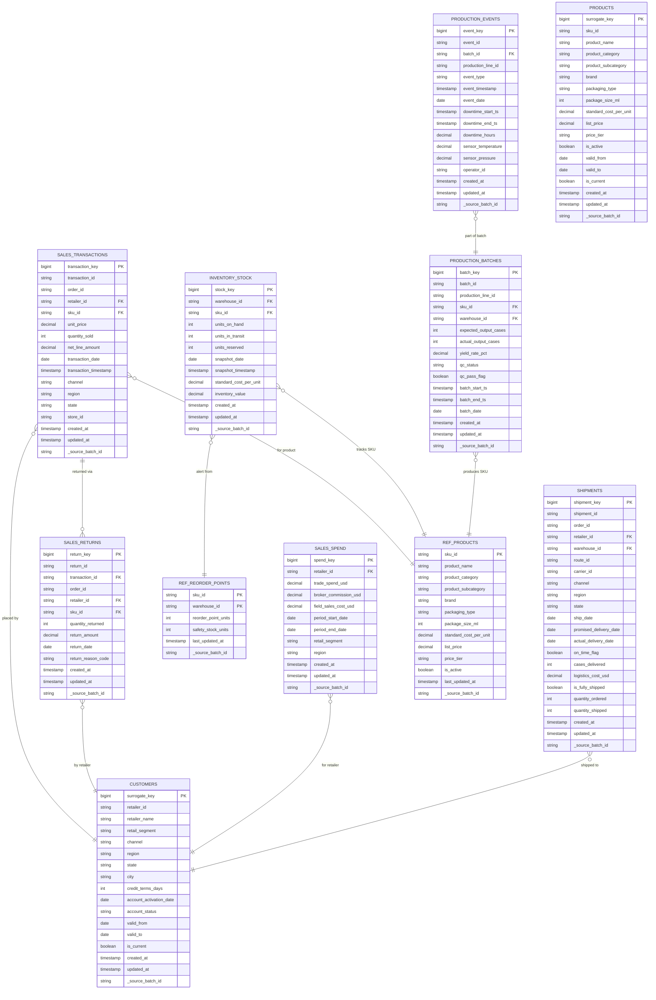

# Silver Layer Schema — FreshSip Beverages CPG Data Platform

**Version:** 1.0
**Date:** 2026-04-05
**Author:** Data Architect Agent
**Layer:** Silver — Cleaned, Conformed, Validated
**Database:** `slv_freshsip` (Hive Metastore)

---

## Design Principles

- **Schema-on-write:** All columns have explicit types, enforced at write time
- **Deduplication:** Applied on natural/business keys before MERGE into Silver
- **Type casting:** All STRING Bronze columns cast to their correct types
- **SCD Type 2:** Applied to `customers`, `products` (dimensional tables with history)
- **SCD Type 1:** Applied to reference tables (`ref_products`, `ref_reorder_points`) — low cardinality, overwrite-safe
- **Reject logging:** Records failing DQ rules written to `slv_freshsip.dq_rejected_records` with reason code
- **Standard audit columns:** `created_at`, `updated_at`, `_source_batch_id` on every table
- **Partitioning:** By date column matching the domain event date
- **OPTIMIZE + ZORDER:** Run after each batch; Z-order columns match dashboard filter patterns

---

## Standard Audit Columns (Every Silver Table)

| Column | Type | Description |
|---|---|---|
| `created_at` | TIMESTAMP | When this record was first created in Silver |
| `updated_at` | TIMESTAMP | When this record was last updated in Silver |
| `_source_batch_id` | STRING | Bronze batch ID that sourced this record |

## SCD Type 2 Additional Columns (Dimensional Tables Only)

| Column | Type | Description |
|---|---|---|
| `surrogate_key` | BIGINT | Auto-generated surrogate key (hash of natural key + valid_from) |
| `valid_from` | DATE | SCD Type 2 effective start date |
| `valid_to` | DATE | SCD Type 2 effective end date (NULL = current record) |
| `is_current` | BOOLEAN | TRUE for the current version of the record |

**SCD Type 2 tables:** `slv_freshsip.customers`, `slv_freshsip.products`
**SCD Type 1 tables:** `slv_freshsip.ref_products`, `slv_freshsip.ref_reorder_points`

---

## ER Diagram — Silver Layer



---

## Table Definitions

---

### Table: `slv_freshsip.sales_transactions`

**Layer:** Silver
**Domain:** Sales
**Description:** Cleaned and deduplicated POS and ERP sales transactions; one row per unique transaction line with typed columns and validated business keys.
**Source:** `brz_freshsip.pos_transactions_raw`, `brz_freshsip.erp_sales_raw`
**Partition Key:** `transaction_date`
**Z-Order Columns:** `sku_id`, `retailer_id`, `region`, `channel`
**Primary Key:** `transaction_key` (surrogate); `transaction_id` (natural, unique)
**Update Strategy:** Delta MERGE (upsert on `transaction_id`)

| Column Name | Data Type | Nullable | Description | Business Rule |
|---|---|---|---|---|
| `transaction_key` | BIGINT | NOT NULL | Surrogate key (hash of transaction_id) | Auto-generated; unique |
| `transaction_id` | STRING | NOT NULL | POS or ERP transaction identifier | Unique; dedup applied; reject duplicates |
| `order_id` | STRING | YES | Linked ERP order ID (null for pure POS records) | May be null for POS-only transactions |
| `retailer_id` | STRING | NOT NULL | Retailer account identifier | Must exist in `slv_freshsip.customers`; reject if missing |
| `sku_id` | STRING | NOT NULL | Product SKU identifier | Must exist in `slv_freshsip.ref_products`; reject if missing |
| `unit_price` | DECIMAL(10,4) | NOT NULL | Invoice unit price in USD | Must be > 0 AND < 10000; reject if violated |
| `quantity_sold` | INTEGER | NOT NULL | Units sold | Must be > 0; reject if <= 0 |
| `net_line_amount` | DECIMAL(14,4) | NOT NULL | Computed: `unit_price * quantity_sold` | Derived column; >= 0 |
| `transaction_date` | DATE | NOT NULL | Date of transaction (partition key) | Must parse to valid DATE; reject if null |
| `transaction_timestamp` | TIMESTAMP | NOT NULL | Full timestamp of transaction | Must parse to valid TIMESTAMP |
| `channel` | STRING | NOT NULL | Distribution channel | Must be in ('Retail', 'Wholesale', 'DTC'); reject if invalid |
| `region` | STRING | NOT NULL | US region | Must be in approved region list; reject if invalid |
| `state` | STRING | YES | US state code (2-char) | ISO 3166-2; warn if invalid |
| `store_id` | STRING | YES | Retailer store location | Informational |
| `created_at` | TIMESTAMP | NOT NULL | Record creation timestamp | Auto-set on first insert |
| `updated_at` | TIMESTAMP | NOT NULL | Last update timestamp | Auto-updated on MERGE |
| `_source_batch_id` | STRING | NOT NULL | Bronze batch ID | Traceability to Bronze |

**Data Quality Rules (embedded):**
1. `transaction_id IS NOT NULL` — BLOCKER — reject to DQ log
2. `unit_price > 0 AND unit_price < 10000` — BLOCKER — reject to DQ log
3. `quantity_sold > 0` — BLOCKER — reject to DQ log
4. `retailer_id IN (SELECT retailer_id FROM slv_freshsip.customers WHERE is_current = true)` — BLOCKER — reject to DQ log
5. `sku_id IN (SELECT sku_id FROM slv_freshsip.ref_products WHERE is_active = true)` — WARNING — flag and log
6. `transaction_date IS NOT NULL AND transaction_date >= '2024-01-01'` — BLOCKER — reject if null; warn if too old
7. `channel IN ('Retail', 'Wholesale', 'DTC')` — BLOCKER — reject if invalid

**CREATE TABLE DDL:**
```sql
CREATE TABLE IF NOT EXISTS slv_freshsip.sales_transactions (
    transaction_key      BIGINT       NOT NULL,
    transaction_id       STRING       NOT NULL,
    order_id             STRING,
    retailer_id          STRING       NOT NULL,
    sku_id               STRING       NOT NULL,
    unit_price           DECIMAL(10,4) NOT NULL,
    quantity_sold        INTEGER      NOT NULL,
    net_line_amount      DECIMAL(14,4) NOT NULL,
    transaction_date     DATE         NOT NULL,
    transaction_timestamp TIMESTAMP   NOT NULL,
    channel              STRING       NOT NULL,
    region               STRING       NOT NULL,
    state                STRING,
    store_id             STRING,
    created_at           TIMESTAMP    NOT NULL,
    updated_at           TIMESTAMP    NOT NULL,
    _source_batch_id     STRING       NOT NULL
)
USING DELTA
PARTITIONED BY (transaction_date)
TBLPROPERTIES (
    'delta.autoOptimize.optimizeWrite' = 'true',
    'delta.autoOptimize.autoCompact'   = 'true',
    'delta.enableChangeDataFeed'       = 'true'
)
-- After CREATE: OPTIMIZE slv_freshsip.sales_transactions ZORDER BY (sku_id, retailer_id, region, channel);
```

---

### Table: `slv_freshsip.sales_returns`

**Layer:** Silver
**Domain:** Sales
**Description:** Cleaned and validated return transactions; each row represents one return event linked back to the originating transaction.
**Source:** `brz_freshsip.erp_returns_raw`
**Partition Key:** `return_date`
**Z-Order Columns:** `sku_id`, `retailer_id`, `return_reason_code`
**Primary Key:** `return_key` (surrogate); `return_id` (natural, unique)
**Update Strategy:** Delta MERGE (upsert on `return_id`)

| Column Name | Data Type | Nullable | Description | Business Rule |
|---|---|---|---|---|
| `return_key` | BIGINT | NOT NULL | Surrogate key | Auto-generated |
| `return_id` | STRING | NOT NULL | Unique return identifier | Unique; dedup applied |
| `transaction_id` | STRING | YES | Originating POS transaction ID | Should exist in `slv_freshsip.sales_transactions`; WARNING if missing |
| `order_id` | STRING | YES | Originating ERP order ID | Informational linkage |
| `retailer_id` | STRING | NOT NULL | Retailer account identifier | Must be valid |
| `sku_id` | STRING | NOT NULL | Returned SKU | Must exist in `slv_freshsip.ref_products` |
| `quantity_returned` | INTEGER | NOT NULL | Units returned | Must be > 0; reject if <= 0 |
| `return_amount` | DECIMAL(14,4) | NOT NULL | Credit amount in USD | Must be > 0; reject if <= 0 |
| `return_date` | DATE | NOT NULL | Date of return (partition key) | Must be valid DATE |
| `return_reason_code` | STRING | NOT NULL | Standard reason code | Must be in ('DAMAGED', 'EXPIRED', 'WRONG_ITEM', 'QUALITY', 'OTHER') |
| `created_at` | TIMESTAMP | NOT NULL | Record creation timestamp | Auto-set |
| `updated_at` | TIMESTAMP | NOT NULL | Last update timestamp | Auto-updated |
| `_source_batch_id` | STRING | NOT NULL | Bronze batch ID | Traceability |

**Data Quality Rules (embedded):**
1. `return_id IS NOT NULL` — BLOCKER
2. `quantity_returned > 0` — BLOCKER
3. `return_amount > 0` — BLOCKER
4. `return_date IS NOT NULL` — BLOCKER
5. `return_reason_code IN ('DAMAGED','EXPIRED','WRONG_ITEM','QUALITY','OTHER')` — WARNING — flag unknown codes

**CREATE TABLE DDL:**
```sql
CREATE TABLE IF NOT EXISTS slv_freshsip.sales_returns (
    return_key          BIGINT        NOT NULL,
    return_id           STRING        NOT NULL,
    transaction_id      STRING,
    order_id            STRING,
    retailer_id         STRING        NOT NULL,
    sku_id              STRING        NOT NULL,
    quantity_returned   INTEGER       NOT NULL,
    return_amount       DECIMAL(14,4) NOT NULL,
    return_date         DATE          NOT NULL,
    return_reason_code  STRING        NOT NULL,
    created_at          TIMESTAMP     NOT NULL,
    updated_at          TIMESTAMP     NOT NULL,
    _source_batch_id    STRING        NOT NULL
)
USING DELTA
PARTITIONED BY (return_date)
TBLPROPERTIES (
    'delta.autoOptimize.optimizeWrite' = 'true',
    'delta.autoOptimize.autoCompact'   = 'true'
);
```

---

### Table: `slv_freshsip.sales_spend`

**Layer:** Silver
**Domain:** Sales / Customers
**Description:** Trade spend, broker commissions, and field sales costs per retailer per period; sourced from ERP customer records; used for CAC calculation.
**Source:** `brz_freshsip.erp_customers_raw` (spend columns extracted)
**Partition Key:** `period_start_date`
**Z-Order Columns:** `retailer_id`, `retail_segment`, `region`
**Primary Key:** `spend_key` (surrogate)
**Update Strategy:** Delta MERGE (upsert on `retailer_id`, `period_start_date`)

| Column Name | Data Type | Nullable | Description | Business Rule |
|---|---|---|---|---|
| `spend_key` | BIGINT | NOT NULL | Surrogate key | Auto-generated |
| `retailer_id` | STRING | NOT NULL | Retailer account | Must exist in customers |
| `trade_spend_usd` | DECIMAL(14,4) | NOT NULL | Trade spend allocated this period | Must be >= 0 |
| `broker_commission_usd` | DECIMAL(14,4) | NOT NULL | Broker commission this period | Must be >= 0 |
| `field_sales_cost_usd` | DECIMAL(14,4) | NOT NULL | Field sales cost allocated | Must be >= 0 |
| `total_acquisition_cost_usd` | DECIMAL(14,4) | NOT NULL | Computed: sum of all three spend columns | Derived; >= 0 |
| `period_start_date` | DATE | NOT NULL | First day of the spend period | Partition key |
| `period_end_date` | DATE | NOT NULL | Last day of the spend period | Must be > period_start_date |
| `retail_segment` | STRING | NOT NULL | Retailer segment | Must be valid segment |
| `region` | STRING | NOT NULL | Region for this spend allocation | Must be valid region |
| `created_at` | TIMESTAMP | NOT NULL | Record creation timestamp | Auto-set |
| `updated_at` | TIMESTAMP | NOT NULL | Last update timestamp | Auto-updated |
| `_source_batch_id` | STRING | NOT NULL | Bronze batch ID | Traceability |

**Data Quality Rules (embedded):**
1. `retailer_id IS NOT NULL` — BLOCKER
2. `trade_spend_usd >= 0 AND broker_commission_usd >= 0 AND field_sales_cost_usd >= 0` — BLOCKER
3. `period_end_date > period_start_date` — BLOCKER
4. `total_acquisition_cost_usd = trade_spend_usd + broker_commission_usd + field_sales_cost_usd` — BLOCKER
5. `period_start_date IS NOT NULL` — BLOCKER

**CREATE TABLE DDL:**
```sql
CREATE TABLE IF NOT EXISTS slv_freshsip.sales_spend (
    spend_key                   BIGINT        NOT NULL,
    retailer_id                 STRING        NOT NULL,
    trade_spend_usd             DECIMAL(14,4) NOT NULL,
    broker_commission_usd       DECIMAL(14,4) NOT NULL,
    field_sales_cost_usd        DECIMAL(14,4) NOT NULL,
    total_acquisition_cost_usd  DECIMAL(14,4) NOT NULL,
    period_start_date           DATE          NOT NULL,
    period_end_date             DATE          NOT NULL,
    retail_segment              STRING        NOT NULL,
    region                      STRING        NOT NULL,
    created_at                  TIMESTAMP     NOT NULL,
    updated_at                  TIMESTAMP     NOT NULL,
    _source_batch_id            STRING        NOT NULL
)
USING DELTA
PARTITIONED BY (period_start_date)
TBLPROPERTIES (
    'delta.autoOptimize.optimizeWrite' = 'true',
    'delta.autoOptimize.autoCompact'   = 'true'
);
```

---

### Table: `slv_freshsip.inventory_stock`

**Layer:** Silver
**Domain:** Inventory
**Description:** Cleaned daily inventory snapshots per SKU per warehouse; one row per (sku_id, warehouse_id, snapshot_date) combination.
**Source:** `brz_freshsip.erp_inventory_raw`
**Partition Key:** `snapshot_date`
**Z-Order Columns:** `sku_id`, `warehouse_id`
**Primary Key:** `stock_key` (surrogate); (`sku_id`, `warehouse_id`, `snapshot_date`) — natural unique key
**Update Strategy:** Delta MERGE (upsert on `sku_id`, `warehouse_id`, `snapshot_date`)

| Column Name | Data Type | Nullable | Description | Business Rule |
|---|---|---|---|---|
| `stock_key` | BIGINT | NOT NULL | Surrogate key | Auto-generated |
| `warehouse_id` | STRING | NOT NULL | Warehouse identifier | Must not be null; warn if not in warehouse reference |
| `sku_id` | STRING | NOT NULL | Product SKU | Must exist in `slv_freshsip.ref_products` |
| `units_on_hand` | INTEGER | NOT NULL | Units in warehouse | Must be >= 0; reject if < 0 (INVALID_STOCK_LEVEL) |
| `units_in_transit` | INTEGER | NOT NULL | Units in transit to warehouse | Must be >= 0 |
| `units_reserved` | INTEGER | NOT NULL | Units reserved for pending orders | Must be >= 0 |
| `units_available` | INTEGER | NOT NULL | Computed: `units_on_hand - units_reserved` | Derived; may be negative (backorder state) |
| `snapshot_date` | DATE | NOT NULL | Date of inventory snapshot (partition key) | Must be valid DATE |
| `snapshot_timestamp` | TIMESTAMP | NOT NULL | Full timestamp of snapshot | Must be valid TIMESTAMP |
| `standard_cost_per_unit` | DECIMAL(10,4) | NOT NULL | Standard cost per unit in USD | Must be > 0 |
| `inventory_value` | DECIMAL(18,4) | NOT NULL | Computed: `units_on_hand * standard_cost_per_unit` | Derived; >= 0 |
| `created_at` | TIMESTAMP | NOT NULL | Record creation timestamp | Auto-set |
| `updated_at` | TIMESTAMP | NOT NULL | Last update timestamp | Auto-updated |
| `_source_batch_id` | STRING | NOT NULL | Bronze batch ID | Traceability |

**Data Quality Rules (embedded):**
1. `warehouse_id IS NOT NULL AND sku_id IS NOT NULL AND snapshot_date IS NOT NULL` — BLOCKER
2. `units_on_hand >= 0` — BLOCKER — reject with reason code `INVALID_STOCK_LEVEL`
3. `standard_cost_per_unit > 0` — BLOCKER
4. `inventory_value = units_on_hand * standard_cost_per_unit` — BLOCKER (computed integrity)
5. `sku_id IN (SELECT sku_id FROM slv_freshsip.ref_products)` — WARNING — flag unrecognized SKUs
6. Uniqueness on `(sku_id, warehouse_id, snapshot_date)` — BLOCKER — dedup before MERGE

**CREATE TABLE DDL:**
```sql
CREATE TABLE IF NOT EXISTS slv_freshsip.inventory_stock (
    stock_key               BIGINT        NOT NULL,
    warehouse_id            STRING        NOT NULL,
    sku_id                  STRING        NOT NULL,
    units_on_hand           INTEGER       NOT NULL,
    units_in_transit        INTEGER       NOT NULL,
    units_reserved          INTEGER       NOT NULL,
    units_available         INTEGER       NOT NULL,
    snapshot_date           DATE          NOT NULL,
    snapshot_timestamp      TIMESTAMP     NOT NULL,
    standard_cost_per_unit  DECIMAL(10,4) NOT NULL,
    inventory_value         DECIMAL(18,4) NOT NULL,
    created_at              TIMESTAMP     NOT NULL,
    updated_at              TIMESTAMP     NOT NULL,
    _source_batch_id        STRING        NOT NULL
)
USING DELTA
PARTITIONED BY (snapshot_date)
TBLPROPERTIES (
    'delta.autoOptimize.optimizeWrite' = 'true',
    'delta.autoOptimize.autoCompact'   = 'true'
)
-- After CREATE: OPTIMIZE slv_freshsip.inventory_stock ZORDER BY (sku_id, warehouse_id);
```

---

### Table: `slv_freshsip.ref_reorder_points`

**Layer:** Silver
**Domain:** Inventory (Reference)
**Description:** Reorder point thresholds per SKU per warehouse; SCD Type 1 (overwrite on update); seeded from ERP inventory snapshots.
**Source:** `brz_freshsip.erp_inventory_raw` (`reorder_point_units` column)
**Partition Key:** None (small reference table; full-scan acceptable)
**Z-Order Columns:** `sku_id`, `warehouse_id`
**Primary Key:** (`sku_id`, `warehouse_id`)
**Update Strategy:** MERGE overwrite on (`sku_id`, `warehouse_id`) — SCD Type 1

| Column Name | Data Type | Nullable | Description | Business Rule |
|---|---|---|---|---|
| `sku_id` | STRING | NOT NULL | Product SKU | Part of composite PK |
| `warehouse_id` | STRING | NOT NULL | Warehouse identifier | Part of composite PK |
| `reorder_point_units` | INTEGER | NOT NULL | Units threshold triggering reorder alert | Must be > 0 |
| `safety_stock_units` | INTEGER | NOT NULL | Buffer stock below which is critical | Must be >= 0 AND < reorder_point_units |
| `last_updated_at` | TIMESTAMP | NOT NULL | When this reference was last updated | Auto-set |
| `_source_batch_id` | STRING | NOT NULL | Bronze batch ID | Traceability |

**Data Quality Rules (embedded):**
1. `sku_id IS NOT NULL AND warehouse_id IS NOT NULL` — BLOCKER
2. `reorder_point_units > 0` — BLOCKER
3. `safety_stock_units >= 0 AND safety_stock_units < reorder_point_units` — WARNING
4. Coverage check: all (sku_id, warehouse_id) in `inventory_stock` must have entry here — WARNING
5. No duplicate (sku_id, warehouse_id) — BLOCKER

**CREATE TABLE DDL:**
```sql
CREATE TABLE IF NOT EXISTS slv_freshsip.ref_reorder_points (
    sku_id              STRING    NOT NULL,
    warehouse_id        STRING    NOT NULL,
    reorder_point_units INTEGER   NOT NULL,
    safety_stock_units  INTEGER   NOT NULL,
    last_updated_at     TIMESTAMP NOT NULL,
    _source_batch_id    STRING    NOT NULL,
    CONSTRAINT pk_ref_reorder PRIMARY KEY (sku_id, warehouse_id)
)
USING DELTA
TBLPROPERTIES (
    'delta.autoOptimize.optimizeWrite' = 'true'
);
```

---

### Table: `slv_freshsip.production_batches`

**Layer:** Silver
**Domain:** Production
**Description:** Cleaned production batch records aggregated from IoT sensor events; one row per batch_id with yield rate, QC status, and timing.
**Source:** `brz_freshsip.iot_sensor_events_raw` (aggregated from BATCH_START, BATCH_END, QC_CHECK events)
**Partition Key:** `batch_date`
**Z-Order Columns:** `production_line_id`, `sku_id`
**Primary Key:** `batch_key` (surrogate); `batch_id` (natural, unique)
**Update Strategy:** Delta MERGE (upsert on `batch_id`; batches updated as events arrive)

| Column Name | Data Type | Nullable | Description | Business Rule |
|---|---|---|---|---|
| `batch_key` | BIGINT | NOT NULL | Surrogate key | Auto-generated |
| `batch_id` | STRING | NOT NULL | Production batch identifier | Unique; from IoT events |
| `production_line_id` | STRING | NOT NULL | Production line identifier | Must not be null |
| `sku_id` | STRING | NOT NULL | SKU being produced | Must exist in `slv_freshsip.ref_products` |
| `warehouse_id` | STRING | NOT NULL | Production facility / warehouse | Must not be null |
| `expected_output_cases` | INTEGER | NOT NULL | Planned output in standard cases | Must be > 0 |
| `actual_output_cases` | INTEGER | YES | Actual output (null until batch completes) | Must be >= 0 when set; must be <= expected * 1.1 |
| `yield_rate_pct` | DECIMAL(6,2) | YES | Computed: `actual / expected * 100` | Must be between 0 and 110 when set |
| `qc_status` | STRING | YES | QC result (PASS, FAIL, PENDING) | Must be in ('PASS','FAIL','PENDING') when not null |
| `qc_pass_flag` | BOOLEAN | YES | TRUE if qc_status = 'PASS' | Derived from qc_status |
| `batch_start_ts` | TIMESTAMP | NOT NULL | Batch start timestamp | Must be valid TIMESTAMP |
| `batch_end_ts` | TIMESTAMP | YES | Batch end timestamp (null until complete) | Must be > batch_start_ts when set |
| `batch_date` | DATE | NOT NULL | Date of batch start (partition key) | Derived from batch_start_ts |
| `created_at` | TIMESTAMP | NOT NULL | Record creation timestamp | Auto-set |
| `updated_at` | TIMESTAMP | NOT NULL | Last update timestamp | Auto-updated |
| `_source_batch_id` | STRING | NOT NULL | Bronze batch ID | Traceability |

**Data Quality Rules (embedded):**
1. `batch_id IS NOT NULL AND production_line_id IS NOT NULL` — BLOCKER
2. `expected_output_cases > 0` — BLOCKER
3. `yield_rate_pct BETWEEN 0 AND 110` — WARNING — flag abnormal yields > 105%; BLOCKER if < 0
4. `qc_status IN ('PASS', 'FAIL', 'PENDING')` — BLOCKER if set to unknown value
5. `batch_end_ts IS NULL OR batch_end_ts > batch_start_ts` — BLOCKER
6. `sku_id IN (SELECT sku_id FROM slv_freshsip.ref_products)` — WARNING

**CREATE TABLE DDL:**
```sql
CREATE TABLE IF NOT EXISTS slv_freshsip.production_batches (
    batch_key               BIGINT       NOT NULL,
    batch_id                STRING       NOT NULL,
    production_line_id      STRING       NOT NULL,
    sku_id                  STRING       NOT NULL,
    warehouse_id            STRING       NOT NULL,
    expected_output_cases   INTEGER      NOT NULL,
    actual_output_cases     INTEGER,
    yield_rate_pct          DECIMAL(6,2),
    qc_status               STRING,
    qc_pass_flag            BOOLEAN,
    batch_start_ts          TIMESTAMP    NOT NULL,
    batch_end_ts            TIMESTAMP,
    batch_date              DATE         NOT NULL,
    created_at              TIMESTAMP    NOT NULL,
    updated_at              TIMESTAMP    NOT NULL,
    _source_batch_id        STRING       NOT NULL
)
USING DELTA
PARTITIONED BY (batch_date)
TBLPROPERTIES (
    'delta.autoOptimize.optimizeWrite' = 'true',
    'delta.autoOptimize.autoCompact'   = 'true',
    'delta.enableChangeDataFeed'       = 'true'
)
-- After CREATE: OPTIMIZE slv_freshsip.production_batches ZORDER BY (production_line_id, sku_id);
```

---

### Table: `slv_freshsip.production_events`

**Layer:** Silver
**Domain:** Production
**Description:** Individual IoT-derived production events (downtime, QC events); supports KPI-P03 (downtime hours) calculations.
**Source:** `brz_freshsip.iot_sensor_events_raw` (one record per raw event)
**Partition Key:** `event_date`
**Z-Order Columns:** `production_line_id`, `event_type`
**Primary Key:** `event_key` (surrogate); `event_id` (natural, unique)
**Update Strategy:** Append-only (events are immutable once recorded)

| Column Name | Data Type | Nullable | Description | Business Rule |
|---|---|---|---|---|
| `event_key` | BIGINT | NOT NULL | Surrogate key | Auto-generated |
| `event_id` | STRING | NOT NULL | Unique event identifier | Unique; dedup applied |
| `batch_id` | STRING | NOT NULL | Parent batch identifier | Must exist in production_batches |
| `production_line_id` | STRING | NOT NULL | Production line | Must not be null |
| `event_type` | STRING | NOT NULL | Event type | Must be in ('BATCH_START','BATCH_END','QC_CHECK','DOWNTIME_UNPLANNED','DOWNTIME_PLANNED') |
| `event_timestamp` | TIMESTAMP | NOT NULL | Event occurrence timestamp | Must be valid TIMESTAMP |
| `event_date` | DATE | NOT NULL | Date of event (partition key) | Derived from event_timestamp |
| `downtime_start_ts` | TIMESTAMP | YES | Downtime start (only for DOWNTIME events) | Must be valid if event_type = DOWNTIME |
| `downtime_end_ts` | TIMESTAMP | YES | Downtime end | Must be > downtime_start_ts if set |
| `downtime_hours` | DECIMAL(8,2) | YES | Computed downtime duration in hours | Derived; must be >= 0 when set |
| `sensor_temperature` | DECIMAL(6,2) | YES | Temperature reading in Celsius | Valid range: -10 to 150 degrees |
| `sensor_pressure` | DECIMAL(6,2) | YES | Pressure reading in PSI | Valid range: 0 to 500 PSI |
| `operator_id` | STRING | YES | Operator identifier | Informational |
| `created_at` | TIMESTAMP | NOT NULL | Record creation timestamp | Auto-set |
| `updated_at` | TIMESTAMP | NOT NULL | Last update timestamp | Auto-set (append-only; updated_at = created_at) |
| `_source_batch_id` | STRING | NOT NULL | Bronze batch ID | Traceability |

**Data Quality Rules (embedded):**
1. `event_id IS NOT NULL AND batch_id IS NOT NULL` — BLOCKER
2. `event_type IN ('BATCH_START','BATCH_END','QC_CHECK','DOWNTIME_UNPLANNED','DOWNTIME_PLANNED')` — BLOCKER
3. `downtime_hours >= 0` — BLOCKER if downtime event
4. `downtime_end_ts > downtime_start_ts` — BLOCKER if both are set
5. `sensor_temperature BETWEEN -10 AND 150` — WARNING if out of range
6. `batch_id IN (SELECT batch_id FROM slv_freshsip.production_batches)` — WARNING if orphaned event

**CREATE TABLE DDL:**
```sql
CREATE TABLE IF NOT EXISTS slv_freshsip.production_events (
    event_key               BIGINT       NOT NULL,
    event_id                STRING       NOT NULL,
    batch_id                STRING       NOT NULL,
    production_line_id      STRING       NOT NULL,
    event_type              STRING       NOT NULL,
    event_timestamp         TIMESTAMP    NOT NULL,
    event_date              DATE         NOT NULL,
    downtime_start_ts       TIMESTAMP,
    downtime_end_ts         TIMESTAMP,
    downtime_hours          DECIMAL(8,2),
    sensor_temperature      DECIMAL(6,2),
    sensor_pressure         DECIMAL(6,2),
    operator_id             STRING,
    created_at              TIMESTAMP    NOT NULL,
    updated_at              TIMESTAMP    NOT NULL,
    _source_batch_id        STRING       NOT NULL
)
USING DELTA
PARTITIONED BY (event_date)
TBLPROPERTIES (
    'delta.autoOptimize.optimizeWrite' = 'true',
    'delta.autoOptimize.autoCompact'   = 'true'
)
-- After CREATE: OPTIMIZE slv_freshsip.production_events ZORDER BY (production_line_id, event_type);
```

---

### Table: `slv_freshsip.shipments`

**Layer:** Silver
**Domain:** Distribution
**Description:** Cleaned shipment records with delivery performance flags and logistics cost data; one row per shipment.
**Source:** `brz_freshsip.logistics_shipments_raw`
**Partition Key:** `ship_date`
**Z-Order Columns:** `channel`, `region`, `route_id`
**Primary Key:** `shipment_key` (surrogate); `shipment_id` (natural, unique)
**Update Strategy:** Delta MERGE (upsert on `shipment_id`; actual_delivery_date may arrive after initial load)

| Column Name | Data Type | Nullable | Description | Business Rule |
|---|---|---|---|---|
| `shipment_key` | BIGINT | NOT NULL | Surrogate key | Auto-generated |
| `shipment_id` | STRING | NOT NULL | Unique shipment identifier | Unique; dedup applied |
| `order_id` | STRING | NOT NULL | Linked ERP order | Must not be null |
| `batch_id` | STRING | YES | FK to production batch that produced the shipped goods | NULL if logistics CSV does not include batch reference; joins to `slv_freshsip.production_batches.batch_id` for KPI-P04 traceability |
| `retailer_id` | STRING | NOT NULL | Destination retailer | Must exist in customers |
| `warehouse_id` | STRING | NOT NULL | Origin warehouse | Must not be null |
| `route_id` | STRING | NOT NULL | Logistics route | Must not be null; key for route performance KPI |
| `carrier_id` | STRING | YES | Carrier identifier | Informational |
| `channel` | STRING | NOT NULL | Distribution channel | Must be in ('Retail','Wholesale','DTC') |
| `region` | STRING | NOT NULL | Destination region | Must be valid region |
| `state` | STRING | YES | Destination state | ISO 3166-2 |
| `ship_date` | DATE | NOT NULL | Departure date (partition key) | Must be valid DATE |
| `promised_delivery_date` | DATE | NOT NULL | Committed delivery date | Must be >= ship_date |
| `actual_delivery_date` | DATE | YES | Actual delivery date | May be null if not yet delivered |
| `on_time_flag` | BOOLEAN | YES | TRUE if actual_delivery_date <= promised_delivery_date | Derived; null until delivered |
| `cases_delivered` | INTEGER | NOT NULL | Cases delivered | Must be >= 0 |
| `logistics_cost_usd` | DECIMAL(14,4) | NOT NULL | Total logistics cost | Must be >= 0 |
| `is_fully_shipped` | BOOLEAN | NOT NULL | All ordered items shipped | Derived from quantity comparison |
| `quantity_ordered` | INTEGER | NOT NULL | Original quantity ordered | Must be > 0 |
| `quantity_shipped` | INTEGER | NOT NULL | Quantity actually shipped | Must be >= 0 |
| `created_at` | TIMESTAMP | NOT NULL | Record creation timestamp | Auto-set |
| `updated_at` | TIMESTAMP | NOT NULL | Last update timestamp | Auto-updated |
| `_source_batch_id` | STRING | NOT NULL | Bronze batch ID | Traceability |

**Data Quality Rules (embedded):**
1. `shipment_id IS NOT NULL AND order_id IS NOT NULL` — BLOCKER
2. `promised_delivery_date >= ship_date` — BLOCKER
3. `logistics_cost_usd >= 0 AND cases_delivered >= 0` — BLOCKER
4. `quantity_ordered > 0 AND quantity_shipped >= 0` — BLOCKER
5. `channel IN ('Retail','Wholesale','DTC')` — BLOCKER
6. `actual_delivery_date IS NULL OR actual_delivery_date >= ship_date` — BLOCKER
7. `retailer_id IN (SELECT retailer_id FROM slv_freshsip.customers WHERE is_current = true)` — WARNING

**CREATE TABLE DDL:**
```sql
CREATE TABLE IF NOT EXISTS slv_freshsip.shipments (
    shipment_key            BIGINT        NOT NULL,
    shipment_id             STRING        NOT NULL,
    order_id                STRING        NOT NULL,
    batch_id                STRING,                   -- FK to slv_freshsip.production_batches.batch_id; NULL if shipment not linked to a production batch
    retailer_id             STRING        NOT NULL,
    warehouse_id            STRING        NOT NULL,
    route_id                STRING        NOT NULL,
    carrier_id              STRING,
    channel                 STRING        NOT NULL,
    region                  STRING        NOT NULL,
    state                   STRING,
    ship_date               DATE          NOT NULL,
    promised_delivery_date  DATE          NOT NULL,
    actual_delivery_date    DATE,
    on_time_flag            BOOLEAN,
    cases_delivered         INTEGER       NOT NULL,
    logistics_cost_usd      DECIMAL(14,4) NOT NULL,
    is_fully_shipped        BOOLEAN       NOT NULL,
    quantity_ordered        INTEGER       NOT NULL,
    quantity_shipped        INTEGER       NOT NULL,
    created_at              TIMESTAMP     NOT NULL,
    updated_at              TIMESTAMP     NOT NULL,
    _source_batch_id        STRING        NOT NULL
)
USING DELTA
PARTITIONED BY (ship_date)
TBLPROPERTIES (
    'delta.autoOptimize.optimizeWrite' = 'true',
    'delta.autoOptimize.autoCompact'   = 'true'
)
-- After CREATE: OPTIMIZE slv_freshsip.shipments ZORDER BY (channel, region, route_id);
```

---

### Table: `slv_freshsip.customers` (SCD Type 2)

**Layer:** Silver
**Domain:** Customers
**Description:** Retailer/customer master data with SCD Type 2 history; each row represents one effective version of a customer record.
**Source:** `brz_freshsip.erp_customers_raw`
**Partition Key:** `valid_from`
**Z-Order Columns:** `retailer_id`, `region`, `retail_segment`
**Primary Key:** `surrogate_key` (unique per version); (`retailer_id`, `valid_from`) — natural unique
**Update Strategy:** SCD Type 2 MERGE — close prior record (set valid_to, is_current=false), insert new record

| Column Name | Data Type | Nullable | Description | Business Rule |
|---|---|---|---|---|
| `surrogate_key` | BIGINT | NOT NULL | Surrogate key for this version | Hash of (retailer_id, valid_from) |
| `retailer_id` | STRING | NOT NULL | Business key | Never null |
| `retailer_name` | STRING | NOT NULL | Retailer business name | Never null |
| `retail_segment` | STRING | NOT NULL | Segment (Grocery, Convenience, Club, Foodservice) | Must be valid segment |
| `channel` | STRING | NOT NULL | Distribution channel | Must be valid channel |
| `region` | STRING | NOT NULL | US region | Must be valid |
| `state` | STRING | NOT NULL | US state code | Must be valid 2-char code |
| `city` | STRING | YES | City name | Informational |
| `credit_terms_days` | INTEGER | NOT NULL | Net payment terms | Must be in (15, 30, 45, 60, 90) |
| `account_activation_date` | DATE | NOT NULL | Account activation date | Must be valid DATE; not in future |
| `account_status` | STRING | NOT NULL | Account status | Must be in ('ACTIVE','INACTIVE','SUSPENDED') |
| `valid_from` | DATE | NOT NULL | SCD Type 2 effective start | Never null |
| `valid_to` | DATE | YES | SCD Type 2 effective end (null = current) | Must be > valid_from when set |
| `is_current` | BOOLEAN | NOT NULL | TRUE for current version | Exactly one TRUE per retailer_id |
| `created_at` | TIMESTAMP | NOT NULL | Record creation timestamp | Auto-set |
| `updated_at` | TIMESTAMP | NOT NULL | Last update timestamp | Auto-updated |
| `_source_batch_id` | STRING | NOT NULL | Bronze batch ID | Traceability |

**Data Quality Rules (embedded):**
1. `retailer_id IS NOT NULL AND retailer_name IS NOT NULL` — BLOCKER
2. `account_status IN ('ACTIVE','INACTIVE','SUSPENDED')` — BLOCKER
3. `valid_to IS NULL OR valid_to > valid_from` — BLOCKER
4. Exactly one `is_current = true` per `retailer_id` — BLOCKER (enforce via MERGE logic)
5. `credit_terms_days IN (15, 30, 45, 60, 90)` — WARNING — flag non-standard terms
6. `account_activation_date <= CURRENT_DATE()` — WARNING — future activation dates flagged

**CREATE TABLE DDL:**
```sql
CREATE TABLE IF NOT EXISTS slv_freshsip.customers (
    surrogate_key           BIGINT    NOT NULL,
    retailer_id             STRING    NOT NULL,
    retailer_name           STRING    NOT NULL,
    retail_segment          STRING    NOT NULL,
    channel                 STRING    NOT NULL,
    region                  STRING    NOT NULL,
    state                   STRING    NOT NULL,
    city                    STRING,
    credit_terms_days       INTEGER   NOT NULL,
    account_activation_date DATE      NOT NULL,
    account_status          STRING    NOT NULL,
    valid_from              DATE      NOT NULL,
    valid_to                DATE,
    is_current              BOOLEAN   NOT NULL,
    created_at              TIMESTAMP NOT NULL,
    updated_at              TIMESTAMP NOT NULL,
    _source_batch_id        STRING    NOT NULL
)
USING DELTA
PARTITIONED BY (valid_from)
TBLPROPERTIES (
    'delta.autoOptimize.optimizeWrite' = 'true',
    'delta.autoOptimize.autoCompact'   = 'true'
)
-- After CREATE: OPTIMIZE slv_freshsip.customers ZORDER BY (retailer_id, region, retail_segment);
```

---

### Table: `slv_freshsip.products` (SCD Type 2)

**Layer:** Silver
**Domain:** Products
**Description:** Product master with SCD Type 2 history; tracks changes to cost, pricing, and classification over time; required for accurate historical margin calculations.
**Source:** `brz_freshsip.erp_products_raw`
**Partition Key:** `valid_from`
**Z-Order Columns:** `sku_id`, `product_category`
**Primary Key:** `surrogate_key` (unique per version); (`sku_id`, `valid_from`) — natural unique
**Update Strategy:** SCD Type 2 MERGE

| Column Name | Data Type | Nullable | Description | Business Rule |
|---|---|---|---|---|
| `surrogate_key` | BIGINT | NOT NULL | Surrogate key for this version | Hash of (sku_id, valid_from) |
| `sku_id` | STRING | NOT NULL | Business key | Never null |
| `product_name` | STRING | NOT NULL | Full product name | Never null |
| `product_category` | STRING | NOT NULL | Category | Must be in ('Carbonated Soft Drinks','Flavored Water','Energy Drinks','Juice Blends') |
| `product_subcategory` | STRING | YES | Subcategory | Informational |
| `brand` | STRING | NOT NULL | Brand name | Never null |
| `packaging_type` | STRING | NOT NULL | Package type | Must be in ('Can','Bottle','Carton','Keg') |
| `package_size_ml` | INTEGER | NOT NULL | Package size in milliliters | Must be > 0 |
| `standard_cost_per_unit` | DECIMAL(10,4) | NOT NULL | Standard cost in USD | Must be > 0; critical for margin KPIs |
| `list_price` | DECIMAL(10,4) | NOT NULL | Standard list price in USD | Must be > standard_cost_per_unit |
| `price_tier` | STRING | NOT NULL | Price tier | Must be in ('Economy','Standard','Premium') |
| `is_active` | BOOLEAN | NOT NULL | Whether SKU is currently active | Never null |
| `valid_from` | DATE | NOT NULL | SCD effective start | Never null |
| `valid_to` | DATE | YES | SCD effective end (null = current) | Must be > valid_from when set |
| `is_current` | BOOLEAN | NOT NULL | TRUE for current version | Exactly one TRUE per sku_id |
| `created_at` | TIMESTAMP | NOT NULL | Record creation timestamp | Auto-set |
| `updated_at` | TIMESTAMP | NOT NULL | Last update timestamp | Auto-updated |
| `_source_batch_id` | STRING | NOT NULL | Bronze batch ID | Traceability |

**Data Quality Rules (embedded):**
1. `sku_id IS NOT NULL AND product_name IS NOT NULL` — BLOCKER
2. `standard_cost_per_unit > 0` — BLOCKER — required for all margin KPIs
3. `list_price > standard_cost_per_unit` — WARNING — negative-margin list price is a data error
4. `product_category IN ('Carbonated Soft Drinks','Flavored Water','Energy Drinks','Juice Blends')` — BLOCKER
5. `is_current = true` count per `sku_id` must equal exactly 1 — BLOCKER
6. `valid_to IS NULL OR valid_to > valid_from` — BLOCKER

**CREATE TABLE DDL:**
```sql
CREATE TABLE IF NOT EXISTS slv_freshsip.products (
    surrogate_key           BIGINT        NOT NULL,
    sku_id                  STRING        NOT NULL,
    product_name            STRING        NOT NULL,
    product_category        STRING        NOT NULL,
    product_subcategory     STRING,
    brand                   STRING        NOT NULL,
    packaging_type          STRING        NOT NULL,
    package_size_ml         INTEGER       NOT NULL,
    standard_cost_per_unit  DECIMAL(10,4) NOT NULL,
    list_price              DECIMAL(10,4) NOT NULL,
    price_tier              STRING        NOT NULL,
    is_active               BOOLEAN       NOT NULL,
    valid_from              DATE          NOT NULL,
    valid_to                DATE,
    is_current              BOOLEAN       NOT NULL,
    created_at              TIMESTAMP     NOT NULL,
    updated_at              TIMESTAMP     NOT NULL,
    _source_batch_id        STRING        NOT NULL
)
USING DELTA
PARTITIONED BY (valid_from)
TBLPROPERTIES (
    'delta.autoOptimize.optimizeWrite' = 'true',
    'delta.autoOptimize.autoCompact'   = 'true'
)
-- After CREATE: OPTIMIZE slv_freshsip.products ZORDER BY (sku_id, product_category);
```

---

### Table: `slv_freshsip.ref_products`

**Layer:** Silver
**Domain:** Products (Reference — SCD Type 1)
**Description:** Current-version product reference table; always reflects the latest active product attributes; used for fast joins in Gold layer KPI computations.
**Source:** `slv_freshsip.products` (filtered to `is_current = true`)
**Partition Key:** None (small reference table)
**Z-Order Columns:** `sku_id`, `product_category`
**Primary Key:** `sku_id`
**Update Strategy:** Full refresh (overwrite) on each pipeline run

| Column Name | Data Type | Nullable | Description | Business Rule |
|---|---|---|---|---|
| `sku_id` | STRING | NOT NULL | Product SKU (PK) | Unique; never null |
| `product_name` | STRING | NOT NULL | Full product name | Never null |
| `product_category` | STRING | NOT NULL | Category | Must be valid category |
| `product_subcategory` | STRING | YES | Subcategory | Informational |
| `brand` | STRING | NOT NULL | Brand | Never null |
| `packaging_type` | STRING | NOT NULL | Package type | Must be valid |
| `package_size_ml` | INTEGER | NOT NULL | Size in ml | Must be > 0 |
| `standard_cost_per_unit` | DECIMAL(10,4) | NOT NULL | Current standard cost | Must be > 0 |
| `list_price` | DECIMAL(10,4) | NOT NULL | Current list price | Must be > 0 |
| `price_tier` | STRING | NOT NULL | Price tier | Must be valid |
| `is_active` | BOOLEAN | NOT NULL | Active flag | Never null |
| `last_updated_at` | TIMESTAMP | NOT NULL | Last refresh timestamp | Auto-set |
| `_source_batch_id` | STRING | NOT NULL | Source batch ID | Traceability |

**Data Quality Rules (embedded):**
1. `sku_id IS NOT NULL` — BLOCKER
2. `standard_cost_per_unit > 0` — BLOCKER
3. No duplicate `sku_id` — BLOCKER
4. `is_active IN (true, false)` — BLOCKER
5. `product_category IN ('Carbonated Soft Drinks','Flavored Water','Energy Drinks','Juice Blends')` — BLOCKER

**CREATE TABLE DDL:**
```sql
CREATE TABLE IF NOT EXISTS slv_freshsip.ref_products (
    sku_id                  STRING        NOT NULL,
    product_name            STRING        NOT NULL,
    product_category        STRING        NOT NULL,
    product_subcategory     STRING,
    brand                   STRING        NOT NULL,
    packaging_type          STRING        NOT NULL,
    package_size_ml         INTEGER       NOT NULL,
    standard_cost_per_unit  DECIMAL(10,4) NOT NULL,
    list_price              DECIMAL(10,4) NOT NULL,
    price_tier              STRING        NOT NULL,
    is_active               BOOLEAN       NOT NULL,
    last_updated_at         TIMESTAMP     NOT NULL,
    _source_batch_id        STRING        NOT NULL,
    CONSTRAINT pk_ref_products PRIMARY KEY (sku_id)
)
USING DELTA
TBLPROPERTIES (
    'delta.autoOptimize.optimizeWrite' = 'true'
);
```

---

### Table: `slv_freshsip.dq_rejected_records`

**Layer:** Silver (Support Table)
**Domain:** All
**Description:** Centralized reject log for all records failing BLOCKER data quality rules across any Silver pipeline; enables audit and investigation.
**Source:** All Silver pipelines (write on DQ failure)
**Partition Key:** `rejection_date`
**Primary Key:** `reject_key`
**Update Strategy:** Append-only

| Column Name | Data Type | Nullable | Description |
|---|---|---|---|
| `reject_key` | BIGINT | NOT NULL | Surrogate key (auto-generated) |
| `source_table` | STRING | NOT NULL | Bronze source table name |
| `target_table` | STRING | NOT NULL | Intended Silver target table |
| `batch_id` | STRING | NOT NULL | Bronze batch ID |
| `pipeline_run_id` | STRING | NOT NULL | Pipeline run that detected the violation |
| `rejection_date` | DATE | NOT NULL | Date of rejection (partition key) |
| `rejection_timestamp` | TIMESTAMP | NOT NULL | Exact timestamp of rejection |
| `rule_id` | STRING | NOT NULL | Data quality rule identifier |
| `rule_type` | STRING | NOT NULL | Rule type (NOT_NULL, RANGE, REFERENTIAL, FORMAT, etc.) |
| `severity` | STRING | NOT NULL | BLOCKER or WARNING |
| `column_name` | STRING | NOT NULL | Column that violated the rule |
| `raw_record_json` | STRING | NOT NULL | JSON of the rejected record |
| `rejection_reason` | STRING | NOT NULL | Human-readable rejection reason |

**CREATE TABLE DDL:**
```sql
CREATE TABLE IF NOT EXISTS slv_freshsip.dq_rejected_records (
    reject_key          BIGINT    NOT NULL,
    source_table        STRING    NOT NULL,
    target_table        STRING    NOT NULL,
    batch_id            STRING    NOT NULL,
    pipeline_run_id     STRING    NOT NULL,
    rejection_date      DATE      NOT NULL,
    rejection_timestamp TIMESTAMP NOT NULL,
    rule_id             STRING    NOT NULL,
    rule_type           STRING    NOT NULL,
    severity            STRING    NOT NULL,
    column_name         STRING    NOT NULL,
    raw_record_json     STRING    NOT NULL,
    rejection_reason    STRING    NOT NULL
)
USING DELTA
PARTITIONED BY (rejection_date)
TBLPROPERTIES (
    'delta.autoOptimize.optimizeWrite' = 'true',
    'delta.autoOptimize.autoCompact'   = 'true'
);
```

---

## Silver Layer Summary

| Table | Domain | SCD Type | Partition Key | Z-Order Columns | Update Strategy |
|---|---|---|---|---|---|
| `sales_transactions` | Sales | N/A (fact) | `transaction_date` | `sku_id, retailer_id, region, channel` | MERGE on `transaction_id` |
| `sales_returns` | Sales | N/A (fact) | `return_date` | `sku_id, retailer_id, return_reason_code` | MERGE on `return_id` |
| `sales_spend` | Sales/Customers | N/A | `period_start_date` | `retailer_id, retail_segment, region` | MERGE on `(retailer_id, period_start_date)` |
| `inventory_stock` | Inventory | N/A (fact) | `snapshot_date` | `sku_id, warehouse_id` | MERGE on `(sku_id, warehouse_id, snapshot_date)` |
| `ref_reorder_points` | Inventory | Type 1 | None | `sku_id, warehouse_id` | MERGE overwrite |
| `production_batches` | Production | N/A (fact) | `batch_date` | `production_line_id, sku_id` | MERGE on `batch_id` |
| `production_events` | Production | N/A (fact) | `event_date` | `production_line_id, event_type` | Append-only |
| `shipments` | Distribution | N/A (fact) | `ship_date` | `channel, region, route_id` | MERGE on `shipment_id` |
| `customers` | Customers | **Type 2** | `valid_from` | `retailer_id, region, retail_segment` | SCD Type 2 MERGE |
| `products` | Products | **Type 2** | `valid_from` | `sku_id, product_category` | SCD Type 2 MERGE |
| `ref_products` | Products | Type 1 | None | `sku_id, product_category` | Full overwrite |
| `dq_rejected_records` | All | N/A | `rejection_date` | None | Append-only |
